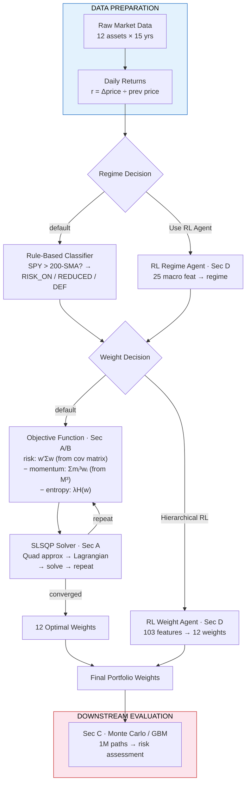
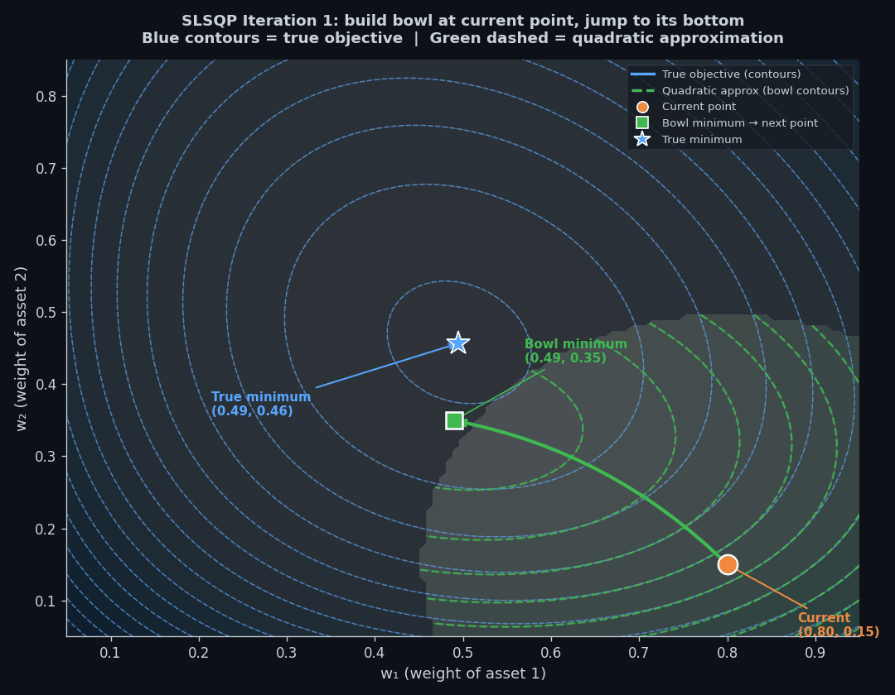
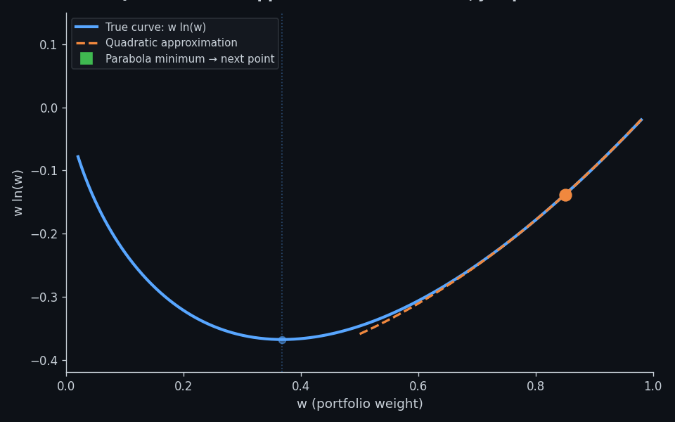

# **How to Run the Docker File**

This project is fully containerized to ensure reproducibility.

**It runs consistently on whatever software environment using Docker.**

### 1. Prerequisites
**a. Docker Desktop (The Environment)**

  Installed and running ([Download here if you don't have one](https://www.docker.com/products/docker-desktop/))

**b. Git (The Code Downloader)**

  Check if you have it by typing `git --version` in your terminal. If not installed:

   **macOS:** Open Terminal and type `xcode-select --install` or download from [git-scm.com](https://git-scm.com/download/mac).

   **Windows:** Download and install **Git for Windows** from [gitforwindows.org](https://gitforwindows.org/).

   **Linux:** Run `sudo apt-get install git` (Debian/Ubuntu).


### 2. Installation
Open your terminal (or Command Prompt) and run:

```bash
# Clone the repository
git clone https://github.com/Guannings/alpha_dual_engine.git
```

### 3. Enter the project folder and install dependencies
```bash
cd alpha_dual_engine
pip install -r requirements.txt
```

### 4. Launching the Dashboard (Choose One Method)

Method A: The "One-Click" Launch (Recommended) Best for first-time setup. This script automatically handles the build, cache-clearing, and port mapping to ensure the 1M simulations work correctly.

```bash
# 1. Make the script executable (only needed once)
chmod +x run_app.sh
```

```bash
# 2. Launch the App
./run_app.sh
```

Method B: Manual Build & Run (Advanced) Use this if you want to configure specific ports or debug the Dockerfile manually.

```bash
# 1. Build the Image (Force fresh build)
docker build --no-cache -t alpha-dual_engine .
```

```bash
# 2. Run the Container
docker run --rm --dns 8.8.8.8 -p 8501:8501 alpha-dual_engine
```

### Troubleshooting & Best Practices
#### **1. Avoid System Folders (Windows Users)**
Do **not** clone this repository into `C:\Windows\System32` or other restricted system directories. This will cause permission errors with Git and Docker.

**Recommended Path:** Clone into a user-controlled folder via the commands below:
```bash
# Go to your user folder
cd ~
# Then go to your desktop:
cd Desktop
```
Then proceed with **2. Installation** and its following commands.

#### **2. Case Sensitivity & Folder Names**
If you encounter a "Path not found" error when using `cd`, ensure you are matching the exact capitalization of the repository:
```powershell
# Use Tab-completion in your terminal to avoid typos
cd alpha_dual_engine
```

#### **3. Port Conflicts:**
**If port 8501 is busy, simply use Option B above to map it to a different local port (replace the first `8501` before the colon with a port number of your choice, e.g. `-p 9000:8501`).**

====================================================================================

# **Computational Requirements**

To ensure the stability of the **Monte Carlo simulation engine** and the **XGBoost training pipeline**, the following resources are recommended:

**1. Memory (RAM):**

  **a. System Total:** 8GB minimum.

  **b. Docker Allocation:**

 Ensure at least **4GB** is dedicated to the container in Docker Desktop settings.

 This prevents **Out-of-Memory (OOM)** errors during the 1,000,000-path stress tests.

**2. Processor (CPU):**

a. **4+ Cores** recommended.

b. The machine learning model utilizes multi-threading for rapid retraining and regime classification.

**3. Connectivity:**

Data Pipeline: High-speed internet access is mandatory for real-time data ingestion via the Yahoo Finance API.

====================================================================================
# **Disclaimer and Terms of Use**
**1. Educational Purpose Only**

This software is for educational and research purposes only and was built as a personal project by a student, PARVAUX, a Public Fianace major at National Chengchi University (NCCU). It is not intended to be a source of financial advice, and the author is not a registered financial advisor. The algorithms, simulations, and optimization techniques implemented herein—including Consensus Machine Learning, Shannon Entropy, and Geometric Brownian Motion—are demonstrations of theoretical concepts and should not be construed as a recommendation to buy, sell, or hold any specific security or asset class.

**2. No Financial Advice**

Nothing in this repository constitutes professional financial, legal, or tax advice. Investment decisions should be made based on your own research and consultation with a qualified financial professional. The strategies modeled in this software may not be suitable for your specific financial situation, risk tolerance, or investment goals.

**3. Risk of Loss**

All investments involve risk, including the possible loss of principal.

a. Past Performance: Historical returns (such as the CAGR in any plots generated from this model) and volatility data used in these simulations are not indicative of future results.

b. Simulation Limitations: Monte Carlo simulations are probabilistic models based on assumptions (such as constant drift and volatility) that may not reflect real-world market conditions, black swan events, or liquidity crises.

c. Model Vetoes: While the Rate Shock Guard and Anxiety Veto are designed to mitigate losses, they are based on historical thresholds that may fail in unprecedented macro-economic environments.

d. Market Data: Data fetched from third-party APIs (e.g., Yahoo Finance) may be delayed, inaccurate, or incomplete.

**4. Hardware and Computation Liability**

The author assumes no responsibility for hardware failure, system instability, or data loss resulting from the execution of the 1,000,000 Monte Carlo simulations. Execution of this code at the configured scale is a high-stress computational event that should only be performed on hardware meeting the minimum specified 8GB RAM requirements.

**5. "AS-IS" SOFTWARE WARRANTY**

**THIS SOFTWARE IS PROVIDED "AS IS", WITHOUT WARRANTY OF ANY KIND, EXPRESS OR IMPLIED, INCLUDING BUT NOT LIMITED TO THE WARRANTIES OF MERCHANTABILITY, FITNESS FOR A PARTICULAR PURPOSE, AND NON-INFRINGEMENT. IN NO EVENT SHALL THE AUTHOR OR COPYRIGHT HOLDER BE LIABLE FOR ANY CLAIM, DAMAGES, OR OTHER LIABILITY, WHETHER IN AN ACTION OF CONTRACT, TORT, OR OTHERWISE, ARISING FROM, OUT OF, OR IN CONNECTION WITH THE SOFTWARE OR THE USE OR OTHER DEALINGS IN THE SOFTWARE.**

**BY USING THIS SOFTWARE, YOU AGREE TO ASSUME ALL RISKS ASSOCIATED WITH YOUR INVESTMENT DECISIONS AND HARDWARE USAGE, RELEASING THE AUTHOR (PARVAUX) FROM ANY LIABILITY REGARDING YOUR FINANCIAL OUTCOMES OR SYSTEM INTEGRITY.**

====================================================================================
# **Alpha Dual Engine v154.6: The Framework**

This documentation details the architecture of Alpha Dual Engine v154.6, a high-performance quantitative trading system refactored to prioritize "Acceleration Alpha" over passive diversification and engineered to navigate complex market regimes through a synthesis of machine learning, macro-economic veto guards, and entropy-weighted optimization. Established by PARVAUX, a Public Finance major at National Chengchi University, the system represents a Bifurcated Logic that applies distinct mathematical strategies to Equities (Growth Flow) and Cryptocurrency (Store of Value Cycles). Unlike traditional mean-variance models that treat all assets identically, v154.6 utilizes a Bifurcated Logic Engine that applies distinct mathematical strategies to Equities (Growth Flow) and Cryptocurrency (Store of Value Cycles).

**I. Configuration & Constants (StrategyConfig)**

The StrategyConfig class serves as the immutable constitution of the Alpha Dual Engine v154.6. Defined as a Python dataclass, it centralizes every hard-coded rule, risk limit, and execution parameter into a single, modifiable control panel. This design ensures that the strategy's logic remains separated from its parameters, allowing for rapid sensitivity testing without risking code breakage.

This section acts as the primary filter for all downstream logic. If a trade or allocation violates these parameters, it is rejected before it ever reaches the optimization engine.

**1. Risk & Portfolio Constraints**

These parameters define the "shape" of the portfolio and the limits of its aggression.

a. target_volatility (0.25 / 25%)

* Function: This sets the target annualized standard deviation for the portfolio optimizer.

* Logic: Unlike conservative funds that target 10-12% volatility, this engine is tuned for 0.25, explicitly telling the math to accept significant daily variance in exchange for higher compound growth (CAGR). It prevents the optimizer from "diluting" high-momentum assets like SMH simply because they are volatile.

aa. prob_ema_span (10-day): Probabilities are smoothed using a 10-day Exponential Moving Average (EMA) to filter out daily market noise and prevent "regime flickering," which can lead to excessive and costly trading.

An Exponential Moving Average (EMA) assigns exponentially decaying weights to past observations, prioritizing recent data. Unlike a Simple Moving Average where all observations contribute equally, a 10-day EMA halves the influence roughly every 5 days. This smoothing eliminates daily probability jitter from the ML classifier, preventing rapid regime oscillation that would trigger excessive rebalancing.

b. max_single_weight (0.30 / 30%)

* Function: The "Anti-Blowup" Cap. No single asset can exceed 30% of the total portfolio value.

* Logic: This forces the "Cubed Momentum" engine to select a basket of winners rather than betting the farm on one. Even if SMH (Semiconductors) has a perfect momentum score, the system must find at least two or three other assets (e.g., TAN, XBI) to fill the remaining allocation, ensuring a mathematical minimum diversity of $\sim 3.33$ assets ($1 / 0.30$).

c. gold_cap_risk_on (0.01 / 1%)

* Function: The "Drag eliminator."

* Logic: During a RISK_ON regime, the strategy is strictly prohibited from allocating more than 1% to Gold (GLD). This prevents the optimizer from "hiding" in safe-haven assets during a bull market, ensuring 99% of capital is deployed into productive, high-beta assets.

d. entropy_lambda (0.02)

* Function: The penalty for concentration.

* Logic: A low lambda value (0.02) tells the optimizer that we prefer concentration over diversification. It allows the weights to cluster near the 30% maximums rather than being flattened out equally across all assets.

Shannon Entropy $H(\mathbf{w}) = -\sum_i w_i \ln(w_i)$ quantifies weight dispersion: equal weighting across 12 assets yields the maximum ($\approx 2.48$), while full concentration yields 0. The optimizer includes $0.02 \times H(\mathbf{w})$ as a soft diversification bonus. Since $\lambda_{\text{entropy}} = 0.02$ is deliberately small, momentum signals dominate — the portfolio remains concentrated in top performers but avoids extreme single-asset allocation. See Appendix Section B for the full derivation.

**2. Execution & Cost Control (The "Fee Guillotine")**

a. Transaction Cost Calculation & Formula

$$\text{Cost} = V_{\text{portfolio}} \times \sum_{i} \left| w_i^{\text{new}} - w_i^{\text{old}} \right| \times \frac{\text{Cost}_i^{\text{bps}}}{10{,}000}$$

This formula computes the total transaction cost per rebalance:
- $V_{\text{portfolio}}$ = total portfolio value
- $|w_i^{\text{new}} - w_i^{\text{old}}|$ = absolute weight change per asset (e.g., SMH moving from 20% to 30% produces a change of 0.10)
- $\sum_i |\cdot|$ = total turnover across all assets
- $\frac{\text{Cost}_i^{\text{bps}}}{10{,}000}$ = per-asset fee rate converted from basis points to decimal (1 bps = 0.01%)

**Example:** A \$100,000 portfolio shifting 10% into SMH (5 bps) incurs a cost of $100{,}000 \times 0.10 \times 0.0005 = 5$ dollars per rebalance.

*  Per-Asset Transaction Costs:

 | Ticker | Asset Name | Asset Class | Cost (bps) | Cost (%) | Rationale |
| :--- | :--- | :--- | :---: | :---: | :--- |
| **QQQ** | Invesco QQQ Trust | Large-cap Equity | 3 | 0.03% | Nasdaq 100 ETF, extremely liquid, tight spreads, commission-free |
| **IWM** | iShares Russell 2000 | Small-cap Equity | 3 | 0.03% | High volume, liquid, commission-free |
| **SMH** | VanEck Semiconductor | Sector Equity | 5 | 0.05% | Moderate liquidity, wider spreads than broad indices |
| **XBI** | SPDR S&P Biotech | Sector Equity | 5 | 0.05% | Thematic sector, moderate spreads |
| **TAN** | Invesco Solar Energy | Thematic Equity | 8 | 0.08% | Lower volume, wider spreads, less liquid |
| **IGV** | iShares Software | Sector Equity | 5 | 0.05% | Tech sector, moderate liquidity |
| **TLT** | iShares 20+ Yr Treasury | Long-term Bonds | 2 | 0.02% | Very liquid treasury ETF, tight spreads |
| **IEF** | iShares 7-10 Yr Treasury | Mid-term Bonds | 2 | 0.02% | Very liquid treasury ETF |
| **SHY** | iShares 1-3 Yr Treasury | Short-term Bonds | 1 | 0.01% | Most liquid, cash-like, tightest spreads |
| **GLD** | SPDR Gold Trust | Commodities | 2 | 0.02% | High liquidity, tight spreads |
| **BTC-USD** | Bitcoin | Cryptocurrency | 30 | 0.30% | Exchange fees (10-25 bps) + spread (5-10 bps) |
| **ETH-USD** | Ethereum | Cryptocurrency | 30 | 0.30% | Exchange fees (10-25 bps) + spread (5-10 bps) |

b. min_rebalance_threshold (0.12 / 12%)

* Function: The Trade Gate.

* Logic: This is the most critical execution parameter. Before rebalancing, the engine calculates the total portfolio turnover (the sum of absolute weight changes).

* If $\text{Turnover} < 12\%$: Trade Cancelled.

* Effect: This prevents "noise trading"—small, mathematical adjustments that generate fees without adding significant alpha. The system only moves when the portfolio structure is significantly misaligned.

**3. Crypto Architecture Constraints**

These parameters define the Active HODL engine, treating crypto as a distinct asset class with its own physics.

a. crypto_floor_risk_on (0.05 / 5%)

* Function: The "Zero-Coin" Prevention Floor.

* Logic: Regardless of how bad the chart looks, the strategy is mathematically forbidden from holding less than 5% in the crypto bucket (BTC + ETH). This ensures exposure to "God Candles"—sudden, violent upside moves that often occur after periods of despair.

b. total_crypto_cap (0.15 / 15%)

* Function: The Volatility Containment Ceiling.

* Logic: Even in a full bull run, crypto exposure is capped at 15%. This prevents a 50% crypto drawdown from destroying the entire portfolio's performance, maintaining the Sharpe Ratio near 1.0.

**4. Macro & ML Thresholds**

These settings govern the "Brain" of the strategy, determining when to enter or exit the market.

a. ml_threshold (0.55)

* Function: The Consensus Bar.

* Logic: The Machine Learning ensemble must be at least 55% certain that the next period will be bullish before the strategy enters a RISK_ON state (unless overridden by the Macro trend).

b. anxiety_vix_threshold (18.0)

* Function: The "Choppy Market" Detector.

* Logic: If the VIX (Volatility Index) is above 18, the market is defined as "Anxious." In this state, the ML conviction requirements are often raised automatically to prevent "whipsaw" losses in sideways markets.


**II. Data Orchestration & Feature Engineering (DataManager)**

The DataManager class is the manufacturing plant of the strategy. It is responsible for ingesting raw, noisy market data and refining it into the precise "fuel" needed for both the Machine Learning models and the Portfolio Optimizer.

In v154.6, this class has been radically re-engineered to support the Bifurcated Asset Logic, treating Crypto and Equities as fundamentally different data species.

**1. Universe Construction (The "Alpha Roster")**

a. Growth Anchors (The Engine): SMH (Semiconductors), XBI (Biotech), TAN (Solar), IGV (Software).

* Logic: These are "High Beta" sectors. They move faster than the S&P 500. The strategy intentionally designates these as the core growth drivers to maximize acceleration alpha.

b. Defensive Assets (The Brakes): TLT (Long-Term Treasuries), IEF (Intermediate Treasuries), SHY (Cash Proxy), GLD (Gold).

* Logic: These are the "Panic Buttons." When the regime flips to DEFENSIVE, capital flees here.

c. Crypto Assets (The Turbo): BTC-USD, ETH-USD.

* Logic: These provide non-correlated, exponential upside potential.


**2. The Bifurcated Signal Engine**

This is the most critical logic block in the entire script, which splits the ranking logic based on the asset class.

a. For Equities: The "Cubed Momentum" Metric

* Formula:

$$M_i = \left(\frac{P_i}{\text{SMA}_{60,i}}\right)^3$$

Where $P_i$ is the current price of asset $i$ and $SMA_{60,i}$ is its 60-day Simple Moving Average. The ratio $P_i / SMA_{60,i}$ measures how far the asset is above or below its recent trend (e.g., $220/200 = 1.10$ means 10% above trend). The **cubing operation** nonlinearly amplifies the gap between strong and weak performers:

Scenario A: Asset is 2% above trend → $1.02^3 \approx 1.06$

Scenario B: Asset is 10% above trend → $1.10^3 \approx 1.33$

After cubing, Scenario B scores approximately **5.5x higher** than Scenario A ($0.33 \div 0.06 \approx 5.5$), causing the optimizer to concentrate capital aggressively into the strongest-trending assets — the desired behavior for a momentum-driven strategy.

* Result: The optimizer sees Scenario B as dramatically better than Scenario A, naturally forcing capital into the fastest-moving sector without needing manual "if/else" exclusions.

b. For Crypto: The "RSI Rotation" Metric

* Formula: 14-Day Relative Strength Index (RSI).

RSI is computed as:

$$\text{RSI} = 100 - \frac{100}{1 + \frac{\text{Avg Gain over 14 days}}{\text{Avg Loss over 14 days}}}$$

This produces a bounded oscillator between 0 and 100. Values above 70 indicate overbought conditions; below 30 indicates oversold; 50 is neutral. The system compares Bitcoin's RSI against Ethereum's RSI and allocates the entire crypto bucket to whichever coin exhibits stronger recent momentum.

* Logic: Crypto doesn't follow smooth trends like stocks; it moves in manic bursts. RSI measures the internal velocity of price changes.

* Result: This allows the "Active HODL" engine to swap 100% of its weight between Bitcoin and Ethereum based on which one is currently experiencing a stronger "pump."

> **Note:** This winner-take-all RSI rotation applies only to the classical SLSQP path. When "Use Hierarchical RL" is toggled on, the RL weight agent does not enforce RSI rotation — it learns its own crypto allocation via soft constraint penalties and can freely split the bucket between BTC and ETH.

**3. The 7-Factor Feature Synthesis**

This section builds the input vectors for the Machine Learning "Brain." It distills the complex market state into 7 digestible numbers:

These 7 features compress the market state into a compact input vector for the ML classifier. Each feature captures a distinct dimension of market conditions:

a. **realized_vol** = $\frac{\text{VIX}}{100}$. The VIX is a number (say 22) that represents how scared the market is. Dividing by 100 just rescales it to 0.22 so the model can digest it. Higher = more fear.

b. **trend_score** = $\frac{\text{SPY Price} - \text{SPY 200-day SMA}}{\text{SPY 200-day SMA}} \times 100$. This asks: "how far is the S&P 500 above or below its 200-day average, in percentage terms?" If SPY is at 500 and the 200-day average is 480, trend_score = $\frac{500 - 480}{480} \times 100 = 4.17$. Positive = bullish, negative = bearish.

c. **momentum_21d** = SPY's percentage return over the last 21 trading days (~1 month). Positive = market has been going up recently.

d. **vol_momentum** = $\frac{\text{VIX today}}{\text{VIX 21 days ago}} - 1$. This measures: "is fear increasing or decreasing?" If VIX went from 15 to 20, vol_momentum = $\frac{20}{15} - 1 = 0.33$ (fear jumped 33%). Rising fear = bad.

e. **qqq_vs_spy** = QQQ return over 63 days minus SPY return over 63 days. This measures: "is tech outperforming the broader market?" If QQQ returned 12% and SPY returned 8% over 3 months, this equals 4%. Positive = tech is leading (usually bullish for growth).

f. **tlt_momentum** = TLT's return over 21 days. TLT is a long-term bond fund. If TLT is crashing, it means interest rates are spiking — bad for stocks.

g. **equity_risk_premium** = $\frac{1}{\text{SPY} / \text{SPY 252-day SMA}} - \text{risk-free rate}$. This is a rough valuation check. When SPY is way above its 1-year average, the "premium" for holding stocks shrinks. The model uses this to detect if the market is overvalued.

**4. Temporal Integrity (The "Time Machine")**

The get_aligned_data method ensures the backtest is honest.

a. The Lag: It strictly uses data up to the close of T-1 (yesterday) to make decisions for T (today).

b. The NaN Handler: It forward-fills missing data (common in Crypto vs. Stock weekends) to prevent the optimizer from crashing due to misalignment.


**III. Regime Intelligence (AdaptiveRegimeClassifier)**

The AdaptiveRegimeClassifier is the central nervous system of the strategy, responsible for the binary decision that determines portfolio survival: "Risk-On" (Aggressive Growth) or "Defensive" (Capital Preservation).

In v154.6, this system was upgraded from a pure Machine Learning model to a Hybrid Override Architecture. This solves the "Black Box" problem by enforcing a strict hierarchy: Macro Logic overrules ML Probabilities.

**1. The Macro Override (The "Anti-Coward" Switch)**

This is the first and most powerful layer of the decision tree. It addresses a fatal flaw in many ML strategies: the tendency to be "too smart" and exit during strong bull markets due to minor volatility signals.

The Trend Rule:

* Logic: if SPY_Price > SPY_200_SMA: return "RISK_ON"

* Purpose: The 200-day Simple Moving Average is the industry-standard definition of a long-term trend. If the S&P 500 is trading above this line, the market is structurally healthy.

* Effect: This effectively "locks" the strategy into the market during major bull runs (e.g., 2013, 2017, 2024), preventing the ML models from triggering premature defensive exits. The strategy ignores all fear signals as long as the primary trend is up.

**2. The Consensus Ensemble (The "Brain")**

If the Macro Override is not active (i.e., the market is below the 200-day SMA or in a grey zone), the system defers to its Machine Learning ensemble to navigate the uncertainty.

a. Model Alpha: XGBoost (The Aggressor)

* Role: Detects complex, non-linear opportunities.

* Configuration: Tuned with Monotonic Constraints to enforce financial logic (e.g., "Higher Volatility = Lower Probability").

XGBoost is a gradient-boosted ensemble that sequentially builds hundreds of shallow decision trees, where each new tree corrects the residual errors of its predecessors. **Monotonic Constraints** enforce domain-specific logic on the learned function — for example, enforcing that higher VIX must produce lower bull probability, regardless of what patterns the training data might suggest. This prevents the model from learning spurious correlations (e.g., "VIX at 30 = bullish" from a single 2020 data point).

* Strength: Excellent at catching "V-shaped" recoveries where price action snaps back quickly despite high fear levels.

b. Model Beta: Decision Tree (The Skeptic)

* Role: Filters out noise and false breakouts.

* Configuration: Shallow tree (max_depth=2) with high regularization (min_samples_leaf=200).

A `max_depth=2` tree can only split twice — for example: "Is trend_score > 0?" → "Is VIX < 25?" → terminal node. This extreme simplicity makes it nearly impossible to overfit, as it can only capture the most dominant patterns. The `min_samples_leaf=200` parameter further constrains the tree by requiring every terminal node to be supported by at least 200 historical observations, preventing decisions based on rare or one-off events.

* Strength: Prevents the XGBoost model from overreacting to short-term noise.

c. The Consensus Rule:

To trigger a RISK_ON signal in the absence of a Macro Override, BOTH models must agree with high conviction (Probability > 0.55). If they disagree, the system defaults to safety.

This dual-model consensus acts as a confirmation filter: the gradient-boosted model (XGBoost) captures complex nonlinear patterns, while the shallow Decision Tree provides a conservative baseline. Both must independently produce a bull probability exceeding 55% for the system to enter RISK_ON. This "default to safety" design ensures the system only takes risk when two structurally different models agree that the statistical edge is significant.

**3. The "Anxiety" & "Panic" States**

The classifier doesn't just look at price; it monitors market psychology via the VIX (Volatility Index).
To ensure the system remains career-relevant in 2026 and beyond, the classifier uses an Adaptive Walk-Forward Training loop.

a. Anxiety State (VIX > 18):

The market is choppy. The system raises the required ML probability threshold (e.g., from 55% to 75%). It demands "extraordinary evidence" to take risks in a nervous environment.

b. Panic State (VIX > 35):

The "Circuit Breaker." If volatility explodes, the system forces a DEFENSIVE regime immediately, overriding everything else. This protects the portfolio during black swan events (e.g., COVID Crash 2020).

**4. Explainability via SHAP Values**

Because black-box models are unacceptable in institutional advisory, the classifier integrates SHAP (SHapley Additive exPlanations). This provides a detailed "Feature Importance" report, allowing the user to explain exactly why a decision was made. For instance, the user can point to a SHAP summary plot to show that TLT Momentum was the primary factor that triggered a defensive exit during the bond market crash of 2022.

SHAP decomposes each prediction into per-feature contributions. For example, if the model outputs a 60% bull probability, SHAP attributes the marginal contribution of each input: trend_score may contribute +15%, while vol_momentum contributes -8% and TLT_momentum contributes -3%. The methodology is grounded in **Shapley Values** from cooperative game theory (Nobel Prize in Economics, 2012), which provides a mathematically unique, fair allocation of credit among interacting variables. Each of the 7 input features receives exactly the contribution it deserves — no more, no less.

**5. The "Regime Shield" (Rate Shock Guard)**

A special logic block designed for the 2022 bear market scenario, where stocks and bonds fell together.

* Logic: It monitors the correlation between SPY and TLT (Treasuries).

* Trigger: If TLT momentum crashes while Equity Risk Premium is negative, it signals a "Rate Shock."

* Action: Immediate exit to Cash/Gold, bypassing even the standard defensive bonds, as bonds themselves are the danger.

**IV. Portfolio Optimization (AlphaDominatorOptimizer)**

The AlphaDominatorOptimizer is the execution arm of the strategy. While the RegimeClassifier decides if we should take risk, the Optimizer decides how much risk to take and where to put it.

This is not a standard "Mean-Variance" optimizer (which often produces boring, over-diversified portfolios). It is a Constrained Momentum Maximizer. It treats the portfolio construction as a mathematical optimization problem: "Find the mix of assets that maximizes expected momentum while keeping volatility below 25% and fees below the guillotine threshold."

**1. The Mathematical Objective**

The heart of the optimizer is the function it tries to minimize:

$$\mathcal{L}(\mathbf{w}) = \lambda_{\text{risk}} \mathbf{w}^\top \Sigma \mathbf{w} - \lambda_{\text{mom}} (\mathbf{w} \cdot \mathbf{M}) - \lambda_{\text{entropy}} H(\mathbf{w})$$

This objective function balances three competing goals — minimize risk, maximize momentum exposure, and maintain diversification — through a single scalar that the SLSQP solver minimizes. The full mathematical derivation is provided in Appendix Section A.

**Variables:**
- $\mathbf{w}$ = The portfolio weight vector (e.g., $[0.25, 0.30, 0.10, \ldots]$ representing 25% SMH, 30% QQQ, 10% TLT). This is the unknown the optimizer solves for.
- $\lambda$ = Scaling coefficients controlling the relative importance of each term.
- $\Sigma$ = The **covariance matrix** — a symmetric matrix capturing pairwise co-movement between all 12 assets. High covariance between two assets means they tend to move together, reducing the diversification benefit of holding both.

**Term 1: Risk** — $\lambda_{risk} \cdot w^\top \Sigma w$ (minimized)

$w^\top \Sigma w$ computes the portfolio variance — a single scalar quantifying total risk, accounting for all pairwise correlations. Concentrated positions in correlated assets produce high variance; diversified positions across uncorrelated assets produce low variance. The $\lambda_{risk}$ coefficient is kept moderate to accommodate the 25% target volatility.

**Term 2: Momentum** — $-\lambda_{mom} (w \cdot M)$ (maximized via negation)

$w \cdot M$ is the dot product of weights and cubed momentum scores. Since the optimizer minimizes the objective, the negative sign converts momentum maximization into an equivalent minimization problem (minimizing $-x$ is equivalent to maximizing $x$). This term drives the strategy toward high-momentum assets.

**Term 3: Entropy** — $-\lambda_{entropy} \cdot H(w)$ (maximized via negation)

$H(w) = -\sum_i w_i \ln(w_i)$ is Shannon Entropy, measuring weight dispersion. Entropy equals 0 when fully concentrated and reaches its maximum ($\ln 12 \approx 2.48$) when equally distributed. The coefficient $\lambda_{entropy} = 0.02$ is deliberately small — a soft diversification nudge that prevents extreme concentration without overriding momentum signals. For a detailed derivation of Shannon Entropy and the Effective N metric, see [Section B: Shannon Entropy](#b-shannon-entropy--from-information-theory-to-portfolio-diversification).

**Net effect:** The optimizer produces aggressive, momentum-driven portfolios concentrated in the top 3-4 trending assets, while the entropy term and bound constraints prevent full single-asset concentration.

**2. The Bifurcated Bounds Engine**

This is where the Crypto vs. Equity separation is strictly enforced. The optimizer doesn't just see a list of tickers; it sees two distinct asset classes with different rules.

a. The Crypto Bounds (Active HODL):

* The Check: It looks at Bitcoin's price relative to its 50-day SMA.

* The Ceiling:

Bull Mode (BTC > 50SMA): Unlocks the crypto bucket to 15%.

Bear Mode (BTC < 50SMA): Locks the crypto bucket to 5%.

* The Rotation (Internal Alpha): It doesn't split the money. It assigns the entire allowed weight (5% or 15%) to the coin with the higher 14-day RSI. The loser gets a strict (0.0, 0.0) bound.

b. The Equity Bounds (Growth Anchors):

* The Cap: Every equity asset (SMH, TAN, XBI, IGV) is capped at 30% (max_single_weight). This forces the optimizer to pick a "Starting Lineup" of at least 3 players.

* The Gold Leash: During Risk-On, GLD is mathematically handcuffed to a maximum of 1%. This ensures "Safety" assets don't steal capital from "Growth" assets.

c. Diversity Enforcement (Effective N)

After finding a candidate portfolio, the optimizer runs a "Sanity Check" using the Inverse Herfindahl Index (Effective N).

Effective N quantifies the number of independent positions the portfolio is effectively exposed to:

$$N_{\text{eff}} = \frac{1}{\sum_i w_i^2}$$

- 100% in one asset: $\frac{1}{1.0^2} = 1.0$ — effectively 1 position.
- 50%/50% split: $\frac{1}{0.5^2 + 0.5^2} = \frac{1}{0.50} = 2.0$ — effectively 2 positions.
- 30%/30%/30%/10%: $\frac{1}{0.09 + 0.09 + 0.09 + 0.01} = \frac{1}{0.28} \approx 3.6$ — effectively 3.6 positions.

Squaring the weights penalizes concentration disproportionately: a 90% weight contributes $0.81$ to the denominator, dominating the sum and pushing $N_{\text{eff}}$ toward 1. The system requires $N_{\text{eff}} \geq 3.0$.

* Target: min_effective_n = 3.0

* Logic: If the optimizer suggests a portfolio that behaves like only 1 or 2 assets (e.g., 90% SMH, 10% Cash), the system rejects it or penalizes it until it diversifies enough to look like at least 3 uncorrelated bets.

d. Defensive & Fallback Modes

The optimizer changes its personality based on the Regime:

* RISK_ON: Maximizes Momentum (Aggressive).

* RISK_REDUCED: Maximizes Sharpe Ratio (Balances Risk/Reward).

* DEFENSIVE: Minimizes Variance (Survival Mode). Allocates 100% to Cash (SHY), Bonds (TLT), and Gold (GLD) to ride out the storm.


**V. Execution Logic (BacktestEngine)**

The BacktestEngine is the "Reality Simulator" of the strategy. It moves beyond theoretical signal generation and optimization to model the messy mechanics of actual trading—slippage, transaction costs, and time. It is responsible for stepping through the 15-year history day-by-day and enforcing the strict execution rules that protect net returns.

**1. The Simulation Loop**

This is the core heartbeat of the backtester. It iterates through every trading day from 2010 to the present.

a. Temporal Integrity:

At every step, the engine strictly uses data available up to that specific date (current_date). This prevents "look-ahead bias"—the most common sin in quantitative finance where a model accidentally peeks at tomorrow's prices to make today's decision.

b. Regime Detection:

Before considering any trades, the engine calls the AdaptiveRegimeClassifier to determine the market state (RISK_ON, RISK_REDUCED, or DEFENSIVE). This decision sets the rules of engagement for the rest of the day.

**2. The "Fee Guillotine" (The Lazy Trader Protocol)**

This is the critical logic block implemented in v154.6 to solve the "Churn Problem" (where fees were eating 4% of the portfolio).

a. Logic: Inside the main loop, before executing any rebalance, the engine calculates the Proposed Turnover:

$$\text{Turnover} = \sum_{i} \left| w_i^{\text{new}} - w_i^{\text{old}} \right|$$

Turnover is the sum of absolute weight changes across all assets — it quantifies the total portfolio reallocation. For example, if SMH shifts from 25% to 30% (+5%) and QQQ from 20% to 15% (-5%), total turnover is $0.05 + 0.05 = 0.10$ (10%). If turnover falls below the 12% threshold, the rebalance is suppressed as the expected fee drag exceeds the benefit.

b. The Rule:

* If $\text{Turnover} < 0.12$ (12%): THE TRADE IS REJECTED.

* Effect: The engine effectively says, "This change is too small to be worth the fees. Do nothing." It carries forward the existing portfolio weights exactly as they were.

c. The Safety Valve:

If the Regime does change (e.g., Bullish to Defensive): The Gate is lifted. Safety takes priority over fees, and the trade is executed immediately to de-risk the portfolio.

**3. Cost Modeling & Friction**

The engine uses a tiered, per-asset transaction cost model that reflects real-world trading friction. Each asset has its own cost in basis points (see the fee table in Section I.2), ranging from 1 bps for the most liquid bond ETFs to 30 bps for cryptocurrency. The cost for each rebalance is calculated as:

$$\text{Cost} = V_{\text{portfolio}} \times \sum_{i} \left| w_i^{\text{new}} - w_i^{\text{old}} \right| \times \frac{\text{Cost}_i^{\text{bps}}}{10{,}000}$$

The formula is identical to Section I.2: portfolio value multiplied by absolute weight changes multiplied by the per-asset fee rate. The tiered structure creates an implicit incentive against high-frequency crypto rebalancing — at 30 bps, cryptocurrency is 30x more expensive to trade than SHY (1 bps).

This penalizes high-turnover strategies proportionally to the actual friction of the assets being traded, rewarding the "Lazy" approach mandated by the Fee Guillotine.

To prevent the optimizer from putting 100% of the capital into a single "best" stock (a common flaw in traditional optimization), the system uses Shannon Entropy as an additional diversity penalty in the objective function.

**4. The "Sniper Score"**

This is a proprietary analytic calculated at the end of the run to judge the quality of the Machine Learning signals.

a. Definition: Precision of the "Buy" signal.

b. Calculation:

* Identify every instance where the model switched to RISK_ON.

* Check the 21-Day Forward Return of the S&P 500 from that date.

* If the market went up, it's a "Hit." If it went down, it's a "Miss."

c. Formula:

$$\text{Sniper Score} = \frac{\text{Successful Bull Signals}}{\text{Total Bull Signals}}$$

This measures the **directional precision** of RISK_ON signals — the proportion of bull signals followed by positive 21-day forward returns in the S&P 500. For example, if the model triggered 100 RISK_ON signals and 73 were followed by positive 21-day returns, the Sniper Score is $\frac{73}{100} = 0.73$ (73%). A random classifier would produce approximately 50%. Scores consistently above 70% indicate statistically meaningful timing ability.

d. Target: A score >0.70 (70%) indicates the model is highly selective and only entering when the statistical edge is real.

**5. The "Final Receipt" (Diagnostics)**

At the end of the simulation, the engine compiles a forensic report of the strategy's behavior:

a. Regime Distribution: How many days were spent in RISK_ON vs. DEFENSIVE. (Proving it doesn't just sit in cash).

b. Effective N (Diversity): A time-series plot proving the portfolio never concentrated 100% in a single asset.

c. Drawdown Analysis: A log of the deepest "pain points" to ensure the strategy remains psychologically swimmable for an investor.


**VI. Backtest Execution & Performance Analytics**

The Backtest Execution & Performance Analytics (BacktestEngine) is the final investigative layer of the strategy, providing a rigorous, out-of-sample validation of the system's decision-making integrity over a 15-year historical horizon. This engine does not merely calculate returns; it audit-trails every regime shift, rebalance decision, and transaction cost to ensure the strategy's theoretical edge translates into robust framework performance.

It is designed to answer three questions:

* Is it Stable? (Sharpe Ratio, Drawdown)

* Is it Precise? (Sniper Score)

* Is it Honest? (Constraint Checks)

**1. The Sniper Score (Precision Metric)**

This is a proprietary Key Performance Indicator (KPI) specific to the Alpha Dual Engine framework.

a. The Problem: Many strategies claim "high returns" but are actually just always long the market (Beta). They buy and hold, taking credit for the market's natural rise.

b. The Solution: The Sniper Score measures the timing accuracy of the Risk-On signal.

Calculation:

* Identify every date the model switched from DEFENSIVE to RISK_ON.

* Measure the S&P 500's return over the next 21 trading days.

* Hit: Market went UP. Miss: Market went DOWN.

c. Verdict: A high Sniper Score (>70%) means that the majority of the time the model told you to buy, the market actually rallied. This proves the Alpha is real.

**2. Financial Metrics**

Standard institutional metrics are calculated to benchmark against the SPY.

a. **CAGR** (Compound Annual Growth Rate): The geometric mean return. (Target: >20%).

> **Formula:** $\text{CAGR} = \left(\frac{\text{Final Value}}{\text{Initial Value}}\right)^{1/\text{years}} - 1$
>
> If `$10,000` grew to `$80,000` over 15 years: $\left(\frac{80000}{10000}\right)^{1/15} - 1 = 8^{0.0667} - 1 \approx 14.9\%$ per year. It smooths out all the ups and downs into a single "average annual growth" number.

b. **Sharpe Ratio**: Return per unit of risk. (Target: ~1.0).

**Formula:** $\text{Sharpe} = \frac{R_p - R_f}{\sigma_p}$ where $R_p$ = portfolio return, $R_f$ = risk-free rate (Treasury bills, ~4%), $\sigma_p$ = portfolio volatility. The ratio quantifies excess return per unit of risk: a Sharpe of 1.0 indicates 1% of excess return for every 1% of volatility. Above 1.0 is considered excellent; below 0.5 is mediocre.

c. **Max Drawdown**: The deepest peak-to-trough decline. This verifies the "Defensive" logic works during crashes.

For example, if the portfolio reached a peak of 150,000 dollars and subsequently declined to 100,000 dollars before recovering, the max drawdown is $(100{,}000 - 150{,}000) / 150{,}000 = -33.3\%$. This metric captures the worst cumulative loss from any peak to its subsequent trough — it represents the maximum capital loss an investor would have experienced at any point during the backtest. The defensive regime is specifically designed to limit this figure.

**3. Constraint Verification**

The script prints a final "Constraint Status" block to prove the optimizer followed the rules.

a. Growth Anchor Check: Did the portfolio maintain >40% in high-growth assets?

b. Gold Cap Check: Did it strictly keep Gold under 1%?

c. Effective N Check: Did it maintain the required diversity score (>3.0)?

**4. Visualizing the Alpha Generation**

To facilitate interpretation and communication of results, the engine generates diagnostic plots:

a. Equity Curve: Compares the strategy against the SPY benchmark, with color-coded regions indicating different regime states.

b. Allocation Stack: A historical visualization of how the portfolio rotated between Growth Anchors, Bonds, and Gold across different market cycles.

c. Regime Analysis: A multi-panel view aligning SPY price action with ML probabilities, revealing how the regime detection protected the portfolio during crashes.


**VII. Tail-Risk Stress Testing (MonteCarloSimulator)**

The Monte Carlo Simulator serves as the final, rigorous validation layer of the Alpha Dual Engine framework. It transitions the analysis from historical backtesting (what did happen) to stochastic modeling (what could happen), providing a probabilistic assessment of tail risk and expected future performance.

**1. Stochastic Engine: Geometric Brownian Motion (GBM)**

a. Mathematical Foundation: The simulator utilizes Geometric Brownian Motion, the industry-standard model for projecting asset price paths. This model assumes that the logarithm of the asset price follows a Brownian motion with drift and diffusion components.

b. Drift Component ($\mu$): The engine calculates the annualized drift based on the portfolio's optimized weighted returns from the backtest, adjusted for volatility drag:

$$\mu_{\text{adj}} = \mu - \frac{1}{2}\sigma^2$$

This adjustment accounts for **volatility drag** — the mathematical asymmetry where symmetric percentage gains and losses do not cancel out. For example, a +50% gain followed by a -50% loss does not return to breakeven: 100 → 150 → 75 (a net 25% loss). The $\sigma^2 / 2$ correction subtracts this drag from the raw expected return.

- $\mu$ = annualized expected return (e.g., 0.20 = 20% per year)
- $\sigma$ = annualized volatility (e.g., 0.25 = 25% per year)
- With $\mu = 0.20$ and $\sigma = 0.25$: $\mu_{adj} = 0.20 - (0.25)^2 / 2 = 0.20 - 0.03125 = 0.169$, reducing the effective growth rate to approximately 16.9%. The full derivation via Ito's Lemma is provided in [Appendix Section C](#c-geometric-brownian-motion--the-complete-derivation).

c. Diffusion Component ($\sigma$): Volatility is modeled as a random walk, scaled by the annualized standard deviation of the portfolio and a standard normal random variable ($Z$):

$$S_{t+1} = S_t \exp\left(\mu_{\text{adj}} \Delta t + \sigma \sqrt{\Delta t} Z\right)$$

This discrete-time simulation formula generates one step of price evolution. Each component:

- $S_t$ = current portfolio value; $S_{t+1}$ = next-period simulated value
- $\exp(\ldots)$ ensures prices remain strictly positive regardless of the random draw — this is the "Geometric" in GBM, operating on log-returns rather than absolute dollar changes
- $\mu_{\text{adj}} \Delta t$ = the **deterministic drift** component, where $\Delta t = \frac{1}{252}$ (one trading day). This produces a small predictable upward nudge each day
- $\sigma \sqrt{\Delta t} \cdot Z$ = the **stochastic diffusion** component, where $Z \sim \mathcal{N}(0, 1)$ is a standard normal random variable. The $\sqrt{\Delta t}$ factor converts annualized volatility to the daily timescale (the standard square-root-of-time scaling used throughout quantitative finance)

Each simulated path chains 1,260 daily steps (5 years) to produce one possible future trajectory. Repeating this process 1,000,000 times constructs the full probability distribution of portfolio outcomes.

d. Vectorized Execution: To handle the immense computational load, the simulation logic is fully vectorized using NumPy, allowing for the simultaneous generation of all price paths without slow iterative loops.

e. Sturdy Scale: The 1,000,000-Path Stress Test

f. Statistical Convergence: While standard academic projects run 1,000 to 10,000 simulations, the Alpha Dual Engine is configured to execute 1,000,000 independent simulations. This scale ensures the Law of Large Numbers applies, minimizing sampling error and producing smooth, reliable probability distributions.

g. Data Intensity: Projecting 1,000,000 paths over a 5-year horizon (1,260 trading days) generates a matrix containing over 1.26 billion data points. This capability acts as a dual stress test: verifying the financial strategy's robustness and demonstrating the hardware's computational capacity.

h. Extreme Tail Detection: At this magnitude, the simulation can capture rare $3\sigma$ or $4\sigma$ events that smaller simulations often miss, providing a more honest view of potential catastrophic downside.

**2. Risk Metrics & Output Analytics**

a. Probability of Loss: The system calculates the specific likelihood that the portfolio's value will be lower than the initial capital at the end of the 5-year period. This is a critical metric for advisory clients focused on capital preservation.

b. Risk-Adjusted Expectations: It computes the mean Compound Annual Growth Rate (CAGR) and the projected Sharpe Ratio across all 1,000,000 paths, helping to set realistic long-term return expectations beyond the specific path dependency of the historical backtest.

**3. Visualization & Interpretation**

a. Path Visualization: The system generates a visual plot of simulation paths, overlaid with the mean trajectory and the 95% Confidence Interval bands. This provides an intuitive visual representation of the range of potential outcomes.

b. Distribution Histograms: It plots the frequency distribution of both CAGR and Ending Portfolio Values. These histograms are color-coded to highlight loss zones (red), underperformance zones (orange), and target zones (green), allowing for an immediate visual assessment of the strategy's risk/reward skew.

**VIII. Main Execution**

The main() function is the entry point that transforms the complex backend logic into an interactive, visual command center. It leverages the Streamlit library to create a browser-based dashboard that allows users to monitor, configure, and stress-test the strategy in real-time without touching the raw Python code.

This interface is designed for transparency and control, bridging the gap between a black-box algorithm and a human portfolio manager.

**1. Architecture & Initialization**

a. Session State Management:

Streamlit re-runs the entire script on every user interaction (click, toggle, etc.). To prevent the model from re-training or re-fetching data constantly (which would be slow), the dashboard uses @st.cache_resource and st.session_state.

* Data Caching: Market data is fetched once and stored.

* Model Caching: The XGBoost and Decision Tree models are trained once and persisted across interactions.

* Config Versioning: A built-in version guard automatically resets cached slider state whenever code defaults change, preventing stale configuration from degrading performance.

b. Sidebar Controls

The left-hand sidebar acts as the strategy's control panel, allowing live parameter injection into the StrategyConfig class.

a. ML Threshold: Users can adjust the consensus probability threshold for RISK_ON classification (default: 0.55).

b. Min Growth Anchor Weight: Controls the minimum combined allocation to growth anchor assets (default: 40%).

c. IR Threshold: Sets the Information Ratio eligibility bar for asset inclusion (default: 0.5).

d. Gold Cap (Risk On): Maximum gold allocation during bull markets (default: 1%).

e. Turnover Penalty: Controls how aggressively the optimizer penalizes portfolio changes (default: 0.3).

**2. The "Command Center" (Main View)**

The central area of the dashboard is organized into three tabs to provide different analytical lenses.

a. Tab 1: Performance Overview (The Bottom Line)

* Equity Curve: A line chart comparing the Strategy's cumulative returns against the Benchmark (SPY).

* Allocation Over Time: A stacked area chart showing how the portfolio's makeup changed over time. Users can see the "Rotation" in action—e.g., the Crypto layer expanding during bull runs and vanishing into TLT (Bonds) during crashes.

* KPI Metrics: Big, bold indicators displaying the "Vital Signs": Total Return, CAGR, Sharpe Ratio, and Max Drawdown.

b. Tab 2: Regime & ML Diagnostics (The Brain)

* Regime Timeline: A color-coded strip chart showing the strategy's historical state.

Green: Risk-On (Aggressive)

Yellow: Risk-Reduced (Cautious)

Red: Defensive (Cash/Hedges)

* ML Probability Plot: A time-series chart overlaying the Machine Learning model's "Bull Probability" against the S&P 500 price. This allows the user to audit why the model got scared (e.g., "Ah, the probability dropped to 40% right before the COVID crash").

* SHAP Feature Importance: A bar chart showing which features drove the ML model's decisions.

* Model Health Dashboard: Validation curves showing train/test accuracy over time.

c. Tab 3: Monte Carlo Stress Test

* 1,000,000-path simulation projecting the portfolio over 5 years.

* Mean Ending Value, Mean CAGR, 95% Confidence Interval, and Probability of Loss metrics.

* Simulation path visualization and return distribution histograms.

**3. System Logs & Transparency**

Log Console: The dashboard pipes Python's logging output to the screen. Users can see real-time messages like "Switching to DEFENSIVE due to VIX spike" or "Rebalance Skipped: Turnover < 12%," providing complete auditability of the decision-making process.

**IX. Hierarchical Reinforcement Learning System**

The Alpha Dual Engine now includes an optional **Hierarchical RL** system that replaces the rule-based regime classifier and scipy optimizer with two trained neural networks operating in a principal-agent hierarchy. This system can be toggled on/off via the Streamlit sidebar checkbox.

**1. Architecture: Two-Level PPO Hierarchy**

The system operates as a principal-agent hierarchy. The high-level **Regime Agent** selects the macro strategy (RISK_ON / RISK_REDUCED / DEFENSIVE) based on market conditions. The low-level **Weight Agent** then allocates portfolio weights conditioned on that regime decision. Both agents are trained using **Proximal Policy Optimization (PPO)** — an on-policy actor-critic algorithm that stabilizes learning by clipping policy updates to prevent catastrophic forgetting. The full mathematical derivation of PPO is provided in [Appendix Section D](#d-proximal-policy-optimization-ppo--the-complete-math).

**Key terminology:**
- **PPO (Proximal Policy Optimization):** "Policy" refers to the agent's decision-making function. "Proximal" constrains how much the policy can change per update, ensuring stable convergence.
- **MLP (Multi-Layer Perceptron):** A feedforward neural network. "2x64" denotes 2 hidden layers with 64 neurons each — inputs are transformed through successive nonlinear layers to produce action outputs.
- **Actor-Critic:** A dual-network architecture where the **Actor** (policy network) selects actions and the **Critic** (value network) estimates expected future reward. The critic's value estimates guide the actor's learning by providing a baseline for advantage computation.

a. **High-Level Regime Agent** (`rl_regime_agent.py`)

* Architecture: 2x64 MLP Actor-Critic trained with Proximal Policy Optimization (PPO)
* Backend: MLX (Apple Silicon native — no CUDA dependency)
* Input: 7-dimensional macro feature vector (VIX, SPY momentum, trend score, ML probability, drawdown, vol momentum, equity risk premium)
* Output: Discrete action space — RISK_ON / RISK_REDUCED / DEFENSIVE
* Training: `python train_100k.py` (100K timestep PPO on historical regime labels)

b. **Low-Level Weight Agent** (`rl_weight_agent.py`)

* Architecture: 2x128 MLP Continuous Actor-Critic
* Input: 103-dimensional observation vector (per-asset momentum, volatility, SMA signals, RSI, information ratio, golden cross, current weights, regime encoding, portfolio state)
* Output: 12-dimensional continuous softmax (portfolio weight for each asset)
* Training: `python train_weight_agent.py` (300K timestep PPO with Differential Sharpe Reward)

The **softmax** function $\frac{e^{x_i}}{\sum_j e^{x_j}}$ maps the network's raw outputs to a valid probability distribution summing to 1. For example, raw outputs $[2.0, 1.0, 0.5, \ldots]$ become approximately $[0.45, 0.22, 0.12, \ldots]$ — directly interpretable as portfolio weights.

**2. Soft Constraint Training**

Unlike traditional constrained optimization where rules are imposed post-hoc, the weight agent learns from **quadratic soft-constraint penalties** during training. It experiences the cost of violating portfolio rules (concentration limits, gold cap, crypto bounds, growth anchor floor, ineligible asset penalties) as negative reward signals, allowing it to internalize the rules rather than having decisions overwritten.

The penalty is **quadratic** in the violation magnitude: a 1% overshoot incurs a penalty of $(0.01)^2 = 0.0001$, while a 20% overshoot incurs $(0.20)^2 = 0.04$ — a 400x increase. This convex penalty structure ensures the agent strongly avoids large violations while tolerating minor boundary-pushing. The **Scale** column in the table below is a multiplier on the base penalty — higher values indicate constraints the system prioritizes more aggressively.

| Constraint | Scale | Threshold | Purpose |
|:---|:---:|:---:|:---|
| Per-asset concentration | 5.0 | 30% | Prevents single-asset dominance |
| Gold cap (RISK_ON) | 3.0 | 1% | Eliminates safe-haven drag in bull markets |
| Crypto floor | 1.5 | 5% | Ensures minimum crypto exposure |
| Crypto cap (regime-dependent) | 2.0 | 5-15% | Volatility containment |
| Ineligible equities (below SMA) | 4.0 | 0% | Enforces trend-following discipline |
| Growth anchor floor (RISK_ON) | 3.0 | 40% | Maintains acceleration alpha core |

**3. Overfitting Prevention**

The training pipeline includes multiple anti-overfitting mechanisms, validated through systematic checkpoint evaluation:

a. **Reward Clipping** [-3, +3]: Prevents the agent from exploiting training-specific return patterns by bounding the reward signal.

Daily rewards are capped to the range [-3, +3]. Without clipping, extreme market events (e.g., a crash producing a reward of -50) would disproportionately dominate the gradient signal, biasing the agent toward excessive risk aversion. Clipping ensures that no single observation dominates the learning process.

b. **Observation Noise** ($\sigma = 0.10$): Gaussian noise injected into training observations to improve generalization to unseen market conditions.

Adding $\pm 10\%$ Gaussian noise to observations during training forces the agent to learn robust policies that generalize across noisy inputs rather than memorizing exact historical values (e.g., "VIX was 22.3 on March 5, 2020"). This is a standard regularization technique — the agent must learn transferable patterns, not overfit to specific data points.

c. **Learning Rate Decay**: Linear decay to 20% of initial LR by end of training, reducing late-stage memorization.

The learning rate controls the magnitude of parameter updates per training step. Starting at a higher value enables rapid initial convergence, while linearly decaying to 20% of the initial rate reduces late-stage parameter oscillation. This prevents large updates near the end of training from overwriting well-learned early patterns — a common cause of overfitting in RL.

d. **Checkpoint Evaluation** (`eval_checkpoints.py`): Periodic model snapshots are saved and evaluated on the full backtest to identify the optimal early-stopping point.

e. **Key Finding**: The best model (checkpoint at 50K steps) was found through systematic evaluation of 11 checkpoints. More training consistently degraded out-of-sample performance — the 50K model achieves **negative Sharpe decay** (OOS Sharpe 1.060 > IS Sharpe 0.985), proving genuine generalization.

**4. Inference Pipeline**

At inference time, the weight agent's raw outputs pass through a multi-stage pipeline:

a. **Constraint Layer**: Hard eligibility enforcement, per-asset caps, gold/crypto bounds

b. **Momentum Tilt**: 50% RL allocation + 50% momentum-proportional blending in RISK_ON

c. **Growth Anchor Floor**: Ensures >= 40% in eligible growth anchors (SMH/XBI/TAN/IGV)

d. **Lazy Drift Gate**: Suppresses micro-rebalances below a per-asset threshold

**5. Ablation Test: Proving the RL Agent's Value**

To verify the RL agent contributes meaningfully beyond the constraint layer, a rigorous ablation test replaces the trained model with naive alternatives while keeping all other components identical:

| Model | Sharpe | CAGR | OOS Sharpe | Max DD |
|:---|:---:|:---:|:---:|:---:|
| **RL Agent (trained)** | **0.992** | **21.67%** | **1.061** | -40.68% |
| Random + constraints | 0.761 | 17.27% | 0.456 | -45.46% |
| Equal (1/N) + constraints | 0.832 | 18.38% | 0.876 | -35.84% |
| Baseline (rule-based) | 0.986 | 22.17% | 0.922 | -34.40% |

The trained RL agent adds **+0.231 Sharpe** over random weights with the same constraints, and **+0.605 OOS Sharpe** — proving the learned policy drives real alpha, not the constraint scaffolding. This ablation test is available interactively in the Streamlit dashboard under the RL Diagnostics tab.

**6. Out-of-Sample Performance Summary**

All metrics evaluated with training cutoff at 2024-01-01:

| Metric | RL Agent | Baseline | Target | Status |
|:---|:---:|:---:|:---:|:---:|
| Full-Period Sharpe | 0.992 | 0.986 | >0.95 | PASS |
| CAGR | 21.67% | 22.17% | >=21% | PASS |
| OOS Sharpe | 1.060 | 0.921 | — | RL wins |
| Sharpe Decay (IS - OOS) | -0.076 | 0.084 | <0.5 | PASS |
| Sniper Score | 0.711 | 0.769 | >0.6 | PASS |

**Key definitions:**
- **IS (In-Sample):** Performance evaluated on the training period (2010-2023) — measures how well the model fits known historical data.
- **OOS (Out-of-Sample):** Performance evaluated on data the model has never seen (2024+) — measures generalization to unseen market conditions.
- **Sharpe Decay (IS $-$ OOS):** The difference between in-sample and out-of-sample Sharpe ratios. A positive value indicates potential overfitting, where the model performs worse on new data than on training data. The RL agent's **negative** decay of $-0.076$ indicates that the model performed *better* on unseen data than on training data — the strongest possible evidence against overfitting, suggesting the learned policy captures genuinely transferable market patterns rather than memorized historical noise.

**7. New Files**

| File | Purpose |
|:---|:---|
| `rl_regime_agent.py` | High-level PPO regime agent (MLX) |
| `rl_weight_agent.py` | Low-level PPO weight agent with training env, constraint layer, and inference |
| `train_100k.py` | Regime agent training script (100K steps) |
| `train_weight_agent.py` | Weight agent training script (300K steps) |
| `eval_oos.py` | Full OOS evaluation: RL vs baseline with Sharpe decay analysis |
| `eval_checkpoints.py` | Checkpoint sweep to find optimal early-stopping point |
| `models/rl_regime_ppo/` | Trained regime model weights (best_model.safetensors) |
| `models/rl_weight_ppo/` | Trained weight model weights + checkpoints |

**X. Challenges & Lessons Learned**

Building the Hierarchical RL system was not a smooth, linear process. The final result — a model that achieves 0.992 Sharpe with negative OOS decay — emerged from a series of failures, dead ends, and hard-won insights. This section documents the key challenges encountered and how they were resolved, as they represent the most instructive parts of the development process.

**1. The Overfitting Paradox: More Training = Worse Performance**

The first major discovery was counterintuitive: increasing training from 300K to 500K timesteps made the model *worse*, not better.

| Training Steps | Training Reward | Full Sharpe | OOS Sharpe | CAGR |
|:---:|:---:|:---:|:---:|:---:|
| 300K | +1.23 | 0.814 | 0.486 | 18.32% |
| 500K | +3.42 | 0.779 | 0.451 | 19.00% |

The training reward at 500K was nearly 3x higher than at 300K, yet the backtest Sharpe *dropped*. The agent was memorizing historical return sequences — learning "buy SMH on this specific date pattern" rather than generalizable allocation principles. This is a well-known problem in financial RL but one that is rarely discussed honestly in practice.

**Lesson:** In financial RL, training reward is a misleading metric. The only honest evaluation is out-of-sample backtest performance.

**2. The Regularization Overcorrection**

The first attempt at fixing overfitting applied all regularization techniques simultaneously at maximum strength:
- Reward clipping tightened to [-3, +3]
- Observation noise increased from 0.05 to 0.10
- Early stopping with patience=5 evaluations
- Learning rate decay to 20% of initial

Result: The run early-stopped at just 60K steps. The **final model at 60K** showed a full-period Sharpe of **0.572** and CAGR of **14.44%** — apparent massive *underfitting*. The run was initially dismissed as a failure.

However, the checkpoint saved at 50K steps — just before early stopping triggered — turned out to be the best model across all training configurations (see Lesson 3 below). The aggressive regularization settings were not wrong; the run simply needed to be stopped even earlier. These same settings are now the production configuration described in the Overfitting Prevention section above.

**Lesson:** A training run that appears to fail can still contain high-quality intermediate checkpoints. Systematic checkpoint evaluation is essential — judging a run solely by its final model can discard the best result.

**3. The Checkpoint Sweep Breakthrough**

The solution came from a systematic approach: save model checkpoints every 30K steps, then evaluate *all* of them on the full backtest. This revealed a clear U-shaped performance curve:

| Checkpoint | Sharpe | OOS Sharpe | Decay |
|:---|:---:|:---:|:---:|
| 30K steps | 0.775 | 0.495 | 0.368 |
| **50K steps** | **0.992** | **1.060** | **-0.076** |
| 60K steps | 0.978 | 0.831 | 0.191 |
| 90K steps | 0.793 | 0.577 | 0.283 |
| 120K steps | 0.822 | 0.617 | 0.264 |
| 241K steps | 0.914 | 0.620 | 0.378 |
| 300K (final) | 0.909 | 0.671 | 0.301 |

The optimal model was at **50K steps** — from the aggressive regularization run that was initially dismissed as a failure. The checkpoint saved at 50K before that run early-stopped at 60K turned out to be the best model across all training configurations. Later checkpoints showed monotonically degrading OOS performance despite improving in-sample Sharpe.

**Lesson:** Checkpoint-based model selection is essential for financial RL. The "best" model by training metrics is almost never the best model by generalization metrics. Saving and evaluating multiple snapshots is the only reliable way to find the sweet spot.

**4. The "Is the RL Actually Doing Anything?" Question**

After fixing overfitting, a legitimate concern remained: the inference pipeline applies hard constraints, momentum tilting, and growth anchor floors *after* the RL agent's output. Is the agent actually contributing, or is the post-processing doing all the work?

This was answered through ablation testing — replacing the trained model with random (Dirichlet) and equal (1/N) weight generators while keeping everything else identical:

| Model | Sharpe | OOS Sharpe |
|:---|:---:|:---:|
| **Trained RL** | **0.992** | **1.061** |
| Random + same pipeline | 0.761 | 0.456 |
| Equal + same pipeline | 0.832 | 0.876 |

The constraint layer alone (random inputs) produces Sharpe 0.761. The RL agent adds +0.231 Sharpe — roughly 23% of total performance is attributable to the learned policy. In OOS, the gap is even larger: +0.605 Sharpe over random.

**Lesson:** Ablation testing is non-negotiable when combining learned models with rule-based post-processing. Without it, you cannot distinguish genuine alpha from well-designed guardrails.

**5. The Asset Count Mismatch Bug**

A practical engineering bug consumed significant debugging time: the evaluation script (`eval_checkpoints.py`) initially created its own optimizer with `prices.columns` (13 assets including SPY) instead of the 12-asset list the model was trained on. Every checkpoint evaluation crashed with a cryptic shape mismatch error: `"could not broadcast input array from shape (13,) into shape (12,)"`.

**Lesson:** In ML pipelines with multiple entry points (training, inference, evaluation), asset universe alignment must be enforced at a single source of truth. The fix was trivial (use `dm.all_tickers` consistently), but finding it required tracing through three different code paths.

**6. The Safety Net Drift Misdiagnosis**

The Streamlit dashboard initially reported "High safety net drift" for the 50K model, suggesting the agent was poorly trained. Investigation revealed the drift metric was measured *after* momentum tilting and growth anchor boosting — intentional post-processing steps that always produce large weight shifts regardless of model quality. Moving the measurement to immediately after the constraint layer (before post-processing) showed the true constraint drift was moderate and healthy.

**Lesson:** Diagnostic metrics must measure what they claim to measure. A monitoring metric that conflates model quality with intentional post-processing creates misleading signals.

**7. Summary of Key Takeaways**

| Challenge | Root Cause | Resolution |
|:---|:---|:---|
| More training = worse results | Agent memorizes historical patterns | Checkpoint sweep + early stopping at 50K |
| Over-regularization | All techniques at max simultaneously | Calibrate individually; rely on checkpoints |
| Shape mismatch in evaluation | Inconsistent asset universe across scripts | Single source of truth (`dm.all_tickers`) |
| Misleading safety net metric | Drift measured after post-processing | Measure before momentum tilt/GA floor |
| "Is RL doing anything?" concern | Constraint layer is strong by itself | Ablation test: RL adds +0.231 Sharpe |

**XI. Conclusion**

The Alpha Dual Engine v154.6 represents a modern evolution in finance and asset management—shifting from reactive rebalancing to proactive, regime-aware navigation. The addition of Hierarchical Reinforcement Learning extends this foundation with learned, adaptive decision-making that demonstrably generalizes to unseen market conditions. The challenges documented above — and their systematic resolution — underscore that building robust financial RL systems requires not just ML expertise, but disciplined experimentation, honest evaluation, and the willingness to question whether your model is truly contributing.

====================================================================================

# **Appendix: Mathematical Foundations — Deep Dive**

This section provides rigorous mathematical interpretations of every core formula used in the Alpha Dual Engine. Each subsection starts from first principles, builds the intuition, walks through the derivation, and ends with a concrete numerical example. The goal is to make every symbol, subscript, and Greek letter fully transparent — no hand-waving allowed.

---

## **Table of Contents**

| # | Section | Formula Name | Key Formulas | What It Answers |
|:---:|:---|:---|:---|:---|
| 0 | [Foundational Concepts](#0-foundational-concepts) | Mean Squared Error (Loss) | $L = (\text{guess} - \text{actual})^2$ | What is a loss function? |
| | | Gradient Descent Update | $w_{\text{new}} = w_{\text{old}} - \alpha \nabla L$ | How does the computer minimize any function? |
| A | [The Objective Function & SLSQP](#a-the-objective-function--slsqp-solver) | Portfolio Objective Function | $\mathcal{L}(\mathbf{w}) = \lambda_{\text{risk}} \mathbf{w}^\top \Sigma \mathbf{w} - \lambda_{\text{mom}} (\mathbf{w} \cdot \mathbf{M}) - \lambda_{\text{entropy}} H(\mathbf{w})$ | How does the optimizer pick portfolio weights? |
| | | SLSQP Quadratic Subproblem | $\mathcal{L}(\mathbf{w}) \approx \mathcal{L}(\mathbf{w}_k) + \nabla \mathcal{L}^\top (\mathbf{w} - \mathbf{w}_k) + \frac{1}{2}(\mathbf{w} - \mathbf{w}_k)^\top B (\mathbf{w} - \mathbf{w}_k)$ | How does SLSQP approximate the objective at each iteration? |
| | | Lagrangian | $\mathcal{L} = f(\mathbf{w}) + \mu(\sum w_i - 1)$ | What are Lagrange multipliers and shadow prices? |
| | | Hessian Matrix | $H_{ij} = \partial^2 f / \partial w_i \partial w_j$ | How does the solver know the shape of the bowl? |
| | | Covariance Matrix | $\sigma_{ij} = \frac{1}{N-1}\sum(r_i - \bar{r}_i)(r_j - \bar{r}_j)$ | How is portfolio risk measured from historical data? |
| | | Scalar / Vector / Matrix | $w_i$ = number, $w$ = list, $\Sigma$ = table | What is $w$ and how does the sandwich $w^\top \Sigma w$ work? |
| | | Dot Product (Momentum) | $w \cdot M = w_1 M_1 + w_2 M_2 + \cdots + w_n M_n$ | Why does risk need a matrix but momentum does not? |
| B | [Shannon Entropy](#b-shannon-entropy--from-information-theory-to-portfolio-diversification) | Shannon Entropy | $H(\mathbf{w}) = -\sum_i w_i \ln(w_i)$ | How does the system measure diversification? |
| | | Effective N | $N_{\text{eff}} = e^{H(\mathbf{w})}$ | What is "Effective N" and why require at least 3? |
| C | [Geometric Brownian Motion](#c-geometric-brownian-motion--the-complete-derivation) | GBM Stochastic Differential Equation | $dS = \mu S \cdot dt + \sigma S \cdot dW$ | How are future stock prices simulated? |
| | | Discrete Simulation (Ito's Lemma) | $\Delta S = S \cdot e^{(\mu - \sigma^2/2)\Delta t + \sigma \sqrt{\Delta t} \cdot Z}$ | What is the $-\sigma^2/2$ correction? |
| D | [Proximal Policy Optimization (PPO)](#d-proximal-policy-optimization-ppo--the-complete-math) | PPO Clipped Surrogate Objective | $L^{CLIP} = -E[\min(r_t A_t, \text{clip}(r_t, 1 \pm \epsilon) A_t)]$ | How does the RL agent learn without destroying itself? |
| | | Generalized Advantage Estimation | $A_t = \delta_t + (\gamma\lambda)\delta_{t+1} + (\gamma\lambda)^2\delta_{t+2} + \ldots$ | What is GAE and the actor-critic architecture? |

**[Math Flow: From Market Data to Portfolio Weights](#math-flow-from-market-data-to-portfolio-weights)** — Visual flowchart of the entire mathematical pipeline

**Detailed sub-sections within each part:**

**Section 0 — Foundational Concepts**
- [What is a loss function?](#what-is-a-loss-function) — Squared error, loss vs reward, the three losses in this project
- [What is gradient descent?](#what-is-gradient-descent) — The update rule, learning rate, worked numerical example

**Section A — The Objective Function & SLSQP**
- [What the formula actually says](#what-the-formula-actually-says) — Breaking down each term (risk, momentum, entropy)
- [How SLSQP actually solves it](#how-slsqp-actually-solves-it) — The "approximate as a parabola and step" method
- [What is the Hessian matrix?](#what-is-the-hessian-matrix-b) — Second partial derivatives, curvature, and the BFGS approximation
- [How the covariance matrix is computed from data](#how-the-covariance-matrix-is-computed-from-data) — Concrete worked example (SMH variance, SMH-TLT covariance), formulas, and annualization
- [What is w? — scalars, vectors, and matrices](#what-is-w--scalars-vectors-and-matrices) — Single numbers vs lists vs tables, the sandwich $w^\top \Sigma w$, the dot product $w \cdot M$, and why risk needs a matrix but momentum does not
- [Can the quadratic subproblem be solved by hand?](#can-the-quadratic-subproblem-be-solved-by-hand) — Layer-by-layer breakdown from 1 variable to 12
- [What is a Lagrange multiplier, exactly?](#what-is-a-lagrange-multiplier-exactly) — Intuition, worked example, geometric interpretation, shadow prices
- [Solving the Linear System: Gaussian Elimination](#solving-the-linear-system-gaussian-elimination) — Forward elimination, back-substitution, worked examples
- [The complete picture](#the-complete-picture) — Summary table: which layer uses which math

**Section B — Shannon Entropy**
- [The formula](#the-formula) — Step-by-step calculation with real numbers
- [Why does ln show up?](#why-does-ln-show-up) — Intuition: "importance-weighted surprise"
- [Concrete examples with real numbers](#concrete-examples-with-real-numbers) — All-in vs equal-weight vs the actual portfolio

**Section C — Geometric Brownian Motion**
- [The continuous-time SDE](#the-continuous-time-sde-the-textbook-form) — Drift and diffusion decomposition
- [Ito's Lemma and the volatility drag correction](#from-the-sde-to-the-formula-you-can-actually-compute-itos-lemma) — Why symmetric gains/losses do not cancel
- [The final simulation formula](#the-final-simulation-formula) — The discrete-time equation the code actually uses
- [A full worked example](#a-full-worked-example--one-simulated-day) — One simulated day with real numbers

**Section D — Proximal Policy Optimization (PPO)**
- [Softmax](#softmax--turning-arbitrary-numbers-into-valid-allocations) — Formula, worked example, why $e$, key properties
- [Step 1: The Policy](#step-1-the-policy-pi_theta) — Discrete (softmax) vs continuous (Gaussian) action spaces
- [Step 2: The Value Function](#step-2-the-value-function-vs) — Shared trunk, actor-critic architecture
- [Step 3: Advantage Estimation (GAE)](#step-3-advantage-estimation--was-this-action-better-than-average) — TD error, bias-variance tradeoff
- [Step 4: The Clipped Surrogate Objective](#step-4-the-ppo-clipped-surrogate-objective--the-core-formula) — The core PPO innovation
- [Step 5: The Full Loss Function](#step-5-the-full-loss-function) — Policy loss + value loss + entropy bonus
- [Step 6: The Complete Training Loop](#step-6-the-complete-training-loop) — Collect, compute, update cycle
- [How the two agents work together](#how-the-two-agents-work-together-hierarchically) — Hierarchical RL: regime agent → weight agent

---

## **Math Flow: From Market Data to Portfolio Weights**

> This flowchart traces the entire mathematical pipeline — from raw prices to final allocation. Appendix section references (A, B, C, D) link to the full derivations below.



---

## **0. Foundational Concepts**

Before diving into the specific formulas, two ideas underpin everything in this appendix: the **loss function** (what the computer is trying to achieve) and **gradient descent** (how it gets there). Every section that follows — SLSQP, Shannon Entropy, GBM, PPO — is built on these two foundations.

### **What is a loss function?**

A loss function is a single number that measures **how wrong the current answer is.** The entire purpose of optimization — whether it is portfolio construction, neural network training, or anything else — is to make this number as small as possible.

**The simplest example:** Suppose you are predicting house prices. Your model guesses \$500K. The real price is \$450K.

$$L = (\text{guess} - \text{actual})^2 = (500{,}000 - 450{,}000)^2 = 2{,}500{,}000{,}000$$

If the model guesses \$460K instead:

$$L = (460{,}000 - 450{,}000)^2 = 100{,}000{,}000$$

Lower loss means a better guess. The computer tries many guesses and adjusts to make the loss smaller — the method for doing this is gradient descent (explained below).

**Why squared?** Two reasons: (1) squaring makes negatives positive — a guess that is \$50K too high and one that is \$50K too low are equally bad. (2) Squaring punishes big mistakes disproportionately — being off by \$100K is **four times** as bad as being off by \$50K ($100^2 = 10{,}000$ vs $50^2 = 2{,}500$), which forces the model to avoid large errors.

**"Loss" vs "reward" — same idea, opposite sign.** In optimization, you **minimize** loss (lower = better). In reinforcement learning, you **maximize** reward (higher = better). They are the same concept with the sign flipped: $\text{loss} = -\text{reward}$. This is why PPO's policy loss has a negative sign in front.

**The three loss functions in the Alpha Dual Engine:**

| Loss function | What it measures | Minimized by | Detailed in |
|:---|:---|:---|:---|
| Portfolio objective | Risk minus momentum minus diversification | SLSQP solver | Section A below |
| PPO policy loss | How much to adjust action probabilities | PPO actor (gradient descent) | Section D below |
| PPO value loss | How wrong the critic's prediction was (mean squared error) | PPO critic (gradient descent) | Section D below |

Each is explained with its full formula in the referenced section. The key insight: all three do the same thing conceptually — define "what is wrong" as a number, then make that number smaller.

**PPO combines its losses into one number.** In practice, PPO does not minimize policy loss and value loss separately. It adds them together — along with an **entropy bonus** — into a single `total_loss`:

```
total_loss = policy_loss + 0.5 × value_loss − 0.10 × entropy
```

Why combine them? Because gradient descent (explained below) can only walk downhill on **one** landscape at a time. By adding the three terms into a single number, the optimizer can adjust all the network's parameters in one pass. The three terms pull in different directions — policy loss wants better actions, value loss wants better predictions, and the entropy bonus wants the agent to keep exploring — and gradient descent finds a compromise that improves all three simultaneously. The full derivation of each term and how they interact is in [Section D](#d-proximal-policy-optimization-ppo--the-complete-math).

### **What is gradient descent?**

Gradient descent is how the computer actually makes the loss function smaller. The loss function tells you "how wrong am I?" — gradient descent tells you "which direction should I adjust to be less wrong?"

**The hiking analogy:** You are blindfolded on a mountain. You want to reach the bottom of the valley. You cannot see, but you can feel the slope under your feet.

1. **Feel which direction is downhill** (compute the gradient)
2. **Take a step that way** (update your parameters)
3. **Repeat until the ground is flat** (loss stopped decreasing)

**What is a "gradient"?** The gradient is the slope, generalized to multiple dimensions. With one variable, the slope tells you: "if I nudge $x$ to the right, does the function go up or down?" With 12 variables (like portfolio weights), the gradient is a vector of 12 slopes — one per variable:

$$\nabla L = \begin{bmatrix} \frac{\partial L}{\partial w_1} \\ \frac{\partial L}{\partial w_2} \\ \vdots \\ \frac{\partial L}{\partial w_{12}} \end{bmatrix}$$

This is a **12×1 column vector** — one row per weight, one column total. Each entry says "if I nudge THIS weight slightly, does the loss go up or down?" The gradient points **uphill**, so you go the opposite direction. (When you see $\nabla \mathcal{L}^\top$ with a transpose symbol elsewhere in this document, that flips it into a 1×12 row vector so the matrix multiplication sizes line up correctly.)

**The update rule — the entire algorithm:**

$$w_{\text{new}} = w_{\text{old}} - \alpha \cdot \nabla L$$

Three pieces: $w_{\text{old}}$ is the current guess, $\nabla L$ is the slope (which direction is uphill), and $\alpha$ is the **learning rate** (how big of a step to take). The minus sign means "go opposite to the slope" — i.e., go downhill.

**The learning rate matters:** Too big and you overshoot the valley and bounce around forever. Too small and you creep toward the answer in a million steps. In the RL agents, $\alpha = 0.0003$ — very small steps, because large steps in RL can destroy the policy.

**Concrete example:** Minimize $f(x) = x^2$. The answer is obviously $x = 0$, but the computer does not know that.

Derivative: $f'(x) = 2x$. Start at $x = 10$, learning rate $\alpha = 0.1$:

| Step | $x$ | $f(x)$ | Slope $2x$ | Update: $x - 0.1 \times 2x$ |
|:---|:---|:---|:---|:---|
| 0 | 10.0 | 100.0 | 20.0 | 8.0 |
| 1 | 8.0 | 64.0 | 16.0 | 6.4 |
| 2 | 6.4 | 40.96 | 12.8 | 5.12 |
| 3 | 5.12 | 26.21 | 10.24 | 4.10 |
| ... | ... | ... | ... | ... |
| 20 | 0.115 | 0.013 | 0.23 | 0.092 |

Each step: compute slope, step opposite. The loss shrinks every time. After enough steps, $x \approx 0$.

**How gradient descent connects to the project:**

| Component | Uses gradient descent? | What it does instead |
|:---|:---|:---|
| SLSQP (portfolio optimizer) | No | Quadratic subproblems (Section A) — more sophisticated but same spirit |
| PPO actor (policy network) | **Yes** | Adam optimizer (a fancier gradient descent with momentum) |
| PPO critic (value network) | **Yes** | Adam optimizer — adjusts predictions to match actual returns |

The neural networks in the RL agents have thousands of parameters. Gradient descent adjusts all of them simultaneously — each one nudged in the direction that reduces the loss.

### **Technical Summary**

A **loss function** (also called cost function or objective function) is a scalar-valued function that quantifies the discrepancy between a model's current output and the desired output. **Gradient descent** is the iterative algorithm that minimizes the loss by computing the gradient (the vector of partial derivatives indicating the direction of steepest ascent) and stepping in the opposite direction, scaled by a learning rate $\alpha$. The Alpha Dual Engine employs three loss functions: a composite portfolio objective combining risk, momentum, and entropy terms (minimized by SLSQP via quadratic subproblems), a clipped surrogate policy loss (minimized by the PPO actor via gradient descent), and a mean squared error value loss (minimized by the PPO critic via gradient descent). SLSQP does not use gradient descent directly — it uses a more sophisticated quadratic programming approach — but the underlying principle is identical: compute which direction improves the answer, step that way, repeat.

---

## **A. The Objective Function & SLSQP Solver**

### **What the formula actually says**

The heart of the portfolio optimizer is the function it tries to minimize:

$$\mathcal{L}(\mathbf{w}) = \lambda_{\text{risk}} \mathbf{w}^\top \Sigma \mathbf{w} - \lambda_{\text{mom}} (\mathbf{w} \cdot \mathbf{M}) - \lambda_{\text{entropy}} H(\mathbf{w})$$

The goal: find the weight vector $\mathbf{w}$ (12 numbers that add up to 1) that makes this as small as possible.

### **Is this a standard formula?**

This objective function is **not** a universal formula like the area of a circle — it is custom-built for this strategy. However, it is assembled from standard, well-established components:

| Component | Origin | Custom part |
|:---|:---|:---|
| Risk term $\mathbf{w}^\top \Sigma \mathbf{w}$ | Markowitz mean-variance theory (1952) | Standard — textbook portfolio risk |
| Momentum term $\mathbf{w} \cdot \mathbf{M}$ | Dot product is standard linear algebra | **Cubing** the momentum scores to amplify winners is a design choice |
| Entropy term $H(\mathbf{w})$ | Shannon information theory (1948) | Using entropy as a diversification nudge in portfolio optimization is a design choice |
| The combination: risk − momentum − entropy | — | **Custom** — the decision to combine these three terms with these signs and lambda weights is specific to this strategy |
| The constraints (30% cap, crypto floor, gold cap, etc.) | — | **Entirely custom** — these encode the specific investment thesis |

The individual ingredients are established mathematics that appear in textbooks. The recipe — which terms to include, with what signs, at what weightings, under which constraints — is a design decision made for this strategy. Nobody else using `scipy.optimize.minimize(method='SLSQP')` would have the same objective function unless they copied this one.

### **Why minimization achieves three goals at once**

The objective combines three competing goals into a single scalar through a sign convention:

- **Term 1 (risk)** is positive → minimizing the objective pushes risk **down**.
- **Term 2 (momentum)** has a negative sign → minimizing $-\text{momentum}$ is mathematically equivalent to **maximizing** momentum.
- **Term 3 (entropy)** has a negative sign → minimizing $-\text{entropy}$ is mathematically equivalent to **maximizing** entropy (diversification).

This is a standard technique in optimization: rather than building separate maximizers and minimizers, you flip the sign of anything you want to maximize and minimize the whole expression. One solver, one pass, three goals satisfied simultaneously.

**Important clarification:** Despite the $\mathcal{L}$ notation, this is NOT a Lagrangian in the classical mechanics sense. It is simply an objective function that gets fed into a numerical solver. You do not solve it by hand with calculus.

### **Why you CANNOT solve this analytically**

In a simple case without constraints, you would take the derivative, set it to zero, and solve. But here:

1. The entropy term $H(\mathbf{w}) = -\sum w_i \ln(w_i)$ — the $\ln(w_i)$ makes the derivative non-linear
2. The inequality constraints (bounds, caps, floors) — you cannot just "set derivative = 0" when the answer must also satisfy 10+ inequalities
3. The growth anchor penalty uses $\max(0, \ldots)^2$ — the $\max$ function is not differentiable everywhere

The inequality constraints are the fundamental barrier. With **equality** constraints only (e.g., "weights sum to 1"), you could apply Lagrange multipliers, set up a system of equations, and solve via Gaussian elimination — all doable by hand. But with **inequality** constraints (e.g., "SMH $\leq$ 30%"), you face a combinatorial problem: you do not know in advance which constraints are **active** (binding at the optimum) and which are **inactive** (satisfied with room to spare). Maybe SMH hits exactly 30% and the cap matters; maybe SMH naturally settles at 22% and the cap is irrelevant. The only way to know is to solve the problem — but you need to know in order to set up the equations.

With approximately 20 inequality constraints, there are $2^{20} \approx 1{,}000{,}000$ possible combinations of active/inactive constraints. For each combination, you would need to solve a full system of equations, then verify that the solution satisfies all constraints that were assumed inactive. This is computationally infeasible by hand.

SLSQP's **active set method** handles this automatically: it maintains a working guess of which constraints are active, solves the resulting equality-only subproblem, checks whether any inactive constraints are violated or any active constraints should be released, adjusts the active set, and repeats. It typically converges in 20-50 iterations rather than exhaustively searching all $2^{20}$ combinations.

### **How SLSQP actually solves it**

The code uses `scipy.optimize.minimize` with the **SLSQP** method (Sequential Least Squares Quadratic Programming).

**The name, decoded:**
- **Sequential** — it solves the problem step by step, not all at once
- **Least Squares** — the method it uses to handle constraints (fits them like a "best fit" line)
- **Quadratic Programming** — at each step, it pretends the problem is a simpler "quadratic" (parabola-shaped) problem and solves that instead

**The core idea: "Approximate and step"**

Imagine you are blindfolded on a hilly landscape and you need to find the lowest valley. You cannot see the whole landscape, but you CAN feel the ground right around your feet.

**What SLSQP does at each step:**

**Step 1 — Start with a guess.** The solver picks an initial set of weights (actually it tries multiple random starting points via `_multi_start_optimize`).

**Step 2 — Feel the ground around you.** Compute the gradient (slope) and curvature (is the slope getting steeper or flatter?) at the current position.

**Step 3 — Build a mental model.** Approximate the nearby landscape as a simple parabola (a bowl shape). A parabola is easy to solve — its minimum is just the bottom of the bowl. This is the "Quadratic Programming" part.

Mathematically, at the current weights $\mathbf{w}_k$, SLSQP approximates:

$$\mathcal{L}(\mathbf{w}) \approx \underbrace{\mathcal{L}(\mathbf{w}_k)}_{\text{Value (Taylor 0th)}} + \underbrace{\nabla \mathcal{L}^\top (\mathbf{w} - \mathbf{w}_k)}_{\text{Gradient (Taylor 1st)}} + \underbrace{\frac{1}{2}(\mathbf{w} - \mathbf{w}_k)^\top \overbrace{B}^{\text{Hessian (BFGS)}} (\mathbf{w} - \mathbf{w}_k)}_{\text{Curvature (Taylor 2nd)}}$$

> **Do not confuse these two formulas.** The objective function $\mathcal{L}(\mathbf{w}) = \lambda_{\text{risk}} \mathbf{w}^\top \Sigma \mathbf{w} - \lambda_{\text{mom}} (\mathbf{w} \cdot \mathbf{M}) - \lambda_{\text{entropy}} H(\mathbf{w})$ is the *real problem* — what we want to minimize. The formula above is SLSQP's *approximation* of that problem at a single point $\mathbf{w}_k$. SLSQP never solves the objective function directly. Instead, at each iteration, it builds this quadratic approximation (a parabola that matches the objective's value, slope, and curvature at the current point), solves the parabola exactly, moves to the answer, and rebuilds. The objective function is the destination; the quadratic subproblem is the vehicle.

### **Where does this formula come from?**

This formula is the **second-order Taylor expansion** — the same approximation taught in introductory calculus, extended to multiple variables. If you have seen the 1D version, you already know the SLSQP formula.

**The 1D Taylor expansion you learned in calculus:**

For any function $f(x)$, if you are standing at point $a$, you can approximate $f$ nearby as:

$$f(x) \approx f(a) + f'(a)(x - a) + \frac{1}{2}f''(a)(x - a)^2$$

**Concrete example:** $f(x) = x^3$ at $a = 2$:
- $f(2) = 8$ — the value where you are standing
- $f'(2) = 3 \times 2^2 = 12$ — the slope at that point
- $f''(2) = 6 \times 2 = 12$ — the curvature at that point

Plugging in: $f(x) \approx 8 + 12(x - 2) + \frac{1}{2}(12)(x - 2)^2$

That is a parabola that touches the true $x^3$ curve at $x = 2$ and closely matches it nearby. This is exactly what SLSQP does — except with 12 weights instead of one $x$.

**Going from 1D to 12D — nothing new is invented, scalars become vectors:**

| 1D (one weight) | 12D (twelve weights) | What changed |
|:---|:---|:---|
| $x$ — a single number | $\mathbf{w}$ — a list of 12 numbers | Scalar → vector |
| $a$ — the current point | $\mathbf{w}_k$ — the current weights | Same idea, just 12 numbers instead of 1 |
| $f'(a)$ — one slope number | $\nabla \mathcal{L}$ — 12 slope numbers (one per weight) | One derivative → a list of 12 partial derivatives (the gradient) |
| $f''(a)$ — one curvature number | $B$ — a 12×12 table of curvature numbers | One second derivative → 144 second derivatives (the Hessian matrix) |
| $(x - a)$ — how far you moved | $(\mathbf{w} - \mathbf{w}_k)$ — how far you moved in each of 12 directions | Same idea |
| $(x - a)^2$ — distance squared | $(\mathbf{w} - \mathbf{w}_k)^\top B (\mathbf{w} - \mathbf{w}_k)$ — the matrix sandwich | Squaring one number → a matrix sandwich that accounts for curvature in every direction and every pairwise interaction |

The SLSQP formula is the 1D Taylor expansion with vectors and matrices substituted for single numbers. The $\frac{1}{2}$ is the same $\frac{1}{2}$. The structure is identical. The only reason it looks more complex is that "slope" and "curvature" in 12 dimensions require a vector and a matrix to describe, whereas in 1D they are just numbers.

<p align="center">
  
  <br/>
  <em>SLSQP visualized with 2 weights (a slice of the full 12D problem), viewed from above as a contour map.
  Blue contours: the true objective function. Green dashed contours: SLSQP's quadratic approximation (the "bowl") —
  notice the green ellipses match the blue contours near the current point (orange dot) but diverge further away.
  At each iteration, SLSQP jumps from the current point to the bowl's bottom (green square), rebuilds the
  approximation, and repeats until it reaches the true minimum (blue star).
  The real 12-weight version is this same concept in 12 dimensions — and internally the solver adds a 13th variable,
  the <a href="#what-is-a-lagrange-multiplier-exactly">Lagrange multiplier</a> λ, which enforces the "weights sum to 1" constraint.</em>
</p>

### **What does the real 12D version actually look like?**

The 2D contour plot above is a slice — pick 2 of the 12 weights, freeze the other 10, and you get a picture. The real 12-weight version cannot be visualized because humans cannot see beyond 3 dimensions. What the solver actually works with at each iteration is pure numbers:

| Object | 2D (the GIF above) | 12D (the real code) |
|:---|:---|:---|
| Current weights | A dot on a 2D plane | A list of 12 numbers: `[0.22, 0.18, 0.30, ...]` |
| Gradient $\nabla L$ | A 2D arrow | 12 numbers: one slope per weight |
| Hessian $B$ | A 2×2 matrix (4 numbers) | A 12×12 matrix (144 numbers, 78 unique) |
| Contour lines | Curves you can see | 11-dimensional hypersurfaces (impossible to picture) |
| The "bowl" | An ellipse | A 12-dimensional ellipsoid (impossible to picture) |
| Step to next point | An arrow on the plane | A 12-number direction vector |

The math is identical — more weights means a bigger gradient vector, a bigger Hessian matrix, and a bigger linear system to solve, but the algorithm is the same. In the actual code ([`alpha_engine.py:883`](alpha_engine.py#L883)), `scipy.optimize.minimize(..., method='SLSQP')` handles all of this internally. You never see the Hessian or the individual iterations — just the final 12 weights that come out.

### **Is this a standard formula?**

Unlike the objective function (which is custom-built for this strategy), the quadratic subproblem formula is **entirely standard mathematics**. It is the second-order Taylor expansion — the same approximation taught in multivariable calculus courses and used across all of numerical optimization, not just finance. Newton's method, quasi-Newton methods, and all sequential quadratic programming (SQP) solvers use this same expansion. The only project-specific element is *what* is being approximated: in our case, the portfolio objective function. The approximation machinery itself is off-the-shelf.

| Component | Origin | What problem it solves |
|:---|:---|:---|
| Second-order Taylor expansion | Calculus (Taylor, 1715) | The objective is too complex to minimize directly — approximate it as a parabola locally |
| Hessian matrix $B$ | Multivariable calculus (Hesse, 1842) | With 12 weights, we need curvature in every direction simultaneously — the Hessian is the multi-dimensional second derivative |
| BFGS approximation of $B$ | Numerical optimization (Broyden, Fletcher, Goldfarb, Shanno, 1970) | Computing the exact 12×12 Hessian (78 second derivatives) every iteration is expensive — BFGS infers curvature by watching how the gradient changes between steps |
| SQP framework | Constrained optimization (Wilson, 1963; Han, 1976) | Taylor + Hessian gives an unconstrained quadratic, but the real problem has constraints (weights sum to 1, caps, floors) — SQP wraps each subproblem in Lagrange multipliers and active-set methods |

Each component solves a limitation left by the previous one. Taylor simplifies the function but only works for one variable. The Hessian extends it to 12 variables but is expensive to compute exactly. BFGS makes it cheap but doesn't handle constraints. SQP adds constraint handling. Together, these four layers form SLSQP — the "Sequential" refers to solving a sequence of these quadratic subproblems, each one more accurate than the last.

### **Why each term exists**

The three terms in the quadratic subproblem each answer a different question at the current point $\mathbf{w}_k$:

| Term | Formula | Question it answers | Analogy |
|:---|:---|:---|:---|
| **Value** | $\mathcal{L}(\mathbf{w}_k)$ | "How good is the current position?" | Your altitude on the hill right now |
| **Gradient** (first-order) | $\nabla \mathcal{L}^\top (\mathbf{w} - \mathbf{w}_k)$ | "Which direction is downhill, and how steep?" | The slope of the ground under your feet |
| **Curvature** (second-order) | $\frac{1}{2}(\mathbf{w} - \mathbf{w}_k)^\top B (\mathbf{w} - \mathbf{w}_k)$ | "How far away is the bottom?" | Whether you're in a wide valley (far to walk) or a narrow gorge (bottom is right below) |

- With only the **value** term, you know where you are but not where to go.
- Adding the **gradient** tells you the direction, but not the distance — you'd overshoot or undershoot.
- Adding the **curvature** (the Hessian $B$) gives you both direction and distance, so SLSQP can jump directly to the approximate bottom of the bowl in one step.

This is why the quadratic approximation is more powerful than gradient descent: gradient descent only uses the first two terms (value + slope) and must take many small, cautious steps. SLSQP uses all three terms and can take large, confident jumps — at the cost of computing or approximating the Hessian.

**Why a quadratic approximation?** Any smooth function, if you zoom in close enough, looks like a parabola. A linear approximation (straight line) tells you which direction is downhill, but not how far to go. A quadratic approximation (parabola) tells you the direction AND roughly where the bottom is.

#### **What is the Hessian matrix $B$?**

The gradient (first derivatives) tells you the **slope** — which direction is downhill. But slope alone does not tell you **how far to walk**. Two landscapes can have the same slope at your feet but completely different shapes:

- **Gentle curvature** (wide bowl): the slope is steep but the valley floor is far away → take a big step
- **Sharp curvature** (narrow bowl): the slope is steep but the valley floor is right below you → take a small step

The Hessian matrix captures exactly this distinction. It is a table of **second derivatives** — derivatives of derivatives — measuring how fast the slope itself is changing in every direction.

**Building the intuition step by step:**

For a function of one variable, say $f(x) = 3x^2$:
- First derivative $f'(x) = 6x$ → the slope. At $x = 5$, the slope is 30 (steep uphill).
- Second derivative $f''(x) = 6$ → the curvature. It is constant — the bowl has the same width everywhere. A large second derivative means a narrow bowl (minimum is nearby); a small one means a wide bowl (minimum is far away).

For a function of two variables, say $f(x, y) = 3x^2 + 2xy + 5y^2$, there is not just one second derivative but **four** — one for each pair of variables. Here is exactly where each number comes from:

**First, take the first partial derivatives (the gradient).** A partial derivative means differentiating with respect to one variable while treating all others as constants — the $\partial$ symbol (as opposed to $d$) indicates this:

$$\frac{\partial f}{\partial x} = 6x + 2y \qquad \frac{\partial f}{\partial y} = 2x + 10y$$

**Then, take partial derivatives of those partial derivatives (second partial derivatives):**

From the first partial derivative with respect to $x$, which is $6x + 2y$:

$$\frac{\partial}{\partial x}(6x + 2y) = 6 \qquad \frac{\partial}{\partial y}(6x + 2y) = 2$$

From the first partial derivative with respect to $y$, which is $2x + 10y$:

$$\frac{\partial}{\partial x}(2x + 10y) = 2 \qquad \frac{\partial}{\partial y}(2x + 10y) = 10$$

**Finally, arrange the four numbers into a grid — that is the Hessian:**

| | $x$ | $y$ |
|:---:|:---:|:---:|
| $x$ | 6 | 2 |
| $y$ | 2 | 10 |

The "matrix" is just bookkeeping — four numbers placed in a 2x2 table. There is no matrix multiplication or linear algebra involved in *computing* the Hessian. You take derivatives twice and write the results in a grid. Notice the off-diagonals are both 2 — this always happens (the order of differentiation does not matter), which is why the Hessian is always symmetric.

What each entry means:

- **Top-left = 6** ($\partial^2 f / \partial x^2$): Curvature in the $x$ direction alone — how fast the $x$-slope changes as you move in $x$.
- **Bottom-right = 10** ($\partial^2 f / \partial y^2$): Curvature in the $y$ direction alone. Since 10 > 6, the bowl is narrower in $y$ than in $x$ — the optimizer needs a smaller step in $y$ to reach the bottom.
- **Off-diagonals = 2** ($\partial^2 f / \partial x \, \partial y$): The **interaction** between variables — changing $x$ affects the slope in the $y$ direction. If this were 0, the two variables would be completely independent.

The off-diagonal entries are always symmetric (the top-right and bottom-left are equal). This is why the Hessian is always a symmetric matrix.

**For the portfolio with 12 weights**, the Hessian is a **12x12 symmetric matrix** — 12 diagonal entries (how curvy the landscape is in each weight's direction) and 66 off-diagonal entries (how each pair of weights interacts). Together, these 78 unique numbers completely describe the shape of the local bowl that SLSQP uses to decide where to step.

**Why SLSQP approximates the Hessian instead of computing it exactly:**

Computing the exact 12x12 Hessian requires evaluating 78 second derivatives at every iteration — expensive. Instead, SLSQP uses a technique called **BFGS** (Broyden-Fletcher-Goldfarb-Shanno) that *estimates* the Hessian from gradient changes between iterations. The logic is: "last step I moved from point A to point B, and the gradient changed from $g_A$ to $g_B$. The relationship between how much I moved and how much the gradient changed tells me the curvature." After a few iterations, this estimate converges close to the true Hessian — accurate enough to find the bottom of the bowl efficiently without computing 78 derivatives every time.

**What else BFGS does beyond approximating the Hessian:**

1. **It updates, not recomputes.** BFGS does not build a new 12×12 matrix from scratch each iteration. It takes the *previous* estimate and applies a small correction using two vectors from the latest step: $s_k = w_{k+1} - w_k$ (how far you moved) and $y_k = \nabla L_{k+1} - \nabla L_k$ (how much the gradient changed). If you moved a little and the gradient changed a lot, the curvature in that direction is steep. If the gradient barely changed, it is flat. BFGS encodes this into a rank-2 update — meaning it adjusts only two "directions" in the matrix per step, leaving the rest unchanged.

2. **It starts from the identity matrix.** At the very first iteration, BFGS has no history, so it sets $B_0 = I$ (the identity matrix — all 1s on the diagonal, 0s elsewhere). This is equivalent to assuming "the curvature is equal in all directions," which makes the first step essentially gradient descent. But after a few iterations, the estimate improves rapidly.

3. **It is self-correcting.** Even if early estimates are poor, each new step refines the approximation. After roughly $n$ steps (where $n$ is the number of variables — 12 for this portfolio), BFGS has "seen" curvature information in enough directions to have a good estimate of the full Hessian.

4. **It guarantees the bowl opens upward.** The Hessian must be *positive definite* (the bowl must open upward, not downward) for the quadratic subproblem to have a minimum. If the bowl opened downward, the "minimum" would be at negative infinity — nonsensical. BFGS guarantees positive definiteness by construction in every update, whereas the true Hessian might not always be positive definite for non-convex functions. This is a safety property: BFGS always produces a solvable subproblem.

**The one-sentence summary:** The gradient says "go downhill." The Hessian says "the bottom of the hill is approximately *this far away* in *that direction*." Without the Hessian, the solver knows which way to walk but not how far — with it, the solver can jump directly to (approximately) the bottom in one step.

**Step 4 — Find the bottom of that bowl.** But ONLY within the allowed zone (you cannot step outside the fence = constraints):
- All weights must sum to 1 (equality constraint)
- Each weight must stay within its bounds (0% to 30% for equities, etc.)
- Growth anchors must be >= 40% total
- Crypto + growth anchors <= 95%

**Important distinction:** The objective function $\mathcal{L}(\mathbf{w})$ that we wrote is NOT a Lagrangian — it is just a cost function. But internally, at this step, SLSQP constructs its own Lagrangian to solve the constrained quadratic subproblem. The solver introduces Lagrange multipliers as auxiliary variables to enforce the equality constraints (e.g., "weights sum to 1") on the simplified parabola, and uses an active set method to handle inequality constraints — basically tracking which bounds are "active" (you are pushed right up against them) vs. "inactive" (you are safely inside). These are two different levels: our function is the problem definition; the Lagrange multipliers are part of the solver's internal machinery for respecting constraints at each iteration.

**Step 5 — Walk there.** Update the weights to that new position.

**Step 6 — Repeat** steps 2-5 until the function stops improving (converges), or you hit 1000 iterations.

### **Why SLSQP and not something simpler?**

| Method | Handles constraints? | Speed | Used for |
|:---|:---:|:---:|:---|
| Gradient Descent | No | Slow | Deep learning |
| Newton's Method | No | Fast | Unconstrained problems |
| Linear Programming | Only linear problems | Fast | Supply chain, logistics |
| **SLSQP** | **Yes — all types** | **Fast** | **Exactly this kind of problem** |

SLSQP is the go-to for "small-to-medium nonlinear problems with constraints" — which is exactly what portfolio optimization is (12 weights, ~10 constraints, nonlinear objective).

### **Technical Summary**

In formal terms, this is a constrained nonlinear optimization problem. The objective function combines a quadratic risk term, a linear momentum term, and a nonlinear entropy regularizer, subject to equality constraints (weights sum to 1) and bound constraints (per-asset caps). It is solved numerically using SLSQP — a sequential quadratic programming method that approximates the problem as a series of simpler quadratic subproblems at each iteration, converging to a local minimum while respecting all constraints. The objective function itself is not a Lagrangian — it is a cost function to be minimized. Internally, however, SLSQP constructs a Lagrangian at each iteration to enforce the constraints on the quadratic subproblem, using Lagrange multipliers for equality constraints and an active set method for inequality constraints. The method can be understood as Newton's method extended to handle both equality and inequality constraints.

### **Why is it called a "quadratic subproblem"?**

The name comes from the shape of the approximation, not from the number of layers or steps.

- **"Quadratic"** — because SLSQP approximates the objective as a quadratic function (a parabola in 1D, a bowl in 12D). This is the second-order Taylor expansion. Quadratics have a clean closed-form minimum — take the derivative, set it to zero, and solve (see [Layer 1](#layer-1-one-variable-no-constraints) for the 1D case and [Layer 2](#layer-2-twelve-variables-no-constraints) for the 12D case where this becomes $B\mathbf{d} = -\nabla \mathcal{L}$).
- **"Sub"** — because it is a smaller, simpler problem solved *inside* each iteration of the main problem. The main problem (minimize risk - momentum + entropy) is too complex to solve directly because of the entropy logarithm. The subproblem (minimize the bowl approximation) is easy.
- **"Sequential"** (the "S" in SLSQP) — because the solver solves a *sequence* of these quadratic subproblems, one per iteration, each at a new point, until convergence.

In short: main problem (hard) → approximate as quadratic subproblem (easy) → solve → move → rebuild → repeat.

### **Can the quadratic subproblem be solved by hand?**

Yes — and that is the entire point of SLSQP. It converts one impossible problem into a chain of easy problems. Each individual subproblem is solvable with high school and early university math. Here is how it breaks down, layer by layer.

#### **Layer 1: One variable, no constraints**

The simplest optimization problem: $y = 3x^2 - 12x + 5$. Take the derivative, set it to zero:

$$\frac{dy}{dx} = 6x - 12 = 0 \quad \Rightarrow \quad x = 2$$

The parabola's bottom is at $x = 2$. This is high school calculus.

#### **Layer 2: Twelve variables, no constraints**

Instead of one $x$, the optimizer works with 12 weights: $w_1, w_2, \ldots, w_{12}$. The quadratic approximation becomes a 12-dimensional bowl — it still has exactly one bottom.

To find it, take 12 partial derivatives (one per weight), set them all to zero, and solve the resulting system of equations simultaneously. This reduces to:

$$B \mathbf{d} = -\nabla \mathcal{L}$$

Where $B$ is a 12×12 matrix (how curvy the bowl is), $\nabla \mathcal{L}$ is a 12×1 column vector of slopes, and $\mathbf{d}$ is the **step direction** — also a 12×1 column vector, the unknown to solve for:

$$\mathbf{d} = \begin{bmatrix} d_1 \\ d_2 \\ \vdots \\ d_{12} \end{bmatrix}$$

Each entry tells the solver how much to adjust one weight. For example, $d_1 = +0.03$ means "increase asset 1's weight by 3%," $d_5 = -0.02$ means "decrease asset 5's weight by 2%." Once solved, the weights update:

$$\mathbf{w}_{\text{new}} = \mathbf{w}_{\text{old}} + \mathbf{d}$$

This is a system of 12 linear equations with 12 unknowns — solvable by Gaussian elimination (systematically manipulating equations to isolate each variable). Tedious with 12 variables, but each operation is just addition, subtraction, multiplication, and division.

#### **Layer 3: Add the constraint "weights must sum to 1"**

Without constraints, the bottom of the bowl might be at weights like $[0.5, 0.5, 0.0, \ldots, -0.3]$ — a negative weight is nonsensical for a portfolio.

The constraint $\sum w_i = 1$ defines a flat plane slicing through the 12-dimensional bowl. The goal becomes: find the lowest point where the bowl and the plane intersect.

This is where the Lagrange multiplier enters. A new variable $\mu$ is introduced along with a new equation:

$$\mathcal{L}_{\text{sub}} = f(\mathbf{w}) + \mu \cdot \left(\sum w_i - 1\right)$$

Taking derivatives with respect to all 12 weights AND $\mu$ and setting them to zero yields **13 equations with 13 unknowns** (12 weights + 1 multiplier). Still a linear system. Still solvable by Gaussian elimination — just one row larger.

The multiplier $\mu$ has a concrete meaning: it measures how much the minimum would improve if the constraint were slightly relaxed. A large $\mu$ means the constraint is actively holding the solution back from the unconstrained optimum. The following subsection explains this concept in full detail.

#### **What is a Lagrange multiplier, exactly?**

**The real-world intuition:** You are at a buffet. You want to eat the most delicious combination of food possible. But you have one rule: your plate can only hold 1 kg total. Without the rule, you would pile on infinite amounts of the best dish. But the 1 kg limit forces tradeoffs — more steak means less dessert. The Lagrange multiplier answers a very specific question: "If my plate could hold 1.01 kg instead of 1 kg, how much more deliciousness could I get?" If the answer is "a lot" — the plate size is really constraining you. If the answer is "barely any" — the plate size does not matter much. The multiplier is a number that measures how much the constraint is costing you.

**A worked example from scratch:** Find the $x$ and $y$ that minimize $f(x, y) = x^2 + y^2$ (distance from the origin) subject to the constraint $x + y = 1$ (you must stay on a specific line).

Without the constraint, the answer is obviously $x = 0, y = 0$ (the origin). But the constraint says you cannot be at the origin — you must be somewhere on the line $x + y = 1$.

**The geometric picture:** Imagine concentric circles centered at the origin (a bullseye), getting bigger. The constraint is a diagonal line cutting through. You want the smallest circle that still touches the line. The point where the smallest circle is tangent to the line is the answer.

**Step 1 — Write the constraint as "something = 0":**

$$g(x, y) = x + y - 1 = 0$$

**Step 2 — Build the Lagrangian** (the original function plus the multiplier times the constraint):

$$\mathcal{L}(x, y, \mu) = x^2 + y^2 + \mu(x + y - 1)$$

**Step 3 — Take partial derivatives with respect to every variable (including $\mu$) and set them all to zero:**

$$\frac{\partial \mathcal{L}}{\partial x} = 2x + \mu = 0$$

$$\frac{\partial \mathcal{L}}{\partial y} = 2y + \mu = 0$$

$$\frac{\partial \mathcal{L}}{\partial \mu} = x + y - 1 = 0$$

The third equation is just the original constraint coming back. This always happens — the derivative with respect to $\mu$ always recovers the constraint. That is by design.

**Step 4 — Solve the system.** From equation 1: $x = -\mu/2$. From equation 2: $y = -\mu/2$. So $x = y$. Plug into equation 3:

$$x + x = 1 \quad \Rightarrow \quad x = 0.5, \quad y = 0.5, \quad \mu = -1$$

The answer: $x = 0.5$, $y = 0.5$, and $f = 0.25 + 0.25 = 0.5$.

**What does $\mu = -1$ mean?** If the constraint were relaxed from $x + y = 1$ to $x + y = 1.01$, the minimum value of $f$ would improve by approximately $0.01 \times |\mu| = 0.01$. The multiplier measures the "price" of the constraint.

**Why this trick works — the deep geometric intuition:** At the optimum on the constraint, two things must be true simultaneously: (1) you are ON the constraint line, and (2) you cannot improve by sliding along the line in either direction. Condition 2 means the gradient (slope) of $f$ must be perpendicular to the constraint line at the solution. If it were not perpendicular, there would be a component along the line — meaning you could slide along the line and get a better value, contradicting that you are at the optimum. The equation $\nabla f = -\mu \nabla g$ says exactly this: the gradient of the objective must point in the same direction as the gradient of the constraint (perpendicular to the constraint surface). The multiplier $\mu$ is just the scaling factor between them.

**Applied to the portfolio:** The objective is $f(\mathbf{w}) = \text{risk} - \text{momentum} - \text{entropy}$, and the constraint is $\sum w_i = 1$. The Lagrangian becomes:

$$\mathcal{L} = f(\mathbf{w}) + \mu\left(\sum_{i=1}^{12} w_i - 1\right)$$

Take 13 partial derivatives (12 weights + $\mu$), set all to zero, solve the 13x13 linear system. The multiplier $\mu$ tells you: "If you were allowed to use 101% of your capital instead of 100%, how much better could the portfolio be?"

**Multiple constraints = multiple multipliers.** The portfolio has more than one constraint, and each one gets its own multiplier:

| Constraint | Multiplier | What it measures |
|:---|:---|:---|
| Weights sum to 1 | $\mu_1$ | "How much would a 101% budget help?" |
| SMH <= 30% | $\mu_2$ | "How much is the SMH cap costing me?" |
| Growth anchors >= 40% | $\mu_3$ | "How much is the 40% floor costing me?" |
| Crypto <= 15% | $\mu_4$ | "How much is the crypto cap costing me?" |

If $\mu_2$ is large, the SMH cap is really constraining the optimizer — it desperately wants to put more into SMH but the 30% cap is blocking it. If $\mu_4$ is near zero, the crypto cap does not matter — the optimizer would not put more than 15% in crypto even without the rule. This is why Lagrange multipliers are sometimes called **shadow prices** — they tell you the price of each constraint, i.e., how much performance you are sacrificing to follow each rule.

#### **Solving the Linear System: Gaussian Elimination**

Every Lagrange multiplier problem ends with a system of linear equations — set all partial derivatives to zero, and you get something like "13 equations with 13 unknowns." **Gaussian elimination** is the method for solving these systems. It is one of the oldest algorithms in mathematics, used by Carl Friedrich Gauss in 1809 to compute the orbit of the asteroid Ceres from noisy telescope observations.

The idea is simple: **use one equation to eliminate one variable from all the others, repeat until each equation has only one variable, then read off the answers backwards.**

##### **Warm-up: 1 equation, 1 unknown**

$$2x = 10 \quad \Rightarrow \quad x = 5$$

No method needed. Just divide.

##### **2 equations, 2 unknowns — worked example**

$$x + y = 10$$

$$2x + 3y = 26$$

**Phase 1 — Forward elimination (kill $x$ from the second equation):**

Multiply the first equation by 2:

$$2x + 2y = 20$$

Subtract from the second equation:

$$(2x + 3y) - (2x + 2y) = 26 - 20$$

$$y = 6$$

Now the system looks like a triangle (upper triangular form):

$$x + y = 10$$

$$y = 6$$

**Phase 2 — Back-substitution (work upward):**

From the second equation: $y = 6$.

Plug into the first: $x + 6 = 10$, so $x = 4$.

**Answer:** $x = 4$, $y = 6$.

##### **3 equations, 3 unknowns — the full pattern**

$$x + 2y + z = 9$$

$$2x + 5y + 2z = 21$$

$$3x + 7y + 4z = 30$$

**Phase 1 — Forward elimination:**

**Step 1:** Eliminate $x$ from equations 2 and 3.

Equation 2 $-$ 2 $\times$ Equation 1:

$$(2x + 5y + 2z) - 2(x + 2y + z) = 21 - 18$$

$$y + 0z = 3 \quad \Rightarrow \quad y = 3$$

Equation 3 $-$ 3 $\times$ Equation 1:

$$(3x + 7y + 4z) - 3(x + 2y + z) = 30 - 27$$

$$y + z = 3$$

**Step 2:** Eliminate $y$ from equation 3 using the new equation 2.

New Equation 3 $-$ New Equation 2:

$$(y + z) - (y) = 3 - 3$$

$$z = 0$$

Now the system is triangular:

$$x + 2y + z = 9$$

$$y = 3$$

$$z = 0$$

**Phase 2 — Back-substitution (bottom to top):**

From equation 3: $z = 0$.

From equation 2: $y = 3$.

From equation 1: $x + 6 + 0 = 9$, so $x = 3$.

**Answer:** $x = 3$, $y = 3$, $z = 0$.

##### **The general pattern for $N$ unknowns**

1. **Forward elimination:** Use equation 1 to eliminate variable 1 from equations 2 through $N$. Then use the modified equation 2 to eliminate variable 2 from equations 3 through $N$. Continue until the system forms a triangle — each equation has one fewer variable than the one above it.

2. **Back-substitution:** The bottom equation now has one variable — solve it directly. Plug that answer into the equation above to find the next variable. Work upward until all $N$ variables are solved.

For $N$ unknowns, forward elimination requires roughly $(2/3)N^3$ arithmetic operations, and back-substitution requires roughly $N^2$. For the portfolio's 13x13 system: approximately $(2/3)(13)^3 = 1{,}465$ multiplications and additions — tedious but entirely feasible by hand in about 20-30 minutes.

##### **How Gaussian elimination connects to the portfolio**

When the SLSQP solver builds a quadratic subproblem with Lagrange multipliers, the result of setting all partial derivatives to zero is a system of linear equations — 12 weight unknowns + 1 (or more) multiplier unknowns. The solver uses Gaussian elimination (or a computationally equivalent method like LU decomposition) to solve this system at every iteration. The entire chain:

| Step | What happens | Method |
|:---|:---|:---|
| 1. Original problem | Nonlinear objective with constraints | Cannot be solved directly |
| 2. SLSQP approximation | Replace with quadratic subproblem | Taylor expansion |
| 3. Lagrange multipliers | Convert constraints into derivatives | Set all partials to zero |
| 4. Linear system | $N$ equations, $N$ unknowns | **Gaussian elimination** |
| 5. Basic arithmetic | Multiply, add, subtract, divide | **High school math** |

Every layer converts an unsolvable problem into a solvable one. At the very bottom, the entire optimization reduces to nothing more than multiplication and addition — the same operations taught in primary school. The computer's advantage is not intelligence; it is speed.

#### **Worked Example: One Complete SLSQP Sub-Problem**

To see exactly what the solver computes at each iteration, here is a complete worked example using a simplified 3-asset portfolio.

**Setup:**

- 3 assets (A, B, C) with momentum scores $M = [3, 1, 2]$ (Asset A trending strongest, B weakest)
- Covariance matrix (all variances = 2, all correlations = 0):

| | Asset A | Asset B | Asset C |
|:---:|:---:|:---:|:---:|
| **Asset A** | 2 | 0 | 0 |
| **Asset B** | 0 | 2 | 0 |
| **Asset C** | 0 | 0 | 2 |

The **diagonal** entries are the ones running from top-left to bottom-right (row 1 column 1, row 2 column 2, row 3 column 3) — these are each asset's **variance**, measuring how much it moves on its own. All three are 2 here, meaning equal volatility.

The **off-diagonal** entries are everything else — the six zeros. Each one represents the **covariance** between a pair of assets: row 1 column 2 = how A and B move together, row 1 column 3 = how A and C move together, row 2 column 3 = how B and C move together (the remaining three are mirrors — the matrix is always symmetric). Zero means the assets move independently of each other.

In the real portfolio, these off-diagonals would be non-zero: SMH and QQQ would have a large positive covariance (they tend to rise and fall together), while TLT might have a negative covariance with SMH (bonds often rise when tech falls). But setting them to zero here removes the cross terms and keeps the arithmetic simple.

#### **How the covariance matrix is computed from data**

Before the formulas, here is a concrete worked example showing exactly what variance and covariance mean with actual numbers.

**Step 1 — Start with one asset: variance**

Suppose SMH (semiconductors) has the following daily returns over 5 days:

| Day | SMH return |
|:---:|:---:|
| Mon | +2% |
| Tue | -1% |
| Wed | +3% |
| Thu | -2% |
| Fri | +1% |

The average return is $(+2 - 1 + 3 - 2 + 1) / 5 = +0.6\%$.

**Variance** answers one question: "how jumpy is this asset?" To compute it, take each day's return, subtract the average, and square the result:

- Mon: return +2%, deviation $= 2 - 0.6 = +1.4$, squared $= 1.96$
- Tue: return -1%, deviation $= -1 - 0.6 = -1.6$, squared $= 2.56$
- Wed: return +3%, deviation $= 3 - 0.6 = +2.4$, squared $= 5.76$
- Thu: return -2%, deviation $= -2 - 0.6 = -2.6$, squared $= 6.76$
- Fri: return +1%, deviation $= 1 - 0.6 = +0.4$, squared $= 0.16$

Variance $= (1.96 + 2.56 + 5.76 + 6.76 + 0.16) / 4 = 4.30$

(We divide by 4 instead of 5 — this is called "N-1" or Bessel's correction, a statistical adjustment that gives a better estimate when working with a sample rather than the entire population.)

The squaring serves two purposes: (1) it makes negative deviations positive — being 2% below average is equally "jumpy" as being 2% above average, and (2) it punishes large deviations more — a 3% swing contributes more to variance than three 1% swings combined. A large variance means the asset's returns swing widely; a small variance means they stay close to the average.

**Step 2 — Add a second asset: covariance**

Now add TLT (bonds) alongside SMH:

| Day | SMH | TLT |
|:---:|:---:|:---:|
| Mon | +2% | -1% |
| Tue | -1% | +2% |
| Wed | +3% | -2% |
| Thu | -2% | +3% |
| Fri | +1% | 0% |

Notice the pattern: when SMH goes up, TLT tends to go down, and vice versa. They move in **opposite directions**. This is exactly the relationship between stocks and bonds that makes them useful together in a portfolio — when one crashes, the other cushions you.

**Covariance** answers: "do these two move together or opposite?" Instead of squaring one asset's deviation, you multiply the deviations of **both assets** together:

TLT average $= (-1 + 2 - 2 + 3 + 0) / 5 = +0.4\%$

- Mon: SMH deviation $= 2 - 0.6 = +1.4$, TLT deviation $= -1 - 0.4 = -1.4$, product $= (+1.4) \times (-1.4) = -1.96$
- Tue: SMH deviation $= -1 - 0.6 = -1.6$, TLT deviation $= 2 - 0.4 = +1.6$, product $= (-1.6) \times (+1.6) = -2.56$
- Wed: SMH deviation $= 3 - 0.6 = +2.4$, TLT deviation $= -2 - 0.4 = -2.4$, product $= (+2.4) \times (-2.4) = -5.76$
- Thu: SMH deviation $= -2 - 0.6 = -2.6$, TLT deviation $= 3 - 0.4 = +2.6$, product $= (-2.6) \times (+2.6) = -6.76$
- Fri: SMH deviation $= 1 - 0.6 = +0.4$, TLT deviation $= 0 - 0.4 = -0.4$, product $= (+0.4) \times (-0.4) = -0.16$

Covariance $= (-1.96 - 2.56 - 5.76 - 6.76 - 0.16) / 4 = -4.30$

The result is **negative**, confirming what we saw in the table: they move in opposite directions. Here is why the sign works:
- When SMH is **above** average and TLT is **below** average, the product is (positive) $\times$ (negative) $=$ **negative**
- When SMH is **below** average and TLT is **above** average, the product is (negative) $\times$ (positive) $=$ **negative**
- Either way, opposite movement produces negative products → negative covariance

If instead both assets tended to be above average on the same days and below average on the same days, the products would be (positive) $\times$ (positive) or (negative) $\times$ (negative) — both **positive** → positive covariance, meaning they crash together. This is what happens with SMH and QQQ (both are tech-heavy), which is bad for diversification.

If there is no consistent pattern (some days same direction, some days opposite), the positive and negative products cancel out → covariance near **zero**, meaning the assets move independently.

**Step 3 — Build the full table: the covariance "matrix"**

With 3 assets (SMH, TLT, QQQ), you compute the variance/covariance for every pair and arrange them in a table:

| | SMH | TLT | QQQ |
|:---:|:---:|:---:|:---:|
| **SMH** | 4.30 | -4.30 | +3.80 |
| **TLT** | -4.30 | 4.30 | -3.50 |
| **QQQ** | +3.80 | -3.50 | 3.90 |

(The QQQ numbers are illustrative — the key point is the sign pattern.)

How to read it:
- **Diagonal** (4.30, 4.30, 3.90) = each asset's variance (how jumpy on its own)
- **SMH-TLT = -4.30** = strong negative covariance (they move opposite — good hedge)
- **SMH-QQQ = +3.80** = strong positive covariance (they crash together — bad for diversification)
- **TLT-QQQ = -3.50** = negative covariance (bonds hedge tech — good)

Reading this table:
- **Diagonal** (top-left to bottom-right): each asset's variance — how jumpy it is on its own
- **Off-diagonal**: covariance between each pair — positive means they move together, negative means they move opposite, near zero means independent
- **Symmetric**: cov(SMH,TLT) = cov(TLT,SMH), because "how SMH moves relative to TLT" is the same question as "how TLT moves relative to SMH"

That is the entire covariance matrix. It is a lookup table that answers, for any pair of assets: "do these two tend to crash together, hedge each other, or not care about each other?"

With 12 assets, the table is 12x12 = 144 entries, but because the matrix is symmetric (the bottom-left half mirrors the top-right half), many entries are copies. The unique entries are:

- **12 diagonal entries** (variances): one per asset (SMH-SMH, TLT-TLT, QQQ-QQQ, etc.)
- **66 unique pairs** above the diagonal: the number of ways to pick 2 assets from 12 $= 12 \times 11 / 2 = 66$ (SMH-TLT, SMH-QQQ, SMH-IWM, ..., GLD-ETH)
- **66 copies** below the diagonal: mirrors of the 66 above (TLT-SMH = SMH-TLT, etc.)

Total unique numbers $= 12 + 66 = 78$, or equivalently $n(n+1)/2 = 12 \times 13 / 2 = 78$. The optimizer reads all 78 when computing portfolio risk via $w^\top \Sigma w$.

**Step 4 — How the code computes it from real data**

The code calculates the covariance matrix from historical daily returns:

1. **Daily returns** — for each asset, compute the percentage change each day (e.g., the price went from 100 to 102, so the daily return is +2%)
2. **Standard deviation** — measure how spread out those daily returns are over a 60-day rolling window. This is the daily volatility.
3. **Annualize** — multiply by $\sqrt{252}$ (there are 252 trading days per year). The square root comes from a statistical property: variance scales linearly with time, so standard deviation scales with the square root. For example, if daily volatility is 1.5%, annual volatility is $1.5\% \times \sqrt{252} \approx 24\%$.
4. **Covariance matrix** — compute `returns.cov()` across all assets, then multiply by 252 to annualize (covariance is variance-like, so it scales linearly with time, not with the square root). The diagonal of this matrix contains each asset's variance; the off-diagonals contain pairwise covariances.

**The formulas (the general versions of what we just computed by hand):**

The **variance** of asset $i$ (diagonal entry) measures how much its returns fluctuate around the mean:

$$\sigma_i^2 = \frac{1}{N-1} \sum_{t=1}^{N} (r_{i,t} - \bar{r}_i)^2$$

Where $r_{i,t}$ is the return of asset $i$ on day $t$, $\bar{r}_i$ is the average return over the period, and $N$ is the number of days. This is exactly the same calculation as the SMH example above — subtract the mean, square, average — but written in compact notation. Each daily return's deviation from the mean is squared (so positive and negative deviations both count), then averaged. The result is a single number: large variance means the asset's returns swing widely, small variance means they stay close to the average.

The **covariance** between assets $i$ and $j$ (off-diagonal entry) measures whether they tend to move in the same direction:

$$\sigma_{ij} = \frac{1}{N-1} \sum_{t=1}^{N} (r_{i,t} - \bar{r}_i)(r_{j,t} - \bar{r}_j)$$

This is exactly the SMH-TLT calculation above in compact notation — subtract each asset's mean, multiply the two deviations together, average. Instead of squaring one asset's deviation, you multiply the deviations of two different assets together. If both tend to be above their means on the same days (both positive deviations), the product is positive → positive covariance (they move together). If one tends to be above when the other is below (opposite signs), the product is negative → negative covariance (they move oppositely). If there is no consistent pattern, the positives and negatives cancel out → covariance near zero (independent).

Notice that when $i = j$, the covariance formula becomes the variance formula (multiplying a deviation by itself is the same as squaring it). This is why the diagonal entries are variances — they are just the special case of covariance of an asset with itself.

The variance of 2 used in the simplified worked example below is chosen for clean arithmetic. In real markets, equity ETFs have annualized variances closer to 0.04-0.09 (corresponding to volatilities of 20-30%).

- Constraint: $w_1 + w_2 + w_3 = 1$

#### **What is $w$? — scalars, vectors, and matrices**

Before expanding the objective function, it helps to clarify what the symbols mean, because the same letter $w$ appears in different forms throughout the formula.

**A scalar is a single number.** Each individual weight is a scalar:

- $w_1 = 0.583$ → "put 58.3% in Asset A"
- $w_2 = 0.083$ → "put 8.3% in Asset B"
- $w_3 = 0.333$ → "put 33.3% in Asset C"

These are just ordinary numbers — you can add, subtract, and multiply them the same way you would in normal arithmetic. The momentum scores are also scalars: $M_1 = 3$, $M_2 = 1$, $M_3 = 2$.

**A vector is a list of scalars stacked together.** When you see $\mathbf{w}$ (bold, no subscript), it means all 12 weights as a group:

$$\mathbf{w} = [w_1, w_2, w_3] = [0.583, 0.083, 0.333]$$

A vector has only one dimension — it is either a single row or a single column of numbers. The superscript $\top$ means "transpose" (flip from column to row or vice versa): $w$ by itself is a column (numbers stacked vertically), and $w^\top$ is a row (numbers laid out horizontally). The momentum scores are also a vector: $M = [3, 1, 2]$.

**A matrix is a table of scalars with rows AND columns.** The covariance matrix $\Sigma$ is 3x3 (or 12x12 in the real portfolio) — it has both rows and columns because it stores the relationship between every pair of assets:

| | A | B | C |
|:---:|:---:|:---:|:---:|
| **A** | 2 | 0 | 0 |
| **B** | 0 | 2 | 0 |
| **C** | 0 | 0 | 2 |

**Why does the distinction matter?** Because the risk formula $w^\top \Sigma w$ is doing something specific with the shapes:

- $w^\top$ = weights as a **row**: shape (1 x 3) — one row, three columns
- $\Sigma$ = covariance **matrix**: shape (3 x 3) — three rows, three columns
- $w$ = weights as a **column**: shape (3 x 1) — three rows, one column
- Result: (1 x 3) $\times$ (3 x 3) $\times$ (3 x 1) = **(1 x 1)** = a single number

**How matrix dimension multiplication works:** The rule is simple — the **inner** dimensions must match, and you keep the **outer** dimensions:

$$(\underline{1} \times \mathbf{3}) \times (\mathbf{3} \times \underline{3}) = (\underline{1} \times \underline{3})$$

The bold 3's match (this is what makes the multiplication valid — you are pairing each column of the first with each row of the second). The underlined numbers (1 and 3) survive as the result's shape. If the inner numbers do not match, the multiplication is impossible.

Then multiply that (1 x 3) result by $w$ which is (3 x 1):

$$(\underline{1} \times \mathbf{3}) \times (\mathbf{3} \times \underline{1}) = (\underline{1} \times \underline{1})$$

Again the bold 3's match, and the outer numbers (1 and 1) give a (1 x 1) result — a single number.

**Concrete example with actual numbers.** Suppose $w = [0.5, 0.3, 0.2]$ (50% in A, 30% in B, 20% in C):

**First, $w^\top \times \Sigma$** — the (1 x 3) row times the (3 x 3) matrix. Here is exactly what this multiplication looks like written out:

Row: $[0.5, 0.3, 0.2]$ multiplied by the covariance matrix:

| | A | B | C |
|:---:|:---:|:---:|:---:|
| **A** | 2 | 0 | 0 |
| **B** | 0 | 2 | 0 |
| **C** | 0 | 0 | 2 |

The rule: take the row, and multiply it against each **column** of the matrix one at a time. Each column produces one number in the result:

- **Column 1** — multiply the row by the first column of the matrix, then add up:

$$0.5 \times 2 + 0.3 \times 0 + 0.2 \times 0 = 1.0 + 0 + 0 = 1.0$$

- **Column 2** — multiply the row by the second column, then add up:

$$0.5 \times 0 + 0.3 \times 2 + 0.2 \times 0 = 0 + 0.6 + 0 = 0.6$$

- **Column 3** — multiply the row by the third column, then add up:

$$0.5 \times 0 + 0.3 \times 0 + 0.2 \times 2 = 0 + 0 + 0.4 = 0.4$$

Result — shape (1 x 3). Three columns in the matrix produced three numbers in the result. Each number represents one asset's risk contribution to the portfolio:

| Asset A | Asset B | Asset C |
|:---:|:---:|:---:|
| 1.0 | 0.6 | 0.4 |

**Then, multiply that result by $w$ as a column (3 x 1).** Same rule: multiply each pair and add up:

| | Weight |
|:---:|:---:|
| **A** | 0.5 |
| **B** | 0.3 |
| **C** | 0.2 |

$$1.0 \times 0.5 + 0.6 \times 0.3 + 0.4 \times 0.2 = 0.50 + 0.18 + 0.08 = 0.76$$

Result: $0.76$ — shape (1 x 1). One single number. This is the total portfolio risk for the allocation [50%, 30%, 20%] given the covariance matrix above.

The whole point of the sandwich is to take a list of simple numbers (your portfolio weights), run them through a table of 78 pairwise interactions (the covariance matrix), and collapse everything into **one single number** — total portfolio risk. That single number is what the optimizer tries to make as small as possible.

**By contrast, the momentum term $w \cdot M$ is much simpler.** It is a **dot product** — two vectors of the same length, multiplied pair by pair and added up. No matrix involved, no sandwich, no two-step process. Just one step:

The weights vector: $w = [0.5, 0.3, 0.2]$

The momentum scores vector: $M = [3, 1, 2]$ (Asset A trending strongest, B weakest)

Multiply each weight by the corresponding momentum score, then add up:

$$w \cdot M = 0.5 \times 3 + 0.3 \times 1 + 0.2 \times 2$$

$$= 1.50 + 0.30 + 0.40$$

$$= 2.20$$

That single number (2.20) measures "how much total momentum is the portfolio exposed to?" A higher number means the portfolio is tilted toward high-momentum assets — which is what the optimizer wants. Since the optimizer **minimizes** the objective, this term is **subtracted**: minimizing "risk $- 2.20$" pushes the optimizer to make 2.20 as large as possible (because subtracting a bigger number makes the result smaller).

**Why risk needs a matrix but momentum does not:** Risk depends on how assets interact with **each other** — SMH crashing together with QQQ is worse than SMH crashing while TLT rises. That pairwise interaction is what the covariance matrix captures, and why the weights must be multiplied twice (once for each side of every pair). Momentum, on the other hand, is an **individual** property — Asset A's momentum score does not depend on Asset B's. Each asset contributes independently, so a simple one-pass multiplication is enough.

**Putting it together:** The objective function computes two numbers — portfolio risk ($0.76$) and momentum exposure ($2.20$) — then subtracts: $0.76 - 2.20 = -1.44$. The optimizer's job is to find the weights that make this as small (as negative) as possible, which means simultaneously pushing risk down and momentum up.

**Building the objective function step by step:**

The section above used concrete numbers ($w = [0.5, 0.3, 0.2]$) to show what the matrix multiplication and dot product physically do — and got risk = 0.76 and momentum = 2.20 for that specific allocation. But the optimizer does not start with fixed weights — it needs to **find** the best weights. To do that, it keeps the weights as unknowns ($w_1, w_2, w_3$) and builds a formula in terms of those unknowns, then uses calculus to find the values that minimize the formula. That is what we do next.

The full objective from the main README has three terms: risk, momentum, and entropy. For this example, entropy is omitted to keep the arithmetic simple. That leaves:

$$\text{Objective} = \underbrace{w^\top \Sigma w}_{\text{risk (want small)}} - \underbrace{w \cdot M}_{\text{momentum (want large)}}$$

The minus sign is the key: the optimizer **minimizes** this expression. Minimizing "risk minus momentum" simultaneously pushes risk **down** and momentum **up** — because subtracting a larger momentum number makes the whole expression smaller. (This is explained in detail in the "Why minimization achieves three goals at once" subsection above.)

Now expand each piece with the actual numbers:

**Risk term** $w^\top \Sigma w$ — this is the matrix sandwich described above. The notation means: take the weights as a row ($w^\top$), multiply by the covariance matrix ($\Sigma$), then multiply by the weights as a column ($w$). The result is a single number measuring total portfolio risk. Here is the calculation broken into two steps:

**Step 1 — Multiply the covariance matrix by the weight column** ($\Sigma \times w$). Each row of the matrix gets multiplied element-by-element with the weights, then added up:

- Row 1: $2 \times w_1 + 0 \times w_2 + 0 \times w_3 = 2w_1$
- Row 2: $0 \times w_1 + 2 \times w_2 + 0 \times w_3 = 2w_2$
- Row 3: $0 \times w_1 + 0 \times w_2 + 2 \times w_3 = 2w_3$

Result: a column vector (one number per asset, stacked vertically):

- Asset A: $2w_1$
- Asset B: $2w_2$
- Asset C: $2w_3$

**Step 2 — Multiply the weight row by that result** ($w^\top \times$ result). Multiply element-by-element and add up:

$$w_1 \times 2w_1 + w_2 \times 2w_2 + w_3 \times 2w_3 = 2w_1^2 + 2w_2^2 + 2w_3^2$$

So:

$$w^\top \Sigma w = 2w_1^2 + 2w_2^2 + 2w_3^2$$

The zeros in the covariance matrix killed all the cross terms. To see where cross terms come from, suppose Asset A and Asset B have a non-zero covariance of 0.5 (they are somewhat correlated):

| | A | B | C |
|:---:|:---:|:---:|:---:|
| **A** | 2 | **0.5** | 0 |
| **B** | **0.5** | 2 | 0 |
| **C** | 0 | 0 | 2 |

Notice that 0.5 appears **twice** — at position (A,B) and at position (B,A) — because the covariance matrix is always symmetric.

Now redo Step 1 with this matrix — Row 1 picks up a $w_2$ term that was not there before:

- Row 1: $2 \times w_1 + 0.5 \times w_2 + 0 \times w_3 = 2w_1 + 0.5w_2$
- Row 2: $0.5 \times w_1 + 2 \times w_2 + 0 \times w_3 = 0.5w_1 + 2w_2$
- Row 3: $0 \times w_1 + 0 \times w_2 + 2 \times w_3 = 2w_3$

And redo Step 2 — multiply each weight by its corresponding row result:

- $w_1 \times (2w_1 + 0.5w_2) = 2w_1^2 + 0.5 w_1 w_2$
- $w_2 \times (0.5w_1 + 2w_2) = 0.5 w_1 w_2 + 2w_2^2$
- $w_3 \times (2w_3) = 2w_3^2$

Add them all up:

$$2w_1^2 + 2w_2^2 + 2w_3^2 + 0.5 w_1 w_2 + 0.5 w_1 w_2$$

The cross term $w_1 w_2$ appeared **twice** — once from Row 1 (the 0.5 at position A,B) and once from Row 2 (the 0.5 at position B,A). They add up:

$$0.5 w_1 w_2 + 0.5 w_1 w_2 = 2 \times 0.5 \times w_1 w_2 = 2\sigma_{A,B} \cdot w_A \cdot w_B$$

That is where the $2\sigma_{A,B} \cdot w_A \cdot w_B$ cross term comes from. The factor of 2 in front exists because the covariance matrix is symmetric — every off-diagonal covariance appears in two positions, and each position contributes one copy of $\sigma_{A,B} w_A w_B$, which double up. In the real 12-asset portfolio, every pair of correlated assets produces one of these cross terms: SMH-QQQ would give a large positive $2\sigma_{SMH,QQQ} w_{SMH} w_{QQQ}$ (they crash together = more total risk), while TLT-SMH would give a negative $2\sigma_{TLT,SMH} w_{TLT} w_{SMH}$ (they hedge each other = less total risk).

**Why the weights appear twice — the intuition behind the sandwich $w^\top \Sigma w$:**

The two multiplications capture two different things. Step 1 ($\Sigma \times w$) answers: "how much risk does each asset bring to this specific portfolio?" — not just each asset's own volatility, but including its correlations with everything else you hold, scaled by how much you hold of those other assets. After Step 1, you have a vector of risk contributions — one number per asset. Step 2 ($w^\top \times$ result) then answers: "now weight those contributions by how much I actually hold of each." If an asset contributes a lot of risk but you only hold 5% of it, its impact on total portfolio risk is small.

The cross term derivation above shows exactly why both weights are needed: $2\sigma_{A,B} \cdot w_A \cdot w_B$ has three ingredients — the covariance $\sigma_{A,B}$ (from the matrix), weight $w_A$ (from one multiplication), and weight $w_B$ (from the other multiplication). If you hold 30% of A but 0% of B, their correlation is irrelevant — and indeed $w_B = 0$ kills the entire term. If you only multiplied once ($w \cdot \sigma$), you would get each asset's individual risk scaled by its weight, but you would completely miss the correlations. The sandwich structure $w^\top \Sigma w$ is the mathematical way to say "account for every pairwise interaction, weighted by how much I hold of both sides."

**Momentum term** $w \cdot M$ — this is a dot product. Multiply each weight by its momentum score and add up:

$$w \cdot M = w_1 \times 3 + w_2 \times 1 + w_3 \times 2 = 3w_1 + w_2 + 2w_3$$

**Subtract** momentum from risk to get the objective:

$$\mathcal{L}(\mathbf{w}) = \underbrace{2w_1^2 + 2w_2^2 + 2w_3^2}_{\text{from risk}} - \underbrace{(3w_1 + w_2 + 2w_3)}_{\text{from momentum}}$$

Which simplifies to:

$$\mathcal{L}(\mathbf{w}) = 2w_1^2 + 2w_2^2 + 2w_3^2 - 3w_1 - w_2 - 2w_3$$

Every number in this formula traces back to either the covariance matrix (the 2's in front of the squared terms) or the momentum scores (the 3, 1, 2 being subtracted). Nothing is arbitrary.

#### **What the full 12-asset formula looks like**

The 3-asset example above is intentionally simple. In the real portfolio with 12 assets and non-zero correlations, the same objective expands to **102 unique terms**:

**Risk term** ( $w^\top \Sigma w$ ) — every pair of assets contributes a term. With 12 assets, the matrix has $12 \times 12 = 144$ entries, but since the covariance matrix is symmetric ( $\sigma_{1,2} = \sigma_{2,1}$ ), these collapse to **78 unique terms**: 12 squared terms on the diagonal plus 66 cross terms:

$$w^\top \Sigma w = \sigma_{1,1} w_1^2 + 2\sigma_{1,2} w_1 w_2 + 2\sigma_{1,3} w_1 w_3 + \cdots + 2\sigma_{1,12} w_1 w_{12}$$

$$+ \sigma_{2,2} w_2^2 + 2\sigma_{2,3} w_2 w_3 + \cdots + 2\sigma_{2,12} w_2 w_{12}$$

$$+ \cdots$$

$$+ \sigma_{12,12} w_{12}^2$$

The diagonal terms (like $\sigma_{1,1} w_1^2$) capture each asset's individual risk. The cross terms (like $2\sigma_{1,2} w_1 w_2$) capture the additional risk from holding two correlated assets together — for example, $2\sigma_{SMH,QQQ} \cdot w_{SMH} \cdot w_{QQQ}$ would be large and positive because SMH and QQQ tend to crash together, while $2\sigma_{TLT,SMH} \cdot w_{TLT} \cdot w_{SMH}$ might be negative because bonds often rise when tech falls. In the 3-asset worked example above, the zeros in the covariance matrix killed all 6 cross terms, leaving only the three squared terms.

**Momentum term** ( $w \cdot M$ ) — just a dot product, one term per asset:

$$w \cdot M = M_1 w_1 + M_2 w_2 + M_3 w_3 + \cdots + M_{12} w_{12}$$

**Entropy term** H(w) — one term per asset:

$$\lambda \cdot (w_1 \ln w_1 + w_2 \ln w_2 + w_3 \ln w_3 + \cdots + w_{12} \ln w_{12})$$

**The full expanded objective** combines all three:

$$\mathcal{L} = \underbrace{78 \text{ risk terms}}_{\text{quadratic}} - \underbrace{12 \text{ momentum terms}}_{\text{linear}} - \underbrace{12 \text{ entropy terms}}_{\text{nonlinear}}$$

The risk term is quadratic ( $w^2$ and $w_i w_j$ terms) — it is already a parabola. The momentum term is linear (just $w$ times constants) — it is a straight line. SLSQP solves both of these exactly in its quadratic subproblems. The entropy term ( $w \ln w$ ) is the only part that is nonlinear and non-quadratic — the logarithm is a curve that does not match any polynomial shape, so it cannot be solved in one step. This is why SLSQP must iterate: it approximates the $\ln$ curve as a parabola at the current point, solves that simpler problem, moves to the answer, then draws a new parabola at the new point and solves again. Each iteration the approximation fits the real curve more closely until the answer stops changing (typically in 20–50 iterations). For a full derivation of the entropy term and what $w \ln w$ measures, see [Section B: Shannon Entropy](#b-shannon-entropy--from-information-theory-to-portfolio-diversification).

**Important distinction — SLSQP is not machine learning.** SLSQP is classical numerical optimization (math from the 1970s). It iterates, but it does not *learn* anything — it is solving an equation step by step, the same way Newton's method finds a square root. Given the same inputs, it always produces the same output. The **machine learning** part of this project is the two PPO agents (see [Section D: PPO](#d-proximal-policy-optimization-ppo--the-complete-math)): a **regime agent** (a neural network that observes 25 macro features like VIX and yield curve spreads and learns which market regime we are in) and a **weight agent** (a neural network that observes 103 per-asset features and learns how to adjust the SLSQP weights). These are actual ML because they have neural networks that train on experience (50,000 episodes), update their parameters via gradient descent, and generalize to unseen market conditions. The full flow is: SLSQP (math, not ML) finds optimal weights using risk, momentum, and entropy → PPO agents (ML) observe market conditions and learn to adjust those weights.

**Step 1 — Build the Lagrangian.** The optimizer cannot just minimize the objective freely — it must obey the rule that all weights sum to 1 (you must invest 100% of your money, no more, no less). The Lagrangian is the trick that bakes this constraint directly into the formula: take the original objective and add $\mu \times (\text{weights} - 1)$, where $\mu$ is a new unknown called the Lagrange multiplier (as described in the [Lagrange multiplier section](#what-is-a-lagrange-multiplier-exactly) above). Now instead of "minimize this subject to a rule," we have a single formula with no rules — just more unknowns to solve for:

$$\mathcal{L}(\mathbf{w}, \mu) = 2w_1^2 + 2w_2^2 + 2w_3^2 - 3w_1 - w_2 - 2w_3 + \mu(w_1 + w_2 + w_3 - 1)$$

**Step 2 — Take all partial derivatives and set to zero:**

$$\frac{\partial \mathcal{L}}{\partial w_1} = 4w_1 - 3 + \mu = 0$$

$$\frac{\partial \mathcal{L}}{\partial w_2} = 4w_2 - 1 + \mu = 0$$

$$\frac{\partial \mathcal{L}}{\partial w_3} = 4w_3 - 2 + \mu = 0$$

$$\frac{\partial \mathcal{L}}{\partial \mu} = w_1 + w_2 + w_3 - 1 = 0$$

This is 4 equations with 4 unknowns — a linear system.

**Step 3 — Solve by Gaussian elimination:**

From equations 1-3, express each weight in terms of $\mu$:

$$w_1 = \frac{3 - \mu}{4}, \quad w_2 = \frac{1 - \mu}{4}, \quad w_3 = \frac{2 - \mu}{4}$$

Substitute into equation 4:

$$\frac{3 - \mu}{4} + \frac{1 - \mu}{4} + \frac{2 - \mu}{4} = 1$$

$$\frac{6 - 3\mu}{4} = 1 \quad \Rightarrow \quad 6 - 3\mu = 4 \quad \Rightarrow \quad \mu = \frac{2}{3}$$

Back-substitute:

$$w_1 = \frac{3 - 2/3}{4} = \frac{7}{12} \approx 0.583, \quad w_2 = \frac{1 - 2/3}{4} = \frac{1}{12} \approx 0.083, \quad w_3 = \frac{2 - 2/3}{4} = \frac{4}{12} = \frac{1}{3} \approx 0.333$$

Verify: $7/12 + 1/12 + 4/12 = 12/12 = 1$ ✓

**Step 4 — Interpret the result:**

| Asset | Momentum Score | Optimal Weight | Interpretation |
|:---|:---:|:---:|:---|
| A | 3 (strongest) | 58.3% | Highest momentum → highest allocation |
| C | 2 (middle) | 33.3% | Middle momentum → middle allocation |
| B | 1 (weakest) | 8.3% | Lowest momentum → lowest allocation |

The optimizer allocated capital proportional to momentum strength — exactly the desired behavior. The multiplier $\mu = 2/3$ means: if the constraint allowed 101% total capital instead of 100%, the objective would improve by approximately $0.01 \times 2/3 \approx 0.0067$.

**Connection to the real portfolio:** The actual optimizer performs this same calculation with 12 assets instead of 3, a full 12x12 covariance matrix with non-zero correlations, and the nonlinear entropy term. Because entropy makes the objective non-quadratic, the quadratic approximation is not exact — so SLSQP must iterate, rebuilding and re-solving the subproblem 20–50 times until the answer converges.

**Why entropy forces iteration:** The risk term ($w^2$) is already a parabola and the momentum term ($w$) is a straight line — SLSQP can represent both exactly inside its quadratic subproblem. But the entropy term ($w \ln w$) contains a logarithm, which is a curve that is *not* a parabola. SLSQP can only approximate $\ln$ as a parabola that matches the true curve *near the current point.* That approximation drifts as you move away, so the solution to the subproblem is slightly off. SLSQP moves to that approximate solution, draws a *new* parabola that matches the $\ln$ curve at the new point, solves again, and repeats until the answer stops changing. Without the entropy term, risk + momentum is purely quadratic-plus-linear, and SLSQP could solve it in a single step. Each iteration is the same sequence shown above: build Lagrangian → take derivatives → solve linear system → update weights.

<p align="center">
  
  <br/>
  <em>SLSQP iteration visualized: the orange parabola approximates the true blue curve at each point,
  jumps to the parabola's minimum (green square), then re-approximates — converging to the true minimum at w = 1/e ≈ 0.368.</em>
</p>

#### **Layer 4: Add inequality constraints (0% to 30% per asset)**

At the solution, each inequality constraint is either **active** (the solution is pressed right against the boundary) or **inactive** (the solution is safely inside and the constraint has no effect).

The **active set method** solves this through intelligent guessing:

**Step 1 — Guess** which constraints are active. For example: "SMH is at the 30% cap, TAN is at the 0% floor, everything else is free."

**Step 2 — Convert the guess into equality constraints.** If SMH is active at 30%, set $w_{\text{SMH}} = 0.30$ as a fixed number. This reduces the number of unknowns.

**Step 3 — Solve** the reduced system (fewer variables, only equality constraints). This is the Lagrange multiplier problem from Layer 3 — solvable by hand.

**Step 4 — Check the guess.** Are any "free" weights outside their bounds? Is any active constraint being pushed the wrong way (indicated by its multiplier's sign)? If the guess is inconsistent, update the active set and return to Step 2.

Each iteration is just solving a system of linear equations. The process typically converges in 3-10 rounds.

#### **Why the FULL optimization cannot be done by hand**

Everything above solves ONE quadratic subproblem — one parabola approximation at one point in weight-space. The full SLSQP process chains 20-50 of these subproblems together, where each depends on the previous answer:

1. Stand at initial weights, build a parabola approximation, solve it (doable by hand)
2. Walk to the answer, build a NEW parabola at the new position, solve it (doable by hand)
3. Repeat until the answer stops changing (20-50 iterations)

Each iteration involves computing 12 partial derivatives, updating a 12×12 Hessian approximation, and solving a 13×13 linear system (12 weights + 1 Lagrange multiplier) via Gaussian elimination — roughly 2,000 arithmetic operations per step. At ~30 minutes per iteration by hand, and 20–50 iterations to converge, the full optimization would take 10–25 hours of continuous arithmetic: 40,000–100,000 multiply-add operations with no errors allowed, since each iteration's starting point depends on the previous iteration's answer.

The conceptual framework here — Lagrange multipliers, Hessian approximation via BFGS, active-set methods for inequality constraints — is upper-level undergraduate or graduate-level mathematics, the kind taught in financial derivatives and numerical optimization courses. These are not trivial topics. However, once the framework is set up, the *execution* at each iteration reduces to operations that are individually mechanical: partial derivatives, matrix-vector products, and Gaussian elimination. The difficulty is not any single operation — it is the volume and the interdependence. The computer completes the entire process in approximately 0.01 seconds.

#### **The complete picture**

| Level | Math required | Hand-solvable? | Time by hand |
|:---|:---|:---:|:---|
| Bottom of $y = 3x^2 - 12x + 5$ | High school derivative | Yes | 30 seconds |
| 12-variable quadratic, no constraints | Solve 12 linear equations | Yes | 20 minutes |
| Add "weights sum to 1" | +1 Lagrange multiplier, 13 equations | Yes | 30 minutes |
| Add per-asset bounds (0%-30%) | Active set: guess, solve, check, repeat | Yes | 1-2 hours |
| Full SLSQP (20-50 iterations of the above) | Same math, repeated many times | Technically yes | 10-25 hours |
| The original nonlinear objective (entropy + momentum) | Cannot be solved directly | No | Impossible |

The genius of SLSQP is converting an impossible problem (nonlinear with constraints) into a long series of easy problems (quadratic with linear constraints). Each easy problem is just high school math applied repeatedly. The computer does not do hard math — it does easy math very fast, very many times.

---

## **B. Shannon Entropy — From Information Theory to Portfolio Diversification**

### **Where it came from**

Claude Shannon invented entropy in 1948 for information theory — specifically to measure "how much surprise is in a message?" It had nothing to do with finance. But the math turns out to be useful anywhere you want to measure how spread out something is.

### **The formula**

$$H(\mathbf{w}) = -\sum_i w_i \ln(w_i)$$

You have 12 assets with weights $w_1, w_2, \ldots, w_{12}$. For each one:
1. Take the weight (e.g., 0.30)
2. Take the natural log of that weight ($\ln(0.30) = -1.20$)
3. Multiply them together ($0.30 \times -1.20 = -0.36$)
4. Do this for all 12 assets
5. Add them all up
6. Put a negative sign in front (to make the result positive)

### **Why does $\ln$ show up?**

This is the part that confuses everyone. Here is the intuition:

$\ln(w_i)$ measures how "surprising" a weight is. If an asset has a big weight (say 0.90), that is not surprising — $\ln(0.90) = -0.105$ (small number). If an asset has a tiny weight (say 0.01), that is surprising — $\ln(0.01) = -4.605$ (big number).

Then you multiply by $w_i$ — which says "how often does this surprise actually matter?" A tiny weight is very surprising but rarely matters. A big weight is unsurprising but matters a lot.

So $w_i \times \ln(w_i)$ = "importance-weighted surprise" for each asset. Sum them all up and you get the total "spread-out-ness."

### **Concrete examples with real numbers**

**Portfolio A: All-in on one stock — SMH = 100%, everything else = 0%**

$$H = -(1.0 \times \ln(1.0)) = -(1.0 \times 0) = 0$$

Entropy = 0. Zero surprise. Zero diversity. You know exactly where all the money is.

(Note: $\ln(1) = 0$ because $e^0 = 1$.)

**Portfolio B: Split between 2 stocks — SMH = 50%, QQQ = 50%**

$$H = -(0.5 \times \ln(0.5) + 0.5 \times \ln(0.5))$$
$$= -(0.5 \times (-0.693) + 0.5 \times (-0.693))$$
$$= -(-0.347 - 0.347) = 0.693$$

Entropy = 0.693. Some diversity.

**Portfolio C: Equal across all 12 assets — each at 8.33%**

$$H = -12 \times (0.0833 \times \ln(0.0833))$$
$$= -12 \times (0.0833 \times (-2.485))$$
$$= -12 \times (-0.207) = 2.485$$

Entropy = 2.485. Maximum diversity for 12 assets.

### **The pattern**

| Portfolio | Entropy | What it looks like |
|:---|:---:|:---|
| 100% in one stock | 0 | All eggs in one basket |
| 50/50 split | 0.693 | Two baskets |
| Equal 12-way split | 2.485 | Maximum spread |

Entropy goes from 0 (fully concentrated) to $\ln(n)$ (perfectly spread across $n$ assets). It can never go negative and it can never exceed $\ln(n)$.

### **Why the optimizer uses it**

Go back to the objective function:

$$\mathcal{L}(\mathbf{w}) = \ldots - \lambda_{\text{entropy}} H(\mathbf{w})$$

That minus sign means the optimizer rewards higher entropy (more spread). Without it, the momentum term would happily shove 100% into the single best stock. The entropy term gently pushes back: "spread the money around a little."

But $\lambda_{\text{entropy}} = 0.02$ is tiny, so it is a whisper, not a shout. The momentum term easily overpowers it. The result: the portfolio concentrates in the top 3-4 winners but does not go full degenerate into just 1.

### **Why not just use Effective N instead?**

The difference is where they are used:
- **Entropy** goes inside the objective function as a smooth, differentiable penalty. The optimizer can compute its gradient and smoothly adjust weights. It is a **soft nudge during optimization**.
- **Effective N** ($1/\sum w_i^2$) is used as a **hard check after optimization**. It is a pass/fail gate: "does this portfolio look like at least 3 bets?"

Entropy is the carrot (gentle reward for spreading). Effective N is the stick (reject the portfolio if it is too concentrated).

### **Technical Summary**

Shannon Entropy measures how spread out the portfolio weights are on a scale from 0 (fully concentrated) to $\ln(n)$ (equally distributed). In the objective function, it serves as a regularization term — mathematically penalizing the optimizer for placing too much weight in too few assets. The deliberately low $\lambda = 0.02$ reflects the strategy's preference for concentration in top-momentum stocks while preventing extreme single-name dominance. This balances the momentum term's tendency to concentrate all capital into one winner against the mathematical requirement for a minimum diversity floor.

---

## **C. Geometric Brownian Motion — The Complete Derivation**

### **Start with regular Brownian Motion**

Before "Geometric," we need plain Brownian Motion. Imagine a drunk person stumbling on a straight road:

- Every second, they take one step
- The step is random — drawn from a bell curve (normal distribution)
- Each step is independent of the previous one

After 100 steps, their position is the sum of 100 random steps. This is Brownian Motion — a pure random walk. Mathematically:

$$X_{t+1} = X_t + \epsilon, \quad \epsilon \sim \mathcal{N}(0, \sigma^2)$$

The $\mathcal{N}(0, \sigma^2)$ means: random number from a bell curve centered at 0, with spread $\sigma$.

### **The problem: stocks cannot go negative**

If you model stock prices with regular Brownian Motion, you get nonsense. Say a stock is at 10. After enough negative random steps, it hits 0, then -5. A stock price of negative five dollars is meaningless.

The fix: instead of adding random dollar amounts, multiply by random percentage changes. A stock can drop 50%, then drop another 50% (now at 25% of original), then another 50% (12.5%)... it keeps halving forever but never hits zero.

This is the "Geometric" part — the randomness is **multiplicative**, not additive.

### **The continuous-time SDE (the textbook form)**

In finance textbooks, GBM is written as a stochastic differential equation (SDE):

$$dS = \mu S  ~ dt + \sigma S  ~ dW$$

Here is what every symbol means:

- $dS$ = the infinitesimal change in stock price (how much it moves in a tiny instant)
- $S$ = current stock price
- $\mu$ = drift — the expected annual return (e.g., 0.20 for 20%/year)
- $\sigma$ = volatility — the annual standard deviation (e.g., 0.25 for 25%)
- $dt$ = a tiny slice of time
- $dW$ = a Wiener process increment — a tiny random shock from a bell curve. Think of it as the universe "rolling a bell-curve die" for the stock at every instant. Most rolls land near 0 (small moves, most days), some land at $\pm 1$ (moderate moves), rare ones hit $\pm 3$ (big moves). Formally: $dW = \sqrt{dt} \times Z$ where $Z \sim \mathcal{N}(0,1)$ is a standard normal random number. The $\sqrt{dt}$ scaling is critical — it ensures that randomness accumulates correctly over time. Over 252 trading days, the daily shocks add up to exactly one year's worth of volatility. Without the square root, short time steps would produce either too much or too little total randomness.

The key insight: both terms are proportional to $S$. A 100 dollar stock moves in dollars, a 1000 dollar stock moves in tens of dollars — but they both move the same percentage. That is what makes it "geometric."

Reading it as a sentence: "The change in price = (expected drift times price times time) + (random shock times price times volatility)"

### **Splitting it into two forces**

Think of the stock price being pulled by two forces simultaneously:

**Force 1: The Drift — $\mu S  ~ dt$**

This is the predictable, deterministic part. If there were zero randomness, the stock would grow smoothly at rate $\mu$ per year, like a savings account. Over a tiny time step $dt$:

$$\text{Predictable change} = \mu \times S \times dt$$

If $S = 100$, $\mu = 0.20$, and $dt = 1/252$ (one trading day):

$$= 0.20 \times 100 \times \frac{1}{252} = 0.0794$$

About 8 cents of upward drift per day. Boring but reliable.

**Force 2: The Diffusion — $\sigma S  ~ dW$**

This is the random part. $dW$ is a random draw from $\mathcal{N}(0, dt)$ — a bell curve with variance equal to the time step. In practice:

$$dW = \sqrt{dt} \times Z, \quad Z \sim \mathcal{N}(0, 1)$$

So the random shock is:

$$\text{Random change} = \sigma \times S \times \sqrt{dt} \times Z$$

If $\sigma = 0.25$, $S = 100$, $dt = 1/252$, and $Z = 1.5$ (a moderately good day):

$$= 0.25 \times 100 \times \sqrt{1/252} \times 1.5 = 0.25 \times 100 \times 0.063 \times 1.5 = 2.36$$

The stock jumps up 2.36 dollars. Notice: **the random part (2.36) completely dwarfs the drift (0.08)**. On any single day, the noise dominates. The drift only shows up over months and years. This is why daily stock charts look like chaos but long-term charts trend upward.

### **From the SDE to the formula you can actually compute: Ito's Lemma**

The SDE $dS = \mu S  ~ dt + \sigma S  ~ dW$ is in continuous time — infinitely small time steps. To actually simulate it on a computer, we need a discrete formula. This is where **Ito's Lemma** comes in.

**Why can't we just plug numbers into the SDE directly?**

Look at the equation again: $dS = \mu S ~ dt + \sigma S ~ dW$. The change in $S$ depends on $S$ itself — both terms multiply by $S$. So to compute tomorrow's price you need today's price, but the randomness *also* scales with today's price, and in continuous time these interact in a way that doesn't simplify into a clean step-by-step recipe.

The trick is to stop tracking $S$ and instead track $\ln(S)$ (the logarithm of the price). To see why, compare the two equations side by side:

**Tracking price $S$ (the original SDE):**

$$dS = \mu \underbrace{S}_{\text{depends on current price}} dt + \sigma \underbrace{S}_{\text{depends on current price}} dW$$

The right side contains $S$. So to simulate 252 trading days, you must go step by step:
- Day 1: $S = 100$. Compute change using $S = 100$. Get $S = 103.2$.
- Day 2: use $S = 103.2$. Compute change using $S = 103.2$. Get $S = 101.7$.
- Day 3: use $S = 101.7$. Compute change using $S = 101.7$. Get $S = 104.1$.
- ... repeat 252 times. Every day depends on yesterday's answer.

**Tracking log-price $\ln(S)$ (after Ito's Lemma converts it):**

$$d(\ln S) = \underbrace{\left(\mu - \tfrac{1}{2}\sigma^2\right)}_{\text{constant}} dt + \underbrace{\sigma}_{\text{constant}} dW$$

The right side has **no** $S$ and **no** $\ln(S)$ — just constants and a random number. Each day's change is independent of where the price is. That means you can add up all the tiny changes from time 0 to time $T$ to get the total change:

**The constant part** — add up $(\mu - \frac{1}{2}\sigma^2) ~ dt$ over the whole period. A constant times many tiny time slices that sum to $T$:

$$\int_0^T \left(\mu - \tfrac{1}{2}\sigma^2\right) dt = \left(\mu - \tfrac{1}{2}\sigma^2\right) \times T$$

Just like: walking at 5 km/h for 3 hours = $5 \times 3 = 15$ km. A constant rate times total time.

**The random part** — add up $\sigma ~ dW$ over the whole period. Here is what literally happens over 252 trading days ($dt = 1/252$):

Each day, the market generates one random shock: $dW_i = \sqrt{dt} \times Z_i$, where each $Z_i$ is an independent random number from $\mathcal{N}(0,1)$. Adding all 252 shocks:

$$\sum dW = \sqrt{dt} \times (Z_1 + Z_2 + Z_3 + \ldots + Z_{252})$$

What is $Z_1 + Z_2 + \ldots + Z_{252}$? You might think the sum is around 252 — but these are random numbers, some positive, some negative. They partially cancel each other. The sum does not grow as fast as 252. The rule from probability: when you add $n$ independent bell-curve random numbers each with variance 1, the **variances** add (not the standard deviations):

- Total variance $= 1 + 1 + \ldots + 1 = 252$
- Total standard deviation (typical size of the sum) $= \sqrt{252}$, not 252

So $Z_1 + Z_2 + \ldots + Z_{252} = \sqrt{252} \times Z$, where $Z$ is one single $\mathcal{N}(0,1)$ random number.

**Where does this $Z$ come from?** It is not a new mysterious variable. The sum of independent bell-curve random numbers is itself a bell-curve random number — this is a fundamental property of normal distributions. The sum of 252 standard normals has mean $0$ and variance $252$, so it follows $\mathcal{N}(0, 252)$.

**Why does $\mathcal{N}(0, 252) = \sqrt{252} \times Z$?** Because of one rule: when you multiply a random variable by a constant $c$, the variance gets multiplied by $c^2$ (the square, not $c$ itself). This is because variance measures *squared* deviations — stretching every number by $c$ stretches each squared deviation by $c^2$. For example:

- $Z \sim \mathcal{N}(0, 1)$: variance = 1. Numbers typically between -1 and +1.
- $3Z$: variance $= 3^2 \times 1 = 9$. Numbers typically between -3 and +3.
- $\sqrt{252} \times Z$: variance $= (\sqrt{252})^2 \times 1 = 252$. That is $\mathcal{N}(0, 252)$.

The square root is needed because variance scales by $c^2$. If you want variance = 252, you need $c^2 = 252$, so $c = \sqrt{252}$. You are just stretching the standard bell curve wider.

So $Z$ is simply **one standard bell-curve random number that represents the net effect of all 252 daily shocks combined.** Instead of tracking 252 separate random numbers, the math lets you replace them all with one.

Plugging back in:

$$\sum dW = \sqrt{dt} \times \sqrt{252} \times Z = \sqrt{dt \times 252} \times Z = \sqrt{T} \times Z$$

The $\sqrt{T}$ comes from two square roots multiplied: $\sqrt{dt}$ (from each individual shock) times $\sqrt{252}$ (from adding 252 random numbers that partially cancel). Multiplying by $\sigma$:

$$\int_0^T \sigma ~ dW = \sigma \times \sqrt{T} \times Z$$

**Combine both parts** and move $\ln(S_0)$ to the right:

$$\ln(S_T) = \ln(S_0) + \left(\mu - \tfrac{1}{2}\sigma^2\right) T + \sigma \sqrt{T} ~ Z$$

One formula. One random number $Z$. No looping through 252 days. This only works because the right side of the $d(\ln S)$ equation has no $S$ — so adding up the pieces is just "constant $\times$ time" plus "random $\times$ $\sqrt{\text{time}}$."

Exponentiate to get the price: $S_T = S_0 ~ e^{(\mu - \frac{1}{2}\sigma^2)T + \sigma\sqrt{T} ~ Z}$. This is the formula the code actually uses to generate 1 million price paths efficiently.

The tool that performs this conversion is **Ito's Lemma** — the chain rule from calculus, but adapted for random processes. In normal calculus, the chain rule tells you how a function of $x$ changes when $x$ changes. Ito's Lemma does the same thing, but adds a correction term because the random part ($dW$) behaves differently from a normal variable: its square doesn't vanish ($(dW)^2 = dt$), which produces the famous $-\frac{1}{2}\sigma^2$ correction.

#### **The full Ito's Lemma derivation — step by step**

We want to find how $\ln(S)$ changes over time, given that $S$ follows $dS = \mu S ~ dt + \sigma S ~ dW$.

**Step 1 — State the general Ito's Lemma formula.**

For any smooth function $f(S)$ applied to a stochastic process $S$, Ito's Lemma says:

"Smooth" means $f$ has no sharp corners or jumps — its first and second derivatives must exist (the formula uses both $f'$ and $f''$, so if either doesn't exist, the formula breaks). "Stochastic process" means $S$ is not a fixed number but a randomly moving stock price following the SDE. The power of Ito's Lemma is that it works as a **universal converter**: if you know how $S$ moves, it tells you how *any* smooth function of $S$ moves. Want $\ln(S)$? Plug in $f = \ln$. Want $S^2$? Plug in $f(S) = S^2$. We choose $f = \ln$ specifically because it is the function that removes $S$ from the right side and gives a closed-form answer — but the formula itself is general-purpose.

$$df(S) = \underbrace{f'(S)}_{\text{first derivative of } f} ~ dS + \frac{1}{2} \underbrace{f''(S)}_{\text{second derivative of } f} ~ \underbrace{(dS)^2}_{\text{the square of } dS}$$

**Important notation clarification:** $f''(S)$ and $(dS)^2$ look similar but mean completely different things. $f''(S)$ is the second derivative of the function $f$ — a calculus operation. $(dS)^2$ is the change in price multiplied by itself — literally $dS \times dS$, a number squared. They happen to appear next to each other in the formula, but one is a property of the function and the other is a property of the price movement.

**Where does the $\frac{1}{2}$ come from?** It comes from the Taylor expansion — the same one used in the [SLSQP quadratic subproblem](#where-does-this-formula-come-from). When you expand any function $f(S + dS)$ around the point $S$:

$$f(S + dS) = f(S) + f'(S) \cdot dS + \frac{1}{2} f''(S) \cdot (dS)^2 + \frac{1}{6} f'''(S) \cdot (dS)^3 + \ldots$$

The $\frac{1}{2}$ is baked into the Taylor series formula — it is always in front of the second-order term (the third-order term has $\frac{1}{6}$, the fourth has $\frac{1}{24}$, the pattern is $\frac{1}{n!}$).

But Ito's Lemma is about the **change** $df$, not the full value $f(S + dS)$. Since the change equals $df = f(S + dS) - f(S)$, subtract $f(S)$ from both sides of the Taylor expansion:

$$df = \underbrace{f(S) - f(S)}_{\text{cancels to } 0} + f'(S) \cdot dS + \frac{1}{2} f''(S) \cdot (dS)^2 = f'(S) \cdot dS + \frac{1}{2} f''(S) \cdot (dS)^2$$

The $f(S)$ term cancels itself — that is all "the first term cancels" means. What remains is Ito's Lemma. In normal calculus, $(dS)^2 = 0$ so the $\frac{1}{2}$ term vanishes and you never see it. In stochastic calculus, $(dW)^2 = dt \neq 0$, so the $\frac{1}{2}$ term survives — and that is exactly where the $\frac{1}{2}$ in $-\frac{1}{2}\sigma^2$ comes from. It is the same $\frac{1}{2}$ that appears in the SLSQP formula $\frac{1}{2}(\mathbf{w} - \mathbf{w}_k)^\top B (\mathbf{w} - \mathbf{w}_k)$. Same Taylor expansion, same $\frac{1}{2}$.

**Step 2 — Choose $f(S) = \ln(S)$ and compute the derivatives.**

$$f(S) = \ln(S), \quad f'(S) = \frac{1}{S}, \quad f''(S) = -\frac{1}{S^2}$$

**Step 3 — Compute $(dS)^2$ using the rules of stochastic calculus.**

We know $dS = \mu S ~ dt + \sigma S ~ dW$. Squaring:

$$(dS)^2 = (\mu S ~ dt + \sigma S ~ dW)^2$$

Expand using three rules of stochastic calculus. These rules are not arbitrary — each has a concrete reason:

- $(dt)^2 = 0$ — a tiny number squared is negligible. If $dt = 0.004$ (one trading day), then $(dt)^2 = 0.000016$. Too small to matter. Same reason normal calculus ignores $(dx)^2$.
- $dt \cdot dW = 0$ — recall from above that $dW = \sqrt{dt} \times Z$, so the typical size of $dW$ is $\sqrt{dt}$ (since $Z$ is usually around 1). Therefore $dt \cdot dW \approx dt \times \sqrt{dt} = dt^{3/2}$, which is even smaller than $dt$ itself. If $dt = 0.004$, then $dt^{3/2} = 0.00025$. Also negligible.
- $(dW)^2 = dt$ — **this is the weird one** that makes stochastic calculus different. Since $dW = \sqrt{dt} \times Z$ (where $Z$ is a bell-curve random number), squaring gives $(dW)^2 = dt \times Z^2$. The key property: if you average $Z^2$ over many draws from the bell curve, the average is exactly 1. So $(dW)^2 = dt \times 1 = dt$. This is small but NOT zero — it survives and creates the extra term that doesn't exist in normal calculus.

Applying these rules:

$$(dS)^2 = \mu^2 S^2 \underbrace{(dt)^2}_{= ~ 0} + 2\mu\sigma S^2 \underbrace{dt \cdot dW}_{= ~ 0} + \sigma^2 S^2 \underbrace{(dW)^2}_{= ~ dt} = \sigma^2 S^2 ~ dt$$

Only the $(dW)^2$ term survives. **This is the entire reason Ito's Lemma exists.** In normal calculus, every squared term vanishes, so the chain rule has no extra term. Here, $(dW)^2 = dt$ does not vanish, so the extra term stays — and that is where the $-\frac{1}{2}\sigma^2$ correction comes from.

**Step 4 — Plug everything into Ito's Lemma.**

$$d(\ln S) = \frac{1}{S} ~ dS + \frac{1}{2}\left(-\frac{1}{S^2}\right)(\sigma^2 S^2 ~ dt)$$

Simplify the second term: $-\frac{1}{2} \cdot \frac{1}{S^2} \cdot \sigma^2 S^2 ~ dt = -\frac{1}{2}\sigma^2 ~ dt$ (the $S^2$ cancels).

$$d(\ln S) = \frac{1}{S} ~ dS - \frac{1}{2}\sigma^2 ~ dt$$

**Step 5 — Substitute $dS = \mu S ~ dt + \sigma S ~ dW$ into the first term.**

$$d(\ln S) = \frac{1}{S}(\mu S ~ dt + \sigma S ~ dW) - \frac{1}{2}\sigma^2 ~ dt$$

The $S$ cancels in $\frac{1}{S} \cdot \mu S = \mu$ and $\frac{1}{S} \cdot \sigma S = \sigma$:

$$d(\ln S) = \mu ~ dt + \sigma ~ dW - \frac{1}{2}\sigma^2 ~ dt$$

**Step 6 — Combine the $dt$ terms.**

$$\boxed{d(\ln S) = \left(\mu - \frac{1}{2}\sigma^2\right) dt + \sigma ~ dW}$$

This is the result. The right side has **no** $S$ anywhere — just constants ($\mu$, $\sigma$) and a random number ($dW$). That is why the log transform works: it turns the self-referencing SDE into a simple equation you can solve in one shot.

#### **The $-\frac{1}{2}\sigma^2$ correction**

The $-\frac{1}{2}\sigma^2$ appeared in Step 4 from the second-derivative term of Ito's Lemma. It is called the **volatility drag** — it reduces the expected growth rate of the stock. Here is the intuition for why it must exist:

### **The intuitive explanation of volatility drag**

Forget the calculus. Here is why it has to exist:

Consider two scenarios over 2 days, both with 25% volatility:

- **Path A:** +25% then -25%: 100 to 125 to 93.75 (lost 6.25%)
- **Path B:** -25% then +25%: 100 to 75 to 93.75 (lost 6.25%)

The average return is 0% (one up, one down), but you **lost money both ways**. This asymmetry — percentage gains and losses do not cancel out — is the volatility drag. The $-\frac{1}{2}\sigma^2$ term accounts for exactly this effect.

With $\sigma = 0.25$: drag = $\frac{1}{2}(0.25)^2 = 0.03125$ = 3.125% per year eaten by volatility.

### **The final simulation formula**

Integrating the log-price equation over a discrete time step $\Delta t$:

$$\ln S_{t+1} - \ln S_t = \left(\mu - \frac{1}{2}\sigma^2\right)\Delta t + \sigma\sqrt{\Delta t}  ~ Z$$

Exponentiate both sides (because $e^{\ln(a) - \ln(b)} = a/b$):

$$\frac{S_{t+1}}{S_t} = \exp\left[\left(\mu - \frac{1}{2}\sigma^2\right)\Delta t + \sigma\sqrt{\Delta t}  ~ Z\right]$$

Rearrange:

$$S_{t+1} = S_t \exp\left[\left(\mu - \frac{1}{2}\sigma^2\right)\Delta t + \sigma\sqrt{\Delta t} ~ Z\right]$$

This is the exact formula used in the Monte Carlo simulation code. Here is every piece labeled:

| Symbol | What it is | Example value |
|:---|:---|:---|
| $S_t$ | Today's portfolio value | 100,000 |
| $S_{t+1}$ | Tomorrow's portfolio value | What we are computing |
| $\mu$ | Annualized expected return | 0.20 (20%) |
| $\sigma$ | Annualized volatility | 0.25 (25%) |
| $\mu - \frac{1}{2}\sigma^2$ | Drift corrected for vol drag | 0.20 - 0.03125 = 0.169 |
| $\Delta t$ | Time step as fraction of year | 1/252 = 0.00397 |
| $\sqrt{\Delta t}$ | Converts annual vol to daily | 0.063 |
| $Z$ | Random draw from $\mathcal{N}(0,1)$ | -1.2 (a bad day) |
| $\exp[\ldots]$ | Ensures price stays positive | Always > 0 |

### **A full worked example — one simulated day**

Starting value: 100,000 dollars. $\mu = 0.20$, $\sigma = 0.25$, $Z = -1.2$ (unlucky day).

**Step 1 — Drift component:**

$$\left(\mu - \frac{1}{2}\sigma^2\right)\Delta t = (0.20 - 0.03125) \times \frac{1}{252} = 0.169 \times 0.00397 = 0.000671$$

**Step 2 — Random component:**

$$\sigma\sqrt{\Delta t} \times Z = 0.25 \times 0.063 \times (-1.2) = -0.01890$$

**Step 3 — Total exponent:**

$$0.000671 + (-0.01890) = -0.01823$$

**Step 4 — Exponentiate:**

$$S_{t+1} = 100{,}000 \times e^{-0.01823} = 100{,}000 \times 0.98194 = 98{,}194$$

The portfolio dropped 1,806 dollars on this simulated day. Notice how the drift (+0.067%) was completely overwhelmed by the random shock (-1.89%).

### **How 1,000,000 paths work**

The code does this exact calculation 1,260 times (5 years times 252 trading days) for each path, and runs 1,000,000 paths in parallel using NumPy vectorization. Each path draws its own independent sequence of $Z$ values, so each path is a different possible future.

After all paths complete, you have 1,000,000 final portfolio values. Sort them and you get:
- Mean = expected outcome
- 5th percentile = bad scenario (95% of paths did better)
- Percentage below starting value = probability of loss
- The full histogram = the complete probability distribution of your financial future

### **Connection to Black-Scholes**

GBM is the same model that underlies the **Black-Scholes options pricing formula** (Black & Scholes, 1973) — arguably the most famous equation in finance. Black-Scholes assumes stock prices follow GBM, then uses that assumption to derive a closed-form formula for the fair price of an option.

**This project uses GBM for a completely different purpose.** Black-Scholes asks: "given that prices follow GBM, what should an option cost?" This project asks: "given that prices follow GBM, what are the 1 million possible futures for this portfolio?" Same underlying model, different application:

| | Black-Scholes | This project |
|:---|:---|:---|
| **Uses GBM to** | Derive a closed-form option price | Simulate 1M possible price paths |
| **Output** | One number (the option price) | A full probability distribution of outcomes |
| **Method** | Analytical (solve the equation) | Monte Carlo simulation (generate random paths) |
| **Application** | Options pricing and hedging | Portfolio risk assessment and tail risk analysis |

### **Technical Summary**

GBM models stock prices as a random walk in log-space. The price change each day comprises two components: a deterministic drift (expected return adjusted for volatility drag) and a stochastic diffusion (random shock scaled by volatility). The $-\frac{1}{2}\sigma^2$ correction is a direct consequence of Ito's Lemma — it accounts for the mathematical asymmetry where symmetric percentage gains and losses do not cancel out (a +50% gain followed by a -50% loss results in a net -25% loss, not 0%). The exponential wrapper ensures that simulated prices remain strictly positive regardless of the random draw. By simulating 1,000,000 independent paths over a 5-year horizon, the engine constructs a full probability distribution of future portfolio outcomes — capturing not just the expected case but the complete range of tail risks and upside scenarios.

---

## **D. Proximal Policy Optimization (PPO) — The Complete Math**

### **How Section D relates to Section A — the "Dual" in Alpha Dual Engine**

The system has two decisions to make every rebalance day: (1) which regime are we in? and (2) what should the 12 portfolio weights be? Each decision has a classical approach and an RL approach — that is the "Dual" in Alpha Dual Engine.

| | Classical (Section A + rule-based regime) | RL (Section D: PPO) |
|:---|:---|:---|
| **Regime decision** | Rule-based classifier: SPY > 200-SMA → RISK_ON, else check ml_prob | **Regime agent:** neural network observes 25 macro features → picks 1 of 3 regimes |
| **Weight decision** | SLSQP optimizer: solves risk − momentum − entropy equation | **Weight agent:** neural network observes 103 per-asset features → outputs 12 weights |
| **How it decides** | Solves equations (math, not learning) | Learns from 50,000 simulated episodes of trial and error |
| **Deterministic?** | Yes — same inputs always give same output | No — samples from distributions (exploration), but converges over training |
| **Adapts over time?** | No — fixed formulas | Yes — neural networks update parameters based on rewards |

**Where does Section C fit?** Section C (GBM / Monte Carlo) is not part of either decision. It runs **after** the weights are already chosen — it takes the final portfolio weights and simulates 1 million future price paths to assess risk (tail losses, drawdown probabilities, etc.). It is a downstream evaluation step, not a competing weight engine.

**Why build two approaches?** The classical path is the reliable baseline — SLSQP is mathematically guaranteed to find the optimal weights for its objective function, and the rule-based regime classifier is simple and interpretable. The RL path is the ambitious alternative — it can potentially learn patterns that fixed formulas cannot capture (like "when VIX spikes, rotate to bonds faster than the momentum signal suggests").

The Streamlit sidebar exposes two toggles under Advanced Options:

| Toggle | What it swaps | Regime | Weights |
|---|---|---|---|
| *(neither)* | — | Rule-based (SPY > 200-SMA) | SLSQP optimizer **(default)** |
| **Use RL Agent (PPO)** | Regime only | RL regime agent · Sec D | SLSQP optimizer |
| **Use Hierarchical RL (Regime + Weights)** | Both stages | Rule-based* | RL weight agent · Sec D |

\* The hierarchical controller internally bypasses the RL regime agent and uses the rule-based classifier (regime allocation: 84.2% RISK_ON, 13.5% RISK_REDUCED, 2.3% DEFENSIVE). When "Use RL Agent (PPO)" is toggled on instead, the RL regime agent shows a **RISK_REDUCED bias of 57.1%** (36.2% RISK_ON, 6.8% DEFENSIVE) — it defaults to the cautious middle ground instead of going fully RISK_ON during bull markets. The rule-based classifier with its simple SPY > 200-SMA master switch remains more reliable. If both toggles are enabled, hierarchical takes precedence. Note: the RL weight agent does not enforce the winner-take-all crypto RSI rotation used by SLSQP — it can freely split the crypto bucket between BTC and ETH.

### **The problem PPO solves**

You have an agent that observes the world (market data), takes actions (pick a regime or pick portfolio weights), and receives rewards (excess Sharpe minus penalties). The goal: find the **policy** (the rule mapping observations to actions) that maximizes cumulative reward.

The Alpha Dual Engine has **two** PPO agents:
- **High-level (discrete):** observes 25-dim state and picks 1 of 3 regimes (RISK_ON / RISK_REDUCED / DEFENSIVE)
- **Low-level (continuous):** observes 103-dim state and outputs 12 portfolio weights

> **How are regimes actually classified?** In production the RL regime agent is bypassed (it shows a 57.1% RISK_REDUCED / 36.2% RISK_ON / 6.8% DEFENSIVE distribution — too cautious compared to the rule-based baseline's 84.2% RISK_ON), so a rule-based classifier decides the regime. The logic is a two-node decision tree:
>
> 1. **Is SPY above its 200-day moving average?** → **RISK_ON**. Full stop — no other checks. This is the master switch.
> 2. **SPY is below its 200-day SMA** → check the XGBoost crash probability (`ml_prob`):
>    - `ml_prob > 0.55` → **RISK_REDUCED** (the model thinks a crash is slightly more likely than not, so reduce exposure)
>    - `ml_prob <= 0.55` → **DEFENSIVE** (not enough bullish signal to warrant risk)
>
> There is no gradual spectrum — it is a hard decision tree. The 200-SMA trend is the dominant signal, and the ML probability is only a tiebreaker when the trend is already bearish. See `get_regime()` in `alpha_engine.py`.

#### **The observation spaces**

"25-dim state" and "103-dim state" simply mean a list of 25 or 103 numbers that describe the current market conditions — each number is one "dimension" (one piece of information the agent can see). The 103 dimensions of the weight agent break down as:

| Dims | Count | What the agent sees |
|:---|:---|:---|
| [0:3] | 3 | Regime one-hot (which regime the high-level agent chose) |
| [3:15] | 12 | Per-asset raw momentum |
| [15:27] | 12 | Per-asset volatilities |
| [27:39] | 12 | Per-asset RSI-14 |
| [39:51] | 12 | Per-asset above-SMA (binary: is the price above the 60-day moving average?) |
| [51:63] | 12 | Per-asset golden cross (binary: did the short-term SMA cross above the long-term?) |
| [63:75] | 12 | Per-asset information ratio |
| [75:87] | 12 | Per-asset 30-day log returns |
| [87:99] | 12 | Current portfolio weights |
| [99] | 1 | ML probability (XGBoost crash probability) |
| [100] | 1 | Current drawdown |
| [101] | 1 | Days since last rebalance |
| [102] | 1 | Portfolio value |

Each rebalance day, these 103 numbers are assembled into one vector and fed to the neural network. The agent's job is to look at all 103 numbers and output 12 weights.

The 25 dimensions of the regime agent break down as:

| Dims | Count | What the agent sees |
|:---|:---|:---|
| [0:7] | 7 | ML features (realized vol, vol momentum, equity risk premium, trend score, 21d momentum, QQQ vs SPY, TLT momentum) |
| [7:13] | 6 | Portfolio-aggregate (equity weight, safe-haven weight, crypto weight, normalized portfolio value, days since rebalance, drawdown) |
| [13:20] | 7 | Cross-asset summaries (mean equity momentum, pct above SMA, mean volatility, BTC golden cross, TLT above SMA, mean information ratio, ML probability) |
| [20:25] | 5 | Recent performance (5d / 21d / 63d portfolio returns, 21d benchmark returns, 21d excess returns) |

Notice the difference: the weight agent sees per-asset detail (12 numbers per feature — one for each asset), while the regime agent sees aggregate summaries (one number for the whole market). This makes sense — the regime agent only needs to answer "what's the big picture?" (risk-on / risk-off / defensive), so it gets macro-level signals. The weight agent needs to decide how much of each specific asset to hold, so it gets asset-level signals.

The math is the same for both agents. Here is the full derivation from scratch.

### **Softmax — turning arbitrary numbers into valid allocations**

Softmax appears twice in this system: once in the regime agent (turning logits into regime probabilities) and once in the weight agent (turning raw samples into portfolio weights). Both uses solve the same problem: you have a list of arbitrary numbers that can be negative, huge, or tiny, and you need to convert them into positive numbers that sum to exactly 1.

**The formula:**

$$\text{softmax}(x_i) = \frac{e^{x_i}}{\sum_j e^{x_j}}$$

Two steps: (1) raise $e$ (Euler's number, ≈ 2.718) to the power of each number — this makes every value positive, even if the input was negative, because $e^x > 0$ for any $x$; (2) divide each by the total — this forces them to sum to exactly 1.

**Why $e$?** You could use any positive base (like $2^x$ or $10^x$), but $e^x$ has a special property: its derivative equals itself, which makes gradient descent (the training algorithm) much simpler. This is a mathematical convenience, not a deep insight — the important thing is that the exponential makes everything positive and amplifies differences.

**Worked example** — 3 assets to keep it simple (the real system does 12):

| Asset | Raw value $x$ | $e^x$ | Softmax = $e^x$ ÷ total |
|:---|:---|:---|:---|
| SMH | 1.2 | $e^{1.2} = 3.32$ | $3.32 / 5.45 = 0.61$ (61%) |
| TLT | -0.5 | $e^{-0.5} = 0.61$ | $0.61 / 5.45 = 0.11$ (11%) |
| GLD | 0.4 | $e^{0.4} = 1.49$ | $1.49 / 5.45 = 0.27$ (27%) |
| **Total** | | **5.45** | **1.00** (100%) |

Key properties:
- **Negative inputs still get positive output.** TLT had $x = -0.5$, but $e^{-0.5} = 0.61$ is still positive — softmax never produces zero.
- **Bigger gaps → more lopsided output.** SMH's raw value (1.2) is only 1.7 more than TLT's (-0.5), but it gets 6× the weight. The exponential amplifies differences.
- **Equal inputs → even split.** If all 12 raw values were identical, softmax would give each asset exactly $1/12 \approx 8.3\%$.
- **Softmax is deterministic.** Same inputs always produce the same outputs — there is no randomness here.

In the actual code, the weight agent's softmax is at [`rl_weight_agent.py:484-487`](rl_weight_agent.py#L484):
```python
z_shifted = z - z.max()       # numerical trick to prevent overflow
exp_z = np.exp(z_shifted)     # step 1: raise e to each value
weights = exp_z / exp_z.sum() # step 2: divide by total
```

### **Step 1: The Policy $\pi_\theta$**

The policy is the agent's **decision-making rule** — it looks at market data and decides what to do. Concretely, it is a neural network: a function with thousands of internal numbers (called parameters, written as $\theta$) that takes in an observation ("here is what the market looks like today") and outputs an action ("pick this regime" or "use these portfolio weights"). At first the parameters are random and the decisions are garbage. Training adjusts $\theta$ until the agent makes good decisions — that is what PPO does (Steps 2–5 below).

**Discrete case** (regime agent): The network outputs logits $\ell_1, \ell_2, \ell_3$ for the 3 regimes. Convert to probabilities via softmax:

$$\pi_\theta(a | s) = \frac{e^{\ell_a}}{\sum_i e^{\ell_i}}$$

> This is the same softmax operation explained in the [subsection above](#softmax--turning-arbitrary-numbers-into-valid-allocations) — it converts 3 raw logits into 3 probabilities that sum to 1. If the logits are $[2.0, 0.5, -1.0]$, softmax gives $[0.82, 0.18, 0.04]$ — the agent strongly prefers RISK_ON.

**Reading the notation:** $\pi_\theta(a | s)$ reads as "the probability of choosing action $a$ given state $s$, according to the policy with parameters $\theta$." So it answers: "given what the agent sees right now, how likely is it to pick each regime?"

**Continuous case** (weight agent): The regime agent picks from 3 options — that is a discrete choice. But the weight agent outputs 12 continuous numbers (portfolio weights). The policy itself cannot be softmax here because there is no finite menu to pick from — the agent needs to output any combination of 12 numbers. So it uses **bell curves** instead: the network outputs a mean $\mu$ and width $\sigma$ for each asset, and the agent samples from those curves. Softmax still shows up later (Step 2 below), but only as a post-processing step to force the 12 sampled numbers to sum to 1 — it is not the decision-making mechanism.

The network outputs two things:
- $\mu$ — the **mean vector**: a list of 12 numbers representing "my best guess" for each weight. This is the center of 12 bell curves.
- $\log\sigma$ — the **log standard deviation**: how wide each bell curve is. Big $\sigma$ = "I'm unsure, try wildly different values." Small $\sigma$ = "I'm pretty confident, stay close to $\mu$."

**Step 1 — Sample from the bell curves.** For each of the 12 assets, generate a random number near the network's best guess:

$$z_i \sim \mathcal{N}(\mu_i, \sigma_i^2)$$

What does "draw from a bell curve" actually mean? It happens in two steps. First, the computer generates a **standard random number** — a number from a bell curve centered at 0 with width 1. This is a built-in function that every programming language provides (like `np.random.randn()` in Python), the same way a calculator has a built-in square root button. Second, it shifts and scales: multiply by $\sigma$ (set the width) and add $\mu$ (set the center):

$$z_i = \mu_i + \sigma_i \times \text{random()}$$

In the actual code, this is a single line ([`rl_weight_agent.py:477`](rl_weight_agent.py#L477)):
```python
z = mu_np + std_np * np.random.randn(self.n_assets)
```
`np.random.randn(12)` generates 12 standard random numbers, `std_np *` scales them, and `mu_np +` shifts them.

That's it. If $\mu = 0.15$ and $\sigma = 0.05$, and the standard random number happens to be $-0.4$, then $z = 0.15 + 0.05 \times (-0.4) = 0.13$. Next time the random number might be $+1.6$, giving $z = 0.15 + 0.05 \times 1.6 = 0.23$. The standard random number is usually small (close to 0), occasionally medium (around ±2), and very rarely large (beyond ±3) — that's what makes the results cluster around $\mu$.

Example: suppose the network's best guess for SMH is $\mu = 0.15$ with $\sigma = 0.05$. One draw might produce 0.14, another 0.17, another 0.08. Most draws land within $\pm 3\sigma$ of the center ($0.15 \pm 0.15 = [0.00, 0.30]$). The network is saying "I think SMH should be around 15%, give or take" — and the randomness lets it accidentally discover that 8% or 25% might actually work better. It does this independently for all 12 assets, producing 12 random-ish numbers $z_1, \ldots, z_{12}$.

**Step 2 — Softmax the samples** to get actual weights that sum to 1:

$$\text{weights} = \text{softmax}(z)$$

The 12 raw samples from Step 1 are arbitrary numbers — they can be negative and don't sum to 1. Softmax (explained in the [subsection above](#softmax--turning-arbitrary-numbers-into-valid-allocations)) converts them into valid portfolio weights: all positive and summing to exactly 1. The randomness doesn't come from softmax — softmax is deterministic. The randomness came from Step 1, where each $z_i$ was randomly drawn from its bell curve.

This is how the agent **explores**. Here is what "trying" looks like concretely: the agent sees today's market data, draws random weights from its bell curves, and those weights are used to run a simulated quarter of trading. At the end of the quarter, the simulation produces a reward (based on Sharpe ratio minus drawdown penalties). If the random draw happened to put 20% in SMH and that worked well, the agent nudges $\mu_{\text{SMH}}$ upward so future draws are more likely to be near 20%. If a draw put 30% in TLT and that lost money, $\mu_{\text{TLT}}$ gets nudged down. Over thousands of these simulated quarters, the bell curve centres ($\mu$) drift toward allocations that consistently earn good rewards, and the widths ($\sigma$) shrink as the agent becomes more confident.

**Does $\sigma$ ever reach zero?** No — but there's no hard floor preventing it either. What stops $\sigma$ from collapsing is a **tug-of-war** between two forces inside the loss function ([`rl_weight_agent.py:1127`](rl_weight_agent.py#L1127)):

**Force 1 — The policy gradient** wants $\sigma$ **small**. Here is the intuition: suppose the agent has already discovered that putting ~15% in SMH works well. Every time it samples from the bell curve, the randomness adds noise — sometimes it draws 8%, sometimes 22%, and those random deviations usually produce worse results than the 15% it already knows works. The policy gradient is the part of training that says "that action got a good reward, make it more likely next time." If the best actions cluster tightly around $\mu$, the gradient nudges $\sigma$ downward so future samples stay closer to the center. In the code, this is the `policy_loss` at [line 1119](rl_weight_agent.py#L1119) — it computes how much better or worse each action was compared to average, and pushes the policy to repeat the good ones. Repeating good actions means less randomness, which means smaller $\sigma$.

**Force 2 — The entropy bonus** wants $\sigma$ **large**. Entropy measures how "spread out" the bell curves are — wide curves = high entropy = lots of randomness, narrow curves = low entropy = predictable. The entropy bonus is an extra term added to the loss function that **rewards** the agent for keeping entropy high.

> **Not the same entropy as Section B.** The word "entropy" appears in two completely different places in this system. [Section B](#b-shannon-entropy--from-information-theory-to-portfolio-diversification) uses **Shannon entropy** $H(\mathbf{w}) = -\sum w_i \ln w_i$ — it measures how spread out the portfolio *weights* are (diversification). Here in Section D, the entropy is **Gaussian entropy** $H = \frac{1}{2}(1 + \ln 2\pi) + \ln\sigma$ — it measures how wide the agent's *bell curves* are (exploration randomness). They share the name because both come from information theory (Shannon's idea of measuring "uncertainty"), but they measure different things: one asks "is the money spread across many assets?", the other asks "is the agent still trying new things?"

In the code ([line 1124](rl_weight_agent.py#L1124)):
```python
entropy = 0.5 * n_assets * (1 + log(2*pi)) + sum(log_std)
```

**Where does this formula come from?** It is the textbook entropy of a Gaussian (bell curve) distribution. For a single bell curve with width $\sigma$, the entropy is:

$$H = \frac{1}{2}\left(1 + \ln(2\pi)\right) + \ln\sigma$$

This comes from the definition of continuous entropy — "take the bell curve formula, multiply each height by its own log, integrate over the entire curve." The integral has a known closed-form answer (derived in any probability textbook), and the result is the formula above. The important thing is what each piece means:

| Piece | Value | What it does |
|:---|:---|:---|
| $\frac{1}{2}(1 + \ln(2\pi))$ | ≈ 1.42 | A constant — same for every bell curve regardless of width. Does not change during training. |
| $\ln\sigma$ | varies | The only part that changes. When $\sigma$ is large, $\ln\sigma$ is large → high entropy. When $\sigma$ shrinks toward zero, $\ln\sigma$ goes to $-\infty$ → entropy plummets. |

So entropy is really just tracking $\ln\sigma$ plus a constant. The constant is irrelevant to training because the optimizer only cares about *changes* in the loss — adding or subtracting a fixed number doesn't change which direction the gradient points.

The weight agent has 12 independent bell curves (one per asset), so the total entropy is the sum across all 12:

$$H_{\text{total}} = \sum_{i=1}^{12}\left[\frac{1}{2}(1 + \ln(2\pi)) + \ln\sigma_i\right] = \frac{12}{2}(1 + \ln(2\pi)) + \sum_{i=1}^{12}\ln\sigma_i$$

Which is exactly what the code computes: `0.5 * n_assets * (1 + log(2*pi)) + sum(log_std)` where `n_assets = 12` and `log_std` is $\ln\sigma$ for each asset.

**How the entropy bonus enters the loss.** The loss function *subtracts* this entropy term ([line 1127](rl_weight_agent.py#L1127)):
```python
total_loss = policy_loss + vf_coef * value_loss - ent_coef * entropy
```
The minus sign means: higher entropy → lower loss → the optimizer is rewarded for keeping the bell curves wide. The coefficient `ent_coef = 0.10` ([line 1080](rl_weight_agent.py#L1080)) controls how strongly this force pushes back — at 0.10, it is a moderate nudge, not an overwhelming force.

**The gradient — why it's a constant push.** Let's work out exactly how the entropy bonus pushes on $\sigma$. The entropy bonus part of the loss is:

$$L_{\text{entropy}} = -0.10 \times \left[\underbrace{\frac{12}{2}(1 + \ln 2\pi)}_{\text{constant } \approx 17.0} + \sum_{i=1}^{12} \ln\sigma_i\right]$$

Now take the derivative with respect to a single asset's $\ln\sigma_j$ (say, SMH's bell curve width). The derivative asks: "if I make SMH's $\ln\sigma$ slightly bigger, how does the loss change?"

$$\frac{\partial \, L_{\text{entropy}}}{\partial \ln\sigma_j} = -0.10 \times \frac{\partial}{\partial \ln\sigma_j}\left[\text{constant} + \sum_{i=1}^{12} \ln\sigma_i\right]$$

Step by step:
- The constant $\frac{12}{2}(1 + \ln 2\pi)$ doesn't depend on $\ln\sigma_j$ at all, so its derivative is **0** — it vanishes.
- The sum $\ln\sigma_1 + \ln\sigma_2 + \cdots + \ln\sigma_{12}$ contains exactly one term with $\ln\sigma_j$. The derivative of $\ln\sigma_j$ with respect to itself is **1**. All the other terms ($\ln\sigma_1, \ln\sigma_2$, etc.) don't contain $\ln\sigma_j$, so they also vanish.

What's left:

$$\frac{\partial \, L_{\text{entropy}}}{\partial \ln\sigma_j} = -0.10 \times 1 = -0.10$$

This is the same for every asset, at every point in training, regardless of what $\sigma$ currently is. It is a **constant downward push of $-0.10$ on the loss for each asset's `log_std`**. In gradient descent, a negative gradient means "increasing this parameter decreases the loss" — so the optimizer is always nudged toward making $\ln\sigma$ larger (i.e., keeping $\sigma$ wide). This is what prevents $\sigma$ from collapsing: no matter how small $\sigma$ gets, the entropy bonus keeps pushing back with the same steady force.

**Why bother keeping $\sigma$ from collapsing?** Without the entropy bonus, the agent would quickly narrow its bell curves to near-zero width, locking in whatever allocation it found first. If that allocation happened to be mediocre (a "local optimum"), the agent would be stuck — it would never explore enough to discover something better. The entropy bonus forces the agent to keep trying new things even when it thinks it knows the answer. It is the difference between a student who only re-reads the one textbook they already own vs. one who occasionally picks up a new book.

$\sigma$ settles at whatever equilibrium these two forces reach: small enough to mostly exploit what works, large enough to keep some exploration alive. In practice, $\sigma$ starts at 1.0 ([line 451](rl_weight_agent.py#L451): `log_std` initialized to 0, so $e^0 = 1.0$) and shrinks during training but never collapses to zero.

**Step 3 — Compute the log probability** of the specific sample. This asks: "how likely was this particular roll?" It is the standard bell curve (Gaussian) formula, written in log form:

$$\log \pi_\theta(z | s) = -\frac{1}{2}\sum_{i=1}^{12}\left[\left(\frac{z_i - \mu_i}{\sigma_i}\right)^2 + 2\log\sigma_i + \log(2\pi)\right]$$

Each of the three parts inside the sum has a concrete meaning:

| Part | Plain English |
|:---|:---|
| $\left(\frac{z_i - \mu_i}{\sigma_i}\right)^2$ | How far was the roll from the center, in standard deviations? Farther = less likely. |
| $2\log\sigma_i$ | Wider bell curves spread probability thinner, so any specific value is less likely. |
| $\log(2\pi)$ | A constant that makes the math work out (the bell curve normalization factor). |

**Why does PPO need this probability?** Because PPO learns by asking "that action got a good reward — was it a lucky fluke (low probability roll) or my deliberate choice (high probability roll)?" The ratio of new probability to old probability is exactly the $r_t$ in the PPO clipping formula further below. Without knowing the probability, PPO cannot update the policy.

**As training progresses**, $\sigma$ shrinks. The agent becomes more confident, explores less, and the bell curves tighten around the best weights it has found. This is implemented directly in `rl_weight_agent.py`.

### **Step 2: The Value Function $V(s)$**

Go back to the network architecture from Step 1. The policy head outputs actions (regime logits or portfolio weights) — that is the **Actor**, the part that decides what to do. But the same network has a second output that we have not discussed yet: the **value head**. It outputs a single number $V(s)$ that answers one question: **"given what the market looks like right now, how much total reward do I expect to earn from here until the end of the episode?"**

Why does the agent need this? Consider an analogy: a poker player who only remembers whether each hand won or lost, but not whether the hand was *expected* to win. They cannot distinguish a smart fold from a cowardly one, or a lucky bluff from a skilled read. $V(s)$ gives the agent that missing context — it is the agent's estimate of "how good is this situation, on average, before I even act?" Step 3 (Advantage Estimation) will use this to ask: "did my action produce a better outcome than I would have expected from this state?" That comparison is what drives learning.

**Concrete example:** Suppose the market is in a strong uptrend. $V(s)$ might output 1.8, meaning "from states like this, I usually earn reward around 1.8." If the agent then picks weights that earn a reward of 2.5, the advantage is $2.5 - 1.8 = +0.7$ — the action was **better** than expected, so the agent should do more of it. If the reward is only 0.9, the advantage is $0.9 - 1.8 = -0.9$ — **worse** than expected, so the agent should do less of it. Without $V(s)$, the agent only knows "0.9 is a low reward" but not whether that's because the action was bad or because the market was bad.

**How the network is structured.** Both agents use a **shared trunk** — two hidden layers that process the observation into a compressed representation — with two separate output branches:

```
Observation (103 numbers for weight agent, 25 for regime agent)
    │
    ▼
┌──────────────────────┐
│  Shared Layer 1      │  103 → 128 neurons (weight agent)
│  tanh activation     │   25 →  64 neurons (regime agent)
└──────────┬───────────┘
           │
           ▼
┌──────────────────────┐
│  Shared Layer 2      │  128 → 128 neurons (weight agent)
│  tanh activation     │   64 →  64 neurons (regime agent)
└──────────┬───────────┘
           │
     ┌─────┴─────┐
     ▼           ▼
┌─────────┐ ┌─────────┐
│ Policy  │ │  Value  │
│  Head   │ │  Head   │
│ (Actor) │ │(Critic) │
└─────────┘ └─────────┘
     │           │
     ▼           ▼
  Actions      V(s)
```

- **Policy head (Actor)**: outputs the action — 3 regime logits ([`rl_regime_agent.py:568`](rl_regime_agent.py#L568)) or 12 weight means $\mu$ ([`rl_weight_agent.py:448`](rl_weight_agent.py#L448))
- **Value head (Critic)**: outputs a single number $V(s)$ — the estimated future reward from this state ([`rl_weight_agent.py:449`](rl_weight_agent.py#L449))

**Why share layers?** The first two layers learn to compress the raw observation into useful features ("the market is trending up", "volatility is spiking"). Both the actor and the critic need this same understanding of the market state, so sharing the computation is efficient. The heads then specialise: the actor uses those features to pick actions, the critic uses them to estimate value.

**What does $V(s)$ actually compute?** Tracing through the code ([`rl_weight_agent.py:455-458`](rl_weight_agent.py#L455)), the value head is:

```python
h = tanh(shared1(x))        # 103 inputs → 128 neurons → squish
h = tanh(shared2(h))        # 128 → 128 → squish
value = value_head(h)       # 128 → 1 number
```

What does each layer actually do? Think of it as an assembly line with 3 stations:

**Station 1** — Take the [103 raw market numbers](#the-observation-spaces) (momentum, volatility, RSI, etc. for each of the 12 assets, plus portfolio state). Multiply each by a learned weight, add them up in 128 different combinations (each combination emphasizes different inputs), add a bias to each, then squish every result through $\tanh$ so nothing explodes to infinity. You now have 128 intermediate numbers. In math: $h_1 = \tanh(W_1 \cdot s + b_1)$, where $W_1$ is a 128×103 table of learned weights (16,384 numbers) and $b_1$ is 128 biases.

> **"Weights" means two different things here.** The word "weights" appears in two completely unrelated contexts in this system. **Portfolio weights** are the 12 numbers that say "put 15% in SMH, 10% in TLT, ..." — these are the *output* of the weight agent, the final allocation. **Network weights** ($W_1, W_2, W_3$) are the ~33,000 internal parameters inside the neural network that determine how it processes inputs — these are the knobs that gradient descent adjusts during training. When Station 1 says "multiply each by a learned weight," it means the network weights (the internal knobs), not portfolio allocations. The ML world calls them "weights" because they weight how much each input matters; the finance world calls allocations "weights" because they weight how much money goes to each asset. Same word, different concept.

**Why 128?** It is a design choice — the `hidden` parameter at [`rl_weight_agent.py:443`](rl_weight_agent.py#L443). It could be 64, 256, or any number. Too small (say 16) and the network cannot learn complex patterns from 103 inputs — it is forced to throw away too much information. Too large (say 1024) and the network has far more capacity than needed, trains slower, and is more likely to memorize the training data instead of learning general patterns (overfitting). 128 is a common middle ground for RL problems of this size. The regime agent uses 64 because it only has 25 inputs — smaller input, smaller hidden layer needed. There is no deep math here — it is a hyperparameter picked by trial and error.

**Station 2** — Take those 128 intermediate numbers and do the same thing again: 128 new combinations, new biases, squish through $\tanh$. This lets the network build higher-level patterns on top of the patterns from Station 1. In math: $h_2 = \tanh(W_2 \cdot h_1 + b_2)$, where $W_2$ is 128×128 (16,384 more learned numbers).

**Station 3** — Take the 128 numbers from Station 2, multiply each by one final weight, add them up into a single number, add a bias. That single number is $V(s)$. In math: $V(s) = W_3 \cdot h_2 + b_3$, where $W_3$ is 1×128 (128 numbers).

Chaining all three stations together gives the full formula:

$$V(s) = W_3 \cdot \tanh(W_2 \cdot \tanh(W_1 \cdot s + b_1) + b_2) + b_3$$

That is roughly **33,000 learned parameters** ($16{,}384 + 16{,}384 + 128$ weights, plus biases) that together produce a single number. At initialization they are random, so $V(s)$ outputs garbage. Training adjusts them so that $V(s)$ gets closer to the actual future reward — that is the `value_loss = (V(s) - actual_return)²` part of the loss function.

There is no way to look at those 33,000 numbers and intuit what the function "means." It is a black box that learned to map market observations to expected rewards. That is the nature of neural networks.

**What does $V(s)$ look like as a shape?** You cannot graph it — it takes 103 inputs and produces 1 output, so you would need a 104-dimensional chart. But if we pretend the network only had **1 input**, we can see what $\tanh$-based networks produce:

```
Single tanh (1 layer):           Two stacked tanh (2 layers):

  1 ┤         ────────             ┤      ╭──╮
    │        /                     │     /    \      ╭───
    │       /                      │    /      \    /
  0 ┤──────/                     0 ┤───╯       ╰──╯
    │     /                        │
    │    /                         │
 -1 ┤────                       -1 ┤
    └──────────────────            └──────────────────
```

With 1 layer, $V(s)$ can only learn a single S-shaped transition — "below this threshold = bad, above = good." With 2 layers (what our network has), it can learn bumps and valleys — "this range is good, this range is bad, this range is good again." Now scale that to 103 inputs: instead of a curve on a flat page, $V(s)$ is a **landscape in 103 dimensions** — with ridges, valleys, bumps, and flat regions that the network learned correspond to high or low expected reward. The 33,000 parameters determine the shape of that landscape. Training carved out the valleys and ridges by adjusting those parameters to match actual observed rewards.

**What is $\tanh$ and why is it there?** $\tanh$ (hyperbolic tangent) is a function that squishes any number into the range $[-1, +1]$:

$$\tanh(x) = \frac{e^x - e^{-x}}{e^x + e^{-x}}$$

A few examples:

| Input $x$ | $\tanh(x)$ | What happened |
|:---|:---|:---|
| 0 | 0 | Zero stays zero |
| 1 | 0.76 | Positive, but pulled toward 1 |
| 3 | 0.995 | Almost 1 — big positives get clamped |
| -2 | -0.96 | Almost -1 — big negatives get clamped |
| 100 | 1.00 | Completely saturated at the ceiling |

The shape looks like an S-curve: flat at the top (+1), flat at the bottom (-1), steep in the middle around 0.

**Why does the network need it?** Without $\tanh$, each layer is just $W \times \text{input} + b$ — a linear operation. Stacking two linear operations is still linear ($W_2(W_1 x + b_1) + b_2$ simplifies to $W_2 W_1 x + W_2 b_1 + b_2$, which is just another $Ax + c$). No matter how many layers you stack, the network can only learn straight-line relationships. $\tanh$ breaks the linearity — by squishing intermediate values through an S-curve, it lets the network learn curves, thresholds, and complex patterns. Without it, a 3-layer network would be no more powerful than a 1-layer network.

**Why $\tanh$ instead of some other squish function?** There are several popular choices (ReLU, sigmoid, etc.). $\tanh$ was chosen here because its output is centered at zero (range $[-1, +1]$), which helps gradients flow smoothly during training. It is a common choice for smaller networks in RL.

This is called the **Actor-Critic** architecture. The Actor decides what to do. The Critic judges how good the current situation is — not how good the action was (that comes from the advantage in Step 3).

### **Step 3: Advantage Estimation — "Was this action better than average?"**

Suppose the agent picks portfolio weights and earns a reward of 2.5. Is that good? It depends on context. If the market was booming and the agent usually earns 3.0 in booms, then 2.5 is actually **below average** — the agent did worse than expected. But if the market was crashing and the agent usually earns 1.0 in crashes, then 2.5 is **excellent** — the agent found a great allocation despite bad conditions.

The **advantage** captures exactly this: how much better (or worse) was this specific action compared to what the agent normally gets from this situation?

$$A_t = \text{what actually happened} - \text{what the critic expected}$$

If $A_t > 0$: the action was better than average → do more of this.
If $A_t < 0$: the action was worse than average → do less of this.

This is why we built $V(s)$ in Step 2 — it provides the "what the critic expected" baseline. Without it, the agent only knows "2.5 is a medium number" but not whether that's good or bad for the current market state.

#### **The TD Error — one step at a time**

The simplest way to measure advantage is to look at what happened in a single step. At step $t$, the agent is in state $s_t$, takes an action, gets reward $r_t$, and lands in a new state $s_{t+1}$. The **TD error** (temporal difference) compares what happened to what the critic predicted:

$$\delta_t = r_t + \gamma \cdot V(s_{t+1}) - V(s_t)$$

| Piece | What it is |
|:---|:---|
| $r_t$ | The actual reward the agent earned this step |
| $\gamma \cdot V(s_{t+1})$ | The critic's estimate of all future rewards from the new state, discounted |
| $V(s_t)$ | The critic's original estimate before the agent acted |

Think of it this way. Before the agent acts, the critic looks at the current state and makes a guess: "from here, I expect a total of $V(s_t)$." That is the **original estimate** — one number covering everything (this step's reward + all future rewards).

Then the agent acts, and one step of reality plays out. The agent earns an actual reward $r_t$ — this is the only part that truly happened, not a guess. The agent also lands in a new state $s_{t+1}$, and the critic now estimates the future from there: $V(s_{t+1})$. This is still a guess, but it's an **updated guess** — the critic has seen one more step of reality and is now estimating from a new position.

The TD error asks: "was the **updated picture** (actual reward + new estimate of the future) better or worse than the **original estimate**?" If it's higher, the situation turned out better than predicted — the action was above average. If it's lower, worse than predicted.

The $\gamma = 0.99$ is a **discount factor** — it slightly shrinks the future estimate, reflecting the idea that rewards sooner are worth slightly more than rewards later ($1 tomorrow is worth $0.99 today). At 0.99, the agent cares about the future almost as much as the present.

In the code ([`rl_weight_agent.py:554`](rl_weight_agent.py#L554)):
```python
delta = rewards[t] + gamma * next_value * next_non_terminal - values[t]
```

The `next_non_terminal` part handles episode endings: if the episode is over (`done = True`), there is no future, so `next_non_terminal = 0` and the future term drops out.

**Concrete example:** The agent is in a bull market. The critic says $V(s_t) = 2.0$ ("I expect reward of about 2.0 from here"). The agent picks weights, earns reward $r_t = 0.8$ this step, and lands in a new state where $V(s_{t+1}) = 1.5$. The TD error is:

$$\delta_t = 0.8 + 0.99 \times 1.5 - 2.0 = 0.8 + 1.485 - 2.0 = +0.285$$

Positive — the outcome (reward + estimated future = 2.285) was slightly better than predicted (2.0). The action was a bit above average.

#### **GAE — why one step is not enough**

The TD error $\delta_t$ only looks at one step. But the agent's action might have consequences that play out over many steps — maybe putting 25% in TLT doesn't hurt immediately but sets up a bad position 3 rebalances later. Using only $\delta_t$ would miss this.

The other extreme is to wait until the entire episode finishes and use the total real return instead of the critic's estimate. This captures all consequences but is very noisy — random events later in the episode contaminate the signal about whether this specific action was good.

**Generalized Advantage Estimation (GAE)** is a compromise: look at TD errors from multiple future steps, but weight nearby steps more heavily than distant ones:

$$A_t = \delta_t + (\gamma \lambda) \cdot \delta_{t+1} + (\gamma \lambda)^2 \cdot \delta_{t+2} + \ldots$$

Where do $\gamma$ and $\lambda$ come from? They are two hyperparameters set in the code ([`rl_weight_agent.py:1077-1078`](rl_weight_agent.py#L1077)):

```python
gamma = 0.99       # discount factor — same γ from the TD error above
gae_lambda = 0.95  # GAE blending — how many future steps to include
```

$\gamma = 0.99$ is the same discount factor from the TD error — "future rewards are worth slightly less than immediate ones." $\lambda = 0.95$ is new: it controls how aggressively GAE blends in future TD errors. Higher $\lambda$ = look further ahead, lower $\lambda$ = mostly trust the immediate step. Both are design choices picked by the developer, same as `hidden = 128` or `ent_coef = 0.10`.

Their product $\gamma \lambda = 0.99 \times 0.95 \approx 0.94$ is the decay rate — each future TD error is multiplied by $0.94^k$, which shrinks rapidly:

| Steps ahead | Weight | How much it counts |
|:---|:---|:---|
| 0 (this step) | 1.00 | 100% |
| 1 | 0.94 | 94% |
| 5 | 0.73 | 73% |
| 10 | 0.54 | 54% |
| 20 | 0.29 | 29% |
| 50 | 0.04 | 4% — barely matters |

So the advantage is mostly about what happened in the next few steps, with a fading tail of future information. The $\gamma = 0.99$ controls how much the agent cares about the future (0.99 = cares a lot), and $\lambda = 0.95$ controls how many steps of TD errors to blend in (0.95 = look fairly far ahead).

In the code ([`rl_weight_agent.py:555`](rl_weight_agent.py#L555)), this is computed efficiently by working backwards:
```python
last_gae = delta + gamma * gae_lambda * next_non_terminal * last_gae
```

**Why backwards?** The naive approach would be to compute each step's advantage from scratch using the full sum — but that repeats a lot of work. There is a shortcut. Say there are 4 steps. The full GAE formula gives:

```
A₃ = δ₃                                          (last step — nothing after)
A₂ = δ₂ + 0.94 × δ₃                              (this + decayed next)
A₁ = δ₁ + 0.94 × δ₂ + 0.94² × δ₃                (this + next + next-next)
A₀ = δ₀ + 0.94 × δ₁ + 0.94² × δ₂ + 0.94³ × δ₃  (all four steps)
```

But notice that each one contains the previous:

```
A₃ = δ₃
A₂ = δ₂ + 0.94 × A₃          ← just reuse A₃
A₁ = δ₁ + 0.94 × A₂          ← just reuse A₂
A₀ = δ₀ + 0.94 × A₁          ← just reuse A₁
```

Each step's advantage = its own TD error + 0.94 × the next step's advantage. So start at the end and work backwards: `last_gae = delta + 0.94 * last_gae`.

**"But how can it start from the end without knowing the beginning?"** It doesn't need the beginning. Think of it like building a snowball rolling uphill:

```
Step 3 (last):   last_gae = δ₃                              ← just this step
Step 2:          last_gae = δ₂ + 0.94 × δ₃                  ← add one layer
Step 1:          last_gae = δ₁ + 0.94 × (δ₂ + 0.94 × δ₃)   ← add another
Step 0 (first):  last_gae = δ₀ + 0.94 × (everything above)  ← full sum
```

At step 3, it only needs δ₃ — nothing comes after the last step. At step 2, it only needs δ₂ and the `last_gae` it already computed (which contains δ₃). Each step only needs two things: its own TD error and the running total from everything after it. By the time it reaches step 0, the snowball contains everything.

The `next_non_terminal` part handles episode endings — if the episode ended at step $t$, there is nothing after it, so multiply by 0 to cut off the chain.

### **Step 4: The PPO Clipped Surrogate Objective — The Core Formula**

**The problem PPO solves.** Imagine the agent tries some portfolio weights and gets a great reward. The simplest learning rule is: "that worked well, do way more of it next time." So the agent massively increases the probability of those weights. But here is the danger — that one great result might have been partly luck (a favourable random draw in Step 1). By swinging the policy hard toward that one experience, the agent might completely wreck its behaviour for all other market conditions. It goes from decent to catastrophically broken in a single update.

This actually happens in practice. The pre-PPO approach (called "vanilla policy gradient") is:

$$L = -\mathbb{E}\left[\log\pi_\theta(a_t | s_t) \cdot A_t\right]$$

Breaking it down piece by piece:

| Symbol | What it is | Where it comes from |
|:---|:---|:---|
| $L$ | The loss — the single number gradient descent tries to make smaller | This is the policy loss, one of the three losses in [Section 0](#what-is-a-loss-function) |
| $\mathbb{E}[\ldots]$ | "Average over all the actions in the batch" | The agent collects many (state, action, reward) tuples; this averages across them |
| $\log\pi_\theta(a_t \| s_t)$ | The log probability of the action the agent took | Computed in Step 3 of the policy — "how likely was this specific action under the current policy?" |
| $A_t$ | The advantage — was this action better or worse than average? | Computed in Step 3 above (TD error + GAE) |
| The $-$ sign | Flips the direction — minimizing $-x$ is the same as maximizing $x$ | Gradient descent minimizes, but we want to maximize good actions |

What does the whole thing do? For each action the agent took, multiply its log probability by its advantage. If $A_t$ is positive (good action), gradient descent increases $\log\pi$ — making this action more likely next time. If $A_t$ is negative (bad action), it decreases $\log\pi$ — making this action less likely. The $-$ sign is there because gradient descent always *minimizes* the loss, but we want to *maximize* the probability of good actions — negating flips the direction.

The problem is there is **no limit** on how much the policy can change in one step. A single action with a large advantage can swing the entire policy, destroying behaviour that took thousands of steps to learn. PPO's entire purpose is to prevent this: **learn from good and bad experiences, but never change the policy too much in one update.**

**Why there is a "new" and "old" policy.** Training does not happen action-by-action. Instead, the agent first **collects a batch of experience** — it plays through 256 steps of market data using its current policy, recording every (state, action, reward) along the way. During this collection phase, the policy is frozen — it does not change. Call this frozen snapshot the **"old" policy**.

After collecting the batch, training begins. Gradient descent starts tweaking the network's 33,000 parameters to improve the policy. But it does not collect new data — it reuses the same 256 steps it already collected. This is efficient (no need to re-simulate the market) but creates a problem: after a few gradient updates, the parameters have changed, so the policy is no longer the same as when the data was collected. The updated policy is the **"new" policy**.

This matters because the data was collected by the old policy. If the new policy drifts too far from the old one, the collected data becomes misleading — the actions in the batch were chosen by the old policy's logic, so they might not be representative of what the new policy would do. It is like studying for an exam using someone else's notes — useful if their approach is similar to yours, but misleading if it's completely different. PPO's clipping keeps the new policy within ±20% of the old one, so the collected data stays relevant.

In the code ([`rl_weight_agent.py:1075-1076`](rl_weight_agent.py#L1075)), these are the batch size and the number of training passes over that same batch:
```python
n_steps = 256    # collect 256 steps with the old policy
n_epochs = 6     # then train on that same batch 6 times
```

**`n_steps = 256`** — the agent plays through 256 rebalancing steps using the current (frozen) policy. At each step it sees a market state, picks portfolio weights, gets a reward, and moves to the next state. All 256 (state, action, reward) tuples are stored in a buffer. During this phase, the network parameters do not change — the agent is just collecting data, not learning. Think of it as a student taking 256 practice exams before sitting down to study.

**`n_epochs = 6`** — now the agent studies. It takes those same 256 stored experiences and trains on them 6 times. Each pass through the batch is one "epoch." In the first epoch, gradient descent tweaks the parameters a bit. In the second epoch, it tweaks them a bit more, using the same 256 experiences. By the 6th epoch, the policy may have drifted noticeably from the frozen snapshot that collected the data — which is exactly why the clipping exists (to prevent it from drifting too far).

After all 6 epochs, the agent throws away the old buffer, collects a fresh 256 steps with the now-updated policy, and repeats. This collect → train → collect → train cycle continues until training ends ([`total_timesteps = 200,000`](rl_weight_agent.py#L1073)).

**The two questions PPO asks.** For every action in the batch, PPO checks:

1. **Was this action good or bad?** That is the advantage $A_t$ from Step 3. Positive = better than expected, negative = worse.
2. **How much has the policy already drifted?** Compare the probability of this action under the new (updated) policy vs. the old (frozen) policy that actually collected the data:

$$r_t = \frac{\text{new policy's probability of this action}}{\text{old policy's probability of this action}}$$

At the start of training (before any gradient updates), the new and old policies are identical, so $r_t = 1.0$ for every action. As gradient descent updates the parameters, the new policy starts to diverge, and $r_t$ moves away from 1.0:

| $r_t$ value | What it means |
|:---|:---|
| 1.0 | The policy hasn't changed yet — new and old are identical |
| 1.3 | The new policy is 30% more likely to take this action than the old one was |
| 0.7 | The new policy is 30% less likely to take this action |

In the code ([`rl_weight_agent.py:1116`](rl_weight_agent.py#L1116)), this ratio is computed in log space (subtracting logs then exponentiating is the same as dividing: $e^{\log a - \log b} = a/b$):
```python
ratio = mx.exp(new_log_probs - old_logprob_batch)
```

**The clipping rule.** Now PPO combines the advantage and the ratio, but with a safety limit. The rule is:

- If the action was **good** ($A_t > 0$): let the policy increase the probability of this action, but **cap $r_t$ at 1.2**. Once the new policy is already 20% more likely to take this action, stop pushing — you've changed enough.
- If the action was **bad** ($A_t < 0$): let the policy decrease the probability, but **floor $r_t$ at 0.8**. Once the new policy is already 20% less likely, stop pushing.

The 0.2 margin comes from `clip_range = 0.2` ([`rl_weight_agent.py:1079`](rl_weight_agent.py#L1079)). It is a design choice — 0.2 means "the policy can change by at most ±20% per update."

**Concrete example.** The agent put 25% in SMH and got a great result ($A_t = +2.0$). During the update, gradient descent keeps nudging the policy to make this action more likely. After a few nudges:

| Update step | $r_t$ | $r_t \times A_t$ | Clipped? | What happens |
|:---|:---|:---|:---|:---|
| Start | 1.0 | 2.0 | No | Normal learning |
| After 2 nudges | 1.1 | 2.2 | No | Still learning |
| After 5 nudges | 1.2 | 2.4 | **Hits cap** | Gradient goes to 0 — stop |
| After 6 nudges | 1.3 | would be 2.6 | **Clipped to 1.2** | No further change |

Without clipping, $r_t$ could reach 3.0 or 10.0, completely rewriting the policy based on one good experience. With clipping, the policy can only move 20% per batch, so it takes many batches to make large changes — and if the good result was a fluke, the agent has time to correct before it's too late.

**The formal formula** says exactly this:

$$L_{\text{CLIP}} = -\min(r_t \cdot A_t, \enspace \text{clip}(r_t, 0.8, 1.2) \cdot A_t)$$

| Piece | What it does |
|:---|:---|
| $r_t \cdot A_t$ | The unclipped version — ratio × advantage, no safety limit |
| $\text{clip}(r_t, 0.8, 1.2) \cdot A_t$ | The clipped version — if $r_t$ goes outside $[0.8, 1.2]$, force it back to the boundary |
| $\min(\ldots)$ | Take whichever is smaller — always pick the more conservative update |
| $-$ | Negate so gradient descent minimizes (same trick as the vanilla formula above) |

**Worked example — good action, policy has drifted too far.** Say $r_t = 1.3$ (policy is 30% more likely to take this action) and $A_t = +2.0$ (good action):

Step 1 — Compute the unclipped version:
$$r_t \cdot A_t = 1.3 \times 2.0 = 2.6$$

Step 2 — Compute the clipped version. First, apply the clip function to $r_t$. The clip function is simple: if the number is inside $[0.8, 1.2]$, leave it alone; if it's outside, force it to the nearest boundary. Since $1.3 > 1.2$, clip forces it down to $1.2$:
$$\text{clip}(1.3, \; 0.8, \; 1.2) = 1.2$$
Then multiply by the advantage:
$$1.2 \times 2.0 = 2.4$$

Step 3 — Take the min of the two:
$$\min(2.6, \; 2.4) = 2.4$$

Step 4 — Negate:
$$L_{\text{CLIP}} = -2.4$$

The unclipped version wanted to give a score of 2.6, but the clipped version capped it at 2.4. The $\min$ picked 2.4 (the capped one). The effect: the policy gets **less credit** for this action than it would without clipping. More importantly, the gradient of the clipped term is zero with respect to $r_t$ — since clip(1.3) was forced to the constant 1.2, small changes to the policy parameters don't change 1.2, so gradient descent has nothing to push on. **The update stops.**

**Worked example — policy hasn't drifted much.** Same good action ($A_t = +2.0$), but now $r_t = 1.1$ (only 10% drift):

$$\text{unclipped: } 1.1 \times 2.0 = 2.2$$
$$\text{clip}(1.1, \; 0.8, \; 1.2) = 1.1 \quad \text{(inside the range — no change)}$$
$$\text{clipped: } 1.1 \times 2.0 = 2.2$$
$$\min(2.2, \; 2.2) = 2.2$$
$$L_{\text{CLIP}} = -2.2$$

Both versions agree — no clipping needed. The gradient flows normally and the policy keeps updating.

**Worked example — bad action.** Now $r_t = 0.7$ (policy has moved away from this action) and $A_t = -1.5$ (bad action):

$$\text{unclipped: } 0.7 \times (-1.5) = -1.05$$
$$\text{clip}(0.7, \; 0.8, \; 1.2) = 0.8 \quad \text{(below 0.8, forced up to boundary)}$$
$$\text{clipped: } 0.8 \times (-1.5) = -1.2$$
$$\min(-1.05, \; -1.2) = -1.2$$
$$L_{\text{CLIP}} = -(-1.2) = 1.2$$

Again, the clipped version is chosen by the $\min$. The gradient of clip(0.7) = 0.8 is zero — **the update stops**. The policy has already moved 30% away from this bad action, which is past the 20% limit, so PPO says "enough, stop pushing."

**The pattern:** clipping never kicks in when $r_t$ is inside $[0.8, 1.2]$ — the two versions are identical and learning proceeds normally. Clipping only activates when the policy has already drifted more than 20%, at which point it kills the gradient and forces the update to stop. This is the "proximal" in Proximal Policy Optimization — "proximal" means "stay close to where you were."

In the code ([`rl_weight_agent.py:1117-1119`](rl_weight_agent.py#L1117)):
```python
surr1 = ratio * advantage_batch                                          # unclipped
surr2 = mx.clip(ratio, 1.0 - clip_range, 1.0 + clip_range) * advantage_batch  # clipped
policy_loss = -mx.minimum(surr1, surr2).mean()                           # take the conservative one
```

### **Step 5: The Full Loss Function**

PPO's total loss combines three components into one number (as previewed in [Section 0](#what-is-a-loss-function)):

$$L_{\text{total}} = L_{\text{CLIP}} + 0.5 \times L_{\text{VF}} - 0.10 \times H$$

Which maps directly to the code at [`rl_weight_agent.py:1127`](rl_weight_agent.py#L1127):

```python
total_loss = policy_loss + vf_coef * value_loss - ent_coef * entropy
```

| Term | Code name | What it does | Coefficient |
|:---|:---|:---|:---|
| $L_{\text{CLIP}}$ | `policy_loss` | Makes the Actor better at choosing actions ([Step 4](#step-4-the-ppo-clipped-surrogate-objective--the-core-formula)) | 1.0 (no scaling) |
| $L_{\text{VF}}$ | `value_loss` | Makes the Critic better at predicting rewards (Part 2 below) | 0.5 (`vf_coef`) |
| $H$ | `entropy` | Keeps the agent exploring (Part 3 below) | 0.10 for weight agent, 0.05 for regime (`ent_coef`) |

The $+$ means policy loss and value loss are added (both should shrink). The $-$ means entropy is subtracted (higher entropy = lower loss = rewarded). Gradient descent minimizes this single number, which simultaneously improves the Actor, improves the Critic, and maintains exploration.

#### **Part 1: Policy loss $L_{\text{CLIP}}$**

What we just covered in [Step 4](#step-4-the-ppo-clipped-surrogate-objective--the-core-formula). Makes the Actor better at choosing actions — increase the probability of actions that were better than expected, decrease for worse, but never change more than ±20% per batch.

#### **Part 2: Value loss $L^{\text{VF}}$**

Remember the value head from [Step 2](#step-2-the-value-function-vs) — the Critic that outputs $V(s)$, a single number estimating "how much total reward do I expect from this state?" That estimate needs to be accurate for the [advantage calculation in Step 3](#step-3-advantage-estimation--was-this-action-better-than-average) to work. If the Critic's predictions are wrong, the advantages are wrong, and the agent learns from garbage signals.

The value loss trains the Critic by asking: **"after the episode played out, how far off was your prediction?"**

$$L_{\text{VF}} = \frac{1}{N}\sum_t(V_\theta(s_t) - R_t)^2$$

This is the same mean squared error from [Section 0](#what-is-a-loss-function) — the house price example where $L = (\text{guess} - \text{actual})^2$. Here:

- $V_\theta(s_t)$ = the Critic's **guess** — "from this state, I predict total reward of X"
- $R_t$ = the **actual** target return — what really happened (computed from the rewards the agent actually earned)
- $(V_\theta(s_t) - R_t)^2$ = squared error for one step — how wrong the guess was
- $\frac{1}{N}\sum_t$ = average across all $N$ steps in the batch

**Where does the target $R_t$ come from?** It is the advantage from Step 3 plus the old Critic's estimate: $R_t = A_t + V_{\text{old}}(s_t)$. Why? Rearranging the advantage formula: $A_t = R_t - V(s_t)$, so $R_t = A_t + V(s_t)$. The advantage tells us how much better (or worse) reality was compared to the prediction, so adding it back to the old prediction recovers what reality was.

**Concrete example:** The Critic looked at a bull market and predicted $V(s) = 2.0$. The advantage turned out to be $A_t = +0.3$ (slightly better than expected). So the target is $R_t = 0.3 + 2.0 = 2.3$. The value loss for this step is $(2.0 - 2.3)^2 = 0.09$. Gradient descent nudges the Critic's parameters so that next time it sees a similar state, it predicts something closer to 2.3 instead of 2.0.

In the code ([`rl_weight_agent.py:1121`](rl_weight_agent.py#L1121)):
```python
value_loss = ((values - return_batch) ** 2).mean()
```

The coefficient $c_1 = 0.5$ (`vf_coef` at [line 1081](rl_weight_agent.py#L1081)) scales this loss down by half before adding it to the total — this prevents the Critic's updates from overwhelming the Actor's updates.

#### **Part 3: Entropy bonus $H[\pi]$**

This is the same entropy bonus explained in detail in [Force 2 of the σ tug-of-war](#does-sigma-ever-reach-zero) earlier. Here is a quick recap of why it's in the loss function and how the two agents use it differently.

**The problem it solves.** Without the entropy bonus, the agent would quickly become overconfident — the regime agent might learn to pick RISK_ON 99% of the time, and the weight agent's bell curves would collapse to near-zero width. In both cases, the agent stops exploring and gets stuck with whatever strategy it found first, even if something better exists.

**How it works.** The entropy bonus measures how "spread out" the agent's decisions are. High entropy = lots of randomness (still exploring). Low entropy = predictable (locked in). The loss function *subtracts* the entropy, which means higher entropy → lower loss → the optimizer is rewarded for keeping the agent's choices spread out.

**The two agents compute entropy differently:**

**Regime agent** (discrete — picking 1 of 3 regimes). The entropy is [Shannon entropy](#b-shannon-entropy--from-information-theory-to-portfolio-diversification) applied to the regime probabilities:

$$H = -\sum_a \pi(a|s) \log\pi(a|s)$$

Concrete example: if the regime agent outputs probabilities [0.80, 0.15, 0.05] for [risk-on, risk-reduced, defensive]:

$$H = -(0.80 \times \ln 0.80 + 0.15 \times \ln 0.15 + 0.05 \times \ln 0.05)$$
$$= -(0.80 \times (-0.22) + 0.15 \times (-1.90) + 0.05 \times (-3.00))$$
$$= -(-0.18 - 0.28 - 0.15) = 0.61$$

If the probabilities were perfectly even [0.33, 0.33, 0.33], entropy would be $\ln 3 \approx 1.10$ (the maximum). If the agent was 99% sure of one regime [0.99, 0.005, 0.005], entropy would be near 0. The entropy bonus pushes the agent away from that 99% certainty.

**Weight agent** (continuous — outputting 12 bell curves). The entropy is the [Gaussian entropy derived earlier](#does-sigma-ever-reach-zero):

$$H = \frac{12}{2}(1 + \ln 2\pi) + \sum_{i=1}^{12} \ln\sigma_i$$

This depends entirely on $\sigma$ — wider bell curves = higher entropy. The formula and its derivation are already covered in the [Force 2 section above](#does-sigma-ever-reach-zero), so we won't repeat it here.

**The coefficients.** The entropy bonus is scaled by `ent_coef` before being subtracted from the loss:

| Agent | `ent_coef` | Why |
|:---|:---|:---|
| Regime agent | 0.05 | 3 discrete choices — doesn't need as much encouragement to explore |
| Weight agent | 0.10 ([line 1080](rl_weight_agent.py#L1080)) | 12 continuous numbers — much easier for the bell curves to collapse, so needs a stronger push |

The weight agent gets double the entropy bonus because continuous action spaces are much more prone to collapsing. With only 3 choices, the regime agent can't get *that* stuck. With 12 independent bell curves, the weight agent can narrow all of them to near-zero and lock into one rigid allocation — the higher coefficient fights this harder.

### **Step 6: The Complete Training Loop**

Here is how it all fits together in each iteration:

**1. Collect experience** (`n_steps = 128` or `256` steps):
   - Run the current policy in the environment
   - At each step, store the tuple $(s_t, a_t, r_t, V(s_t), \log\pi(a_t|s_t))$ in the rollout buffer
   - When an episode ends (full backtest traversal), reset the environment and continue collecting

**2. Compute advantages** using GAE:
   - Get the critic's value estimate for the final state (bootstrap)
   - Walk backwards through the buffer computing $\delta_t$ and GAE advantages

**3. Normalize advantages** to zero mean, unit variance:

$$A_t \leftarrow \frac{A_t - \bar{A}}{\text{std}(A) + 10^{-8}}$$

This is like converting test scores to a curve. Suppose the raw advantages in a batch are [+50, +48, +52, +0.1, +0.3]. The first three actions would completely dominate the gradient update, and the last two would barely matter — even though those last two might contain useful information about what to avoid. After normalization, they become something like [+0.8, +0.6, +1.0, -1.2, -1.0] — all roughly the same magnitude, so every action gets a fair say in the update.

The formula does three things:
- **Subtract the mean** (the average of all advantages in the batch) — now the average advantage is 0. Actions that were above average become positive, below average become negative.
- **Divide by the standard deviation** (the spread of advantages in the batch) — now the spread is 1. No single action can dominate by being 100× larger than the others.
- **Add 0.00000001** to the denominator — just a safety net to prevent dividing by zero if all advantages happen to be identical.

In the code ([`rl_weight_agent.py:1166-1167`](rl_weight_agent.py#L1166)):
```python
adv_mean, adv_std = advantages.mean(), advantages.std() + 1e-8
advantages = (advantages - adv_mean) / adv_std
```

**4. PPO update** (run `n_epochs = 6-10` passes over the collected data):
   - Shuffle the buffer into mini-batches of size 64
   - For each mini-batch: compute the clipped loss + value loss + entropy bonus, backpropagate, update network weights
   - Clip gradient norms to 0.5 (`max_grad_norm`) to prevent gradient explosion

**5. Repeat** from step 1 until `total_timesteps` is reached

### **Why PPO specifically (vs. other RL algorithms)?**

| Algorithm | Problem | Why not for this use case |
|:---|:---|:---|
| DQN | Only works for discrete actions | Cannot output 12 continuous portfolio weights |
| A2C | No clipping — unstable with small data | The backtest has ~50 decisions per episode; cannot afford instability |
| TRPO | Trust region via constrained optimization — slow | Requires computing the Fisher Information Matrix; computationally expensive |
| **PPO** | **Clipping approximates trust region cheaply** | **Fast, stable, works for both discrete (regime) and continuous (weights)** |
| SAC | Off-policy — needs replay buffer, more complex | PPO's on-policy simplicity is sufficient for this problem scale |

PPO hits the sweet spot: almost as stable as TRPO, almost as simple as A2C, and works for both agents in the hierarchy.

### **How the two agents work together hierarchically**

The system operates as a principal-agent hierarchy:

1. The **Regime Agent** (principal) observes the macro state (25 dimensions: VIX, SPY momentum, drawdowns, ML probability, etc.) and outputs a discrete regime decision (RISK_ON / RISK_REDUCED / DEFENSIVE)

2. The regime decision is encoded as a **one-hot vector** and prepended to the Weight Agent's observation

3. The **Weight Agent** (subordinate) observes the full state (103 dimensions: regime encoding + per-asset signals + portfolio state) and outputs 12 continuous weights via softmax

4. During training, the Regime Agent is frozen (pre-trained) while the Weight Agent learns. During inference, both run in sequence: regime first, then weights conditioned on that regime

5. In the current production configuration, the Regime Agent's learned policy is **bypassed** in favor of a simple rule (SPY > 200-SMA = RISK_ON) because the learned regime policy shows a 57.1% RISK_REDUCED / 36.2% RISK_ON / 6.8% DEFENSIVE distribution — too cautious compared to the rule-based baseline's 84.2% RISK_ON. The Weight Agent still operates, preserving the benefits of learned allocation while using the more reliable rule-based regime signal.

### **Technical Summary**

PPO is an on-policy actor-critic algorithm that stabilizes policy gradient updates via a clipped surrogate objective. At each iteration, the system collects a rollout of experience, computes GAE advantages (a bias-variance balanced estimate of action quality), then performs multiple epochs of mini-batch gradient descent on the clipped loss. The clipping mechanism — min($r_t A_t$, clip($r_t, 1 \pm \epsilon$) $A_t$) — prevents destructive policy updates by bounding the probability ratio, ensuring the policy evolves gradually rather than making catastrophic jumps. The Alpha Dual Engine deploys two PPO agents in a hierarchical configuration: a discrete agent for regime selection (3-action softmax over 25-dimensional macro observations) and a continuous agent for weight allocation (12-dimensional Gaussian over 103-dimensional per-asset observations). Both are implemented as shared-trunk actor-critic networks and trained natively on Apple Silicon via the MLX framework.

====================================================================================
# **Development Methodology**

**The core financial strategy was conceptualized and architected by the author.**

This project was built using an AI-Accelerated Workflow. Large Language Models (Claude Opus 4.6, Gemini 3 Pro) were utilized to accelerate syntax generation and boilerplate implementation, allowing the focus to remain on quantitative logic, parameter tuning, and risk management validation.

---

## **Author's Design Decisions**

The following strategic and architectural decisions were made entirely by the author. These are the choices that define the system's behavior, risk profile, and performance characteristics — none were suggested or generated by AI tooling.

**Strategy Architecture:**
- Bifurcated logic — treating cryptocurrency and equities as fundamentally distinct asset classes with separate ranking rules (cubed momentum for equities, RSI rotation for crypto)
- Hierarchical RL architecture — the decision to split regime detection and weight allocation into two separate PPO agents operating in a principal-agent hierarchy, rather than a single monolithic agent
- 12-asset universe design — selecting assets across growth anchors (SMH, XBI, TAN, IGV), safe havens (TLT, IEF, SHY, GLD), broad equity (QQQ, IWM), and crypto (BTC, ETH), with each category serving a specific role in the regime-switching logic

**Risk & Parameter Engineering:**
- 25% target volatility — a deliberately aggressive threshold that prevents the optimizer from diluting high-momentum positions, calibrated to the strategy's growth-oriented mandate
- 12% turnover gate — identified through backtest analysis that frequent micro-rebalances were eroding returns via transaction costs; this threshold suppresses trades too small to justify their fees
- 1% gold cap during RISK_ON — prevents the optimizer from allocating to safe-haven assets during bull markets, ensuring capital is fully deployed into productive positions
- 40% growth anchor floor — guarantees meaningful exposure to high-beta sector ETFs during risk-on regimes, preventing the optimizer from drifting toward conservative allocations
- Cubing momentum scores — the nonlinear amplification that forces the optimizer to concentrate into the strongest-trending assets rather than spreading across mediocre performers
- Every parameter in `StrategyConfig` — all thresholds, lambda coefficients, constraint bounds, and regime logic cutoffs

**RL Training & Debugging:**
- Reward function design — excess Sharpe ratio over benchmark with a quadratic drawdown penalty, balancing risk-adjusted return maximization against tail-risk control
- Bypassing the RL regime agent — the trained policy shows 57.1% RISK_REDUCED / 36.2% RISK_ON / 6.8% DEFENSIVE, too cautious compared to the rule-based baseline's 84.2% RISK_ON. Replaced with a rule-based override (SPY > 200-SMA) while retaining the trained Weight Agent
- Checkpoint selection — systematic evaluation of 11 model checkpoints across the training run, identifying the 50K-step model as optimal based on negative Sharpe decay (OOS Sharpe 1.060 > IS Sharpe 0.985), proving that more training degraded generalization
- Diagnosing the safety net drift measurement bug — identifying and resolving an error in the drift calculation that caused the defensive regime to trigger incorrectly

**Documented Failures:**
- Section X of this README documents 5 specific failures encountered during development and the diagnostic process for each. These failures — and the reasoning behind their resolution — represent the iterative engineering judgment that no AI tool can replicate.
